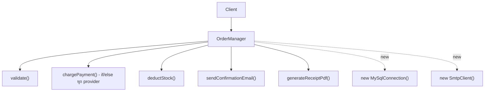
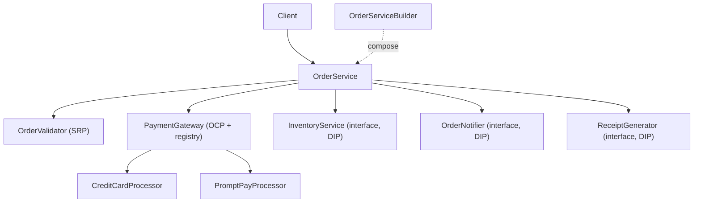
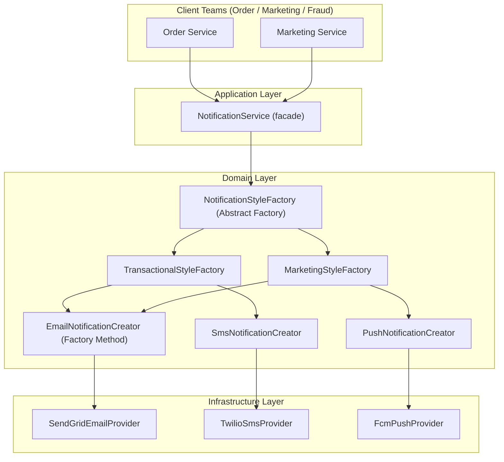
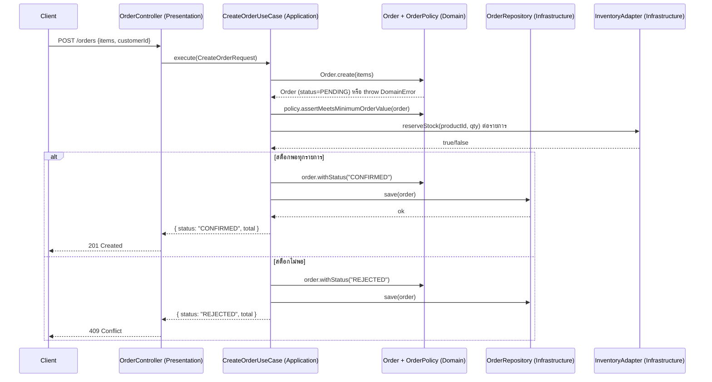

# LAB — System Architecture & Design Patterns (Beginner)

> รูปแบบ Labs นี้จำลองการสัมภาษณ์งานสาย System Design / Software Architecture ระดับ
> ต้น-กลาง แต่ละ lab มีโครงสร้าง: **โจทย์ → ข้อจำกัด → วิธีคิด → โครงสร้างระบบ → โค้ดเฉลย →
> จุดที่ interviewer มักถาม** เพื่อให้ฝึกทั้ง "คิดเป็นระบบ" และ "เขียนโค้ดเฉลยได้จริง"

โค้ดตัวอย่างในเอกสารนี้เป็น TypeScript ที่ compile ผ่านจริง (ไม่มี pseudo-code) สามารถ copy
ไปรันต่อใน `src/` ของบทนี้ได้ (ต้อง `import` type ที่จำเป็นเพิ่มเองตามบริบทไฟล์จริง)

---

## สารบัญ

- [Lab 1: Refactor God Class — `OrderManager`](#lab-1-refactor-god-class--ordermanager)
- [Lab 2: ออกแบบ Notification Platform](#lab-2-ออกแบบ-notification-platform)
- [Lab 3: Mini Order API เป็น N-Tier Monolith](#lab-3-mini-order-api-เป็น-n-tier-monolith)

---

## Lab 1: Refactor God Class — `OrderManager`

### โจทย์

บริษัท e-commerce ขนาดกลางมี class `OrderManager` ที่ทุกคนในทีมกลัวจะแก้ เพราะมันทำ**ทุกอย่าง**
ที่เกี่ยวกับออเดอร์: validate ข้อมูล, ตัดจ่ายเงิน, ตัดสต็อกสินค้า, ส่งอีเมลยืนยัน, และสร้าง PDF
ใบเสร็จ ทุกครั้งที่มีการแก้ไข (เช่น เพิ่มช่องทางจ่ายเงินใหม่ หรือเปลี่ยน template PDF)
ทีมอื่นที่ไม่เกี่ยวข้องต้อง merge conflict กับโค้ดใน `OrderManager` เสมอ และการเขียน unit test
ก็แทบเป็นไปไม่ได้เพราะต้อง mock ทั้ง payment gateway, database, SMTP, และ PDF library พร้อมกัน

**Task:** รีแฟกเตอร์ `OrderManager` โดยใช้ SOLID Principles + Creational Patterns ที่เหมาะสม

### ข้อจำกัด

- ต้องคง behavior เดิม 100% (สร้างออเดอร์ -> validate -> ตัดจ่ายเงิน -> ตัดสต็อก -> ส่งอีเมล -> สร้าง PDF)
- ต้องรองรับการเพิ่ม payment method ใหม่ในอนาคตโดย **ไม่แก้โค้ดเดิม** (ทีม payment เคย
  โดนตำหนิเรื่อง merge conflict มาก่อน)
- ทีม QA ต้องการให้เขียน unit test คลุม business logic การคำนวณยอดได้โดยไม่ต้องมี DB/SMTP จริง
- ห้ามใช้ library เพิ่มเติมนอกเหนือจาก TypeScript standard

### วิธีคิด

1. **หา "แกนของการเปลี่ยนแปลง" (axis of change)** ของ `OrderManager` แต่ละส่วน:

- Validation logic เปลี่ยนเมื่อกฎธุรกิจเปลี่ยน (เช่น ขั้นต่ำการสั่งซื้อ)
- Payment logic เปลี่ยนเมื่อมี payment provider ใหม่ (บ่อยที่สุด ตามที่ทีม payment บอก)
- Inventory logic เปลี่ยนเมื่อระบบคลังสินค้าเปลี่ยน
- Notification logic เปลี่ยนเมื่อช่องทางแจ้งเตือนเปลี่ยน
- PDF generation เปลี่ยนเมื่อ template/library เปลี่ยน

-> แต่ละแกนนี้คือ **เหตุผลในการเปลี่ยนแปลงคนละเหตุผล** = ต้องแยกเป็นคนละ class ตาม **SRP**

2. **Payment ต้องขยายได้โดยไม่แก้โค้ดเดิม** -> ใช้ **OCP** ผ่าน interface `PaymentProcessor`

- registry ที่เพิ่ม processor ใหม่ได้โดยไม่ต้องแก้ dispatcher

3. **แต่ละ dependency (DB, SMTP, PDF, Payment Gateway) ต้อง mock ได้ในเทส** -> ใช้ **DIP**
   ให้ `OrderService` (orchestrator) รับทุก dependency ผ่าน constructor เป็น interface
   ไม่ `new` เอง

4. **การสร้าง `OrderService` ที่มี dependency 4-5 ตัวพร้อม default implementation** อาจซับซ้อน
   ตอน wiring -> ใช้ **Builder pattern** (`OrderServiceBuilder`) เพื่อให้ composition root
   อ่านง่ายขึ้น และตั้งค่า default ให้ได้โดยไม่ต้องพิมพ์ constructor ยาว ๆ ทุกครั้ง

### โครงสร้างระบบ

**ก่อน refactor:**



ทุกกล่องอยู่ใน**class เดียว** และ "new" dependency เองข้างใน -> ละเมิด SRP, OCP, DIP พร้อมกัน

**หลัง refactor:**



`OrderService` กลายเป็น **orchestrator บาง ๆ** ที่ประสานงาน ไม่มี business logic ของแต่ละ
concern อยู่ในตัวมันเองเลย

### โค้ดเฉลย

**ก่อน (Anti-pattern):**

```typescript
// ❌ God Class — ทุกอย่างปนกัน ทดสอบยาก ขยายยาก
class OrderManagerBefore {
  createOrder(
    customerEmail: string,
    items: { productId: string; price: number; qty: number }[],
    paymentMethod: string,
  ): void {
    // 1. Validation ปนอยู่ตรงนี้
    if (items.length === 0) throw new Error('Order must have items');
    const total = items.reduce((sum, i) => sum + i.price * i.qty, 0);
    if (total < 100) throw new Error('Minimum order is 100');

    // 2. Payment logic แบบ if/else ที่จะยาวขึ้นเรื่อย ๆ (ละเมิด OCP)
    if (paymentMethod === 'credit_card') {
      console.log(`[Payment] Charging ${total} via Credit Card`);
    } else if (paymentMethod === 'promptpay') {
      console.log(`[Payment] Charging ${total} via PromptPay`);
    } else {
      throw new Error(`Unsupported payment: ${paymentMethod}`);
    }

    // 3. Inventory logic ผูกกับ DB ตรง ๆ (ละเมิด DIP)
    for (const item of items) {
      console.log(
        `[MySQL] UPDATE inventory SET stock = stock - ${item.qty} WHERE product_id = '${item.productId}'`,
      );
    }

    // 4. Notification ผูกกับ SMTP ตรง ๆ (ละเมิด DIP)
    console.log(`[SMTP] Emailing ${customerEmail}: Your order total is ${total}`);

    // 5. PDF generation ปนอยู่ที่นี่ด้วย (ละเมิด SRP)
    console.log(`[PDF] Generating receipt PDF for ${customerEmail}, total=${total}`);
  }
}
```

**หลัง (Refactored ด้วย SOLID + Creational Patterns):**

```typescript
// =============================================================================
// Domain types
// =============================================================================
interface OrderItem {
  readonly productId: string;
  readonly price: number;
  readonly qty: number;
}

interface OrderRequest {
  readonly customerEmail: string;
  readonly items: readonly OrderItem[];
  readonly paymentMethod: string;
}

interface OrderResult {
  readonly total: number;
  readonly paymentRef: string;
}

// =============================================================================
// 1) SRP: แยก validation logic ออกมาเป็นของตัวเอง
// =============================================================================
class OrderValidator {
  private static readonly MIN_ORDER_TOTAL = 100;

  validate(items: readonly OrderItem[]): number {
    if (items.length === 0) {
      throw new Error('Order must have at least one item');
    }
    const total = items.reduce((sum, i) => sum + i.price * i.qty, 0);
    if (total < OrderValidator.MIN_ORDER_TOTAL) {
      throw new Error(`Minimum order is ${OrderValidator.MIN_ORDER_TOTAL}, got ${total}`);
    }
    return total;
  }
}

// =============================================================================
// 2) OCP: Payment processors ผ่าน interface + registry (เพิ่ม provider ใหม่ไม่แก้ของเดิม)
// =============================================================================
interface PaymentProcessor {
  readonly methodCode: string;
  charge(amount: number): string; // คืน transaction reference
}

class CreditCardProcessor implements PaymentProcessor {
  readonly methodCode = 'credit_card';
  charge(amount: number): string {
    return `CC-${amount}-${Date.now()}`;
  }
}

class PromptPayProcessor implements PaymentProcessor {
  readonly methodCode = 'promptpay';
  charge(amount: number): string {
    return `PP-${amount}-${Date.now()}`;
  }
}

class PaymentGateway {
  private readonly processors = new Map<string, PaymentProcessor>();

  register(processor: PaymentProcessor): this {
    this.processors.set(processor.methodCode, processor);
    return this;
  }

  charge(methodCode: string, amount: number): string {
    const processor = this.processors.get(methodCode);
    if (!processor) throw new Error(`Unsupported payment method: ${methodCode}`);
    return processor.charge(amount);
  }
}

// =============================================================================
// 3) DIP: Inventory / Notification / Receipt เป็น interface — implementation แยกอิสระ
// =============================================================================
interface InventoryService {
  deductStock(items: readonly OrderItem[]): void;
}

interface OrderNotifier {
  notify(customerEmail: string, total: number): void;
}

interface ReceiptGenerator {
  generate(customerEmail: string, total: number): void;
}

class SqlInventoryService implements InventoryService {
  deductStock(items: readonly OrderItem[]): void {
    for (const item of items) {
      console.log(
        `[MySQL] UPDATE inventory SET stock = stock - ${item.qty} WHERE product_id = '${item.productId}'`,
      );
    }
  }
}

class EmailOrderNotifier implements OrderNotifier {
  notify(customerEmail: string, total: number): void {
    console.log(`[SMTP] Emailing ${customerEmail}: Your order total is ${total}`);
  }
}

class PdfReceiptGenerator implements ReceiptGenerator {
  generate(customerEmail: string, total: number): void {
    console.log(`[PDF] Generating receipt for ${customerEmail}, total=${total}`);
  }
}

// =============================================================================
// 4) Orchestrator — ไม่มี business logic ของแต่ละ concern อยู่ในตัวมันเอง (SRP ระดับ class)
// =============================================================================
class OrderService {
  constructor(
    private readonly validator: OrderValidator,
    private readonly paymentGateway: PaymentGateway,
    private readonly inventory: InventoryService,
    private readonly notifier: OrderNotifier,
    private readonly receiptGenerator: ReceiptGenerator,
  ) {}

  createOrder(request: OrderRequest): OrderResult {
    const total = this.validator.validate(request.items);
    const paymentRef = this.paymentGateway.charge(request.paymentMethod, total);
    this.inventory.deductStock(request.items);
    this.notifier.notify(request.customerEmail, total);
    this.receiptGenerator.generate(request.customerEmail, total);
    return { total, paymentRef };
  }
}

// =============================================================================
// 5) Builder pattern — ช่วยประกอบ OrderService ที่มี dependency หลายตัว ให้อ่านง่ายขึ้น
// =============================================================================
class OrderServiceBuilder {
  private validator: OrderValidator = new OrderValidator();
  private paymentGateway: PaymentGateway = new PaymentGateway()
    .register(new CreditCardProcessor())
    .register(new PromptPayProcessor());
  private inventory: InventoryService = new SqlInventoryService();
  private notifier: OrderNotifier = new EmailOrderNotifier();
  private receiptGenerator: ReceiptGenerator = new PdfReceiptGenerator();

  withValidator(validator: OrderValidator): this {
    this.validator = validator;
    return this;
  }

  withPaymentGateway(gateway: PaymentGateway): this {
    this.paymentGateway = gateway;
    return this;
  }

  withInventory(inventory: InventoryService): this {
    this.inventory = inventory;
    return this;
  }

  withNotifier(notifier: OrderNotifier): this {
    this.notifier = notifier;
    return this;
  }

  withReceiptGenerator(generator: ReceiptGenerator): this {
    this.receiptGenerator = generator;
    return this;
  }

  build(): OrderService {
    return new OrderService(
      this.validator,
      this.paymentGateway,
      this.inventory,
      this.notifier,
      this.receiptGenerator,
    );
  }
}

// =============================================================================
// การใช้งาน (production wiring ผ่าน builder — มี default ที่ใช้งานได้ทันที)
// =============================================================================
const orderService = new OrderServiceBuilder().build();
const result = orderService.createOrder({
  customerEmail: 'customer@example.com',
  items: [{ productId: 'SKU-1', price: 300, qty: 2 }],
  paymentMethod: 'credit_card',
});
console.log(result); // { total: 600, paymentRef: 'CC-600-...' }

// =============================================================================
// ตัวอย่าง unit test (จำลอง — ไม่ต้องมี DB/SMTP/PDF จริงเลย เพราะ inject stub เข้าไปได้)
// =============================================================================
class StubInventory implements InventoryService {
  deductStock(): void {
    /* no-op สำหรับเทส */
  }
}
class StubNotifier implements OrderNotifier {
  notify(): void {
    /* no-op สำหรับเทส */
  }
}
class StubReceiptGenerator implements ReceiptGenerator {
  generate(): void {
    /* no-op สำหรับเทส */
  }
}

const testService = new OrderServiceBuilder()
  .withInventory(new StubInventory())
  .withNotifier(new StubNotifier())
  .withReceiptGenerator(new StubReceiptGenerator())
  .build();

const testResult = testService.createOrder({
  customerEmail: 'test@example.com',
  items: [{ productId: 'SKU-2', price: 50, qty: 3 }],
  paymentMethod: 'promptpay',
});
console.assert(testResult.total === 150, 'total should be 150');
```

### จุดที่ interviewer มักถาม

1. **"ทำไมเลือกแยก `OrderValidator` เป็น class แยก ไม่ทำเป็น static function เฉย ๆ?"**
   คำตอบที่ดี: เพราะในอนาคตอาจมีกฎ validate ที่ต่างกันตาม customer tier (VIP ขั้นต่ำต่างจาก
   regular) การทำเป็น class เปิดช่องให้ inject configuration หรือทำ subclass ได้ ถ้าใช้
   static function ล้วนจะ hardcode ค่าคงที่และ inject ยากกว่า — แต่ถ้ามั่นใจว่าไม่มี variation
   จริง ๆ static function ก็เป็นตัวเลือกที่ simple กว่าได้เช่นกัน (ไม่มีคำตอบผิด ขึ้นกับบริบท)

2. **"ถ้าอยาก rollback การตัดสต็อกเมื่อ payment สำเร็จแต่ notify ล้ม จะทำยังไง?"**
   นี่คือคำถามเรื่อง **transactional consistency** — คำตอบที่ดีคือพูดถึง Saga pattern หรือ
   Outbox pattern (จะเรียนลึกในบท expert) หรือถ้าอยู่ใน DB เดียวกันก็ใช้ DB transaction ครอบ
   ส่วน side-effect ภายนอก (email/PDF) ควรทำแบบ eventual/async ผ่าน event queue แทนการ
   เรียก synchronous ตรง ๆ ใน orchestrator

3. **"ทำไมไม่ใช้ Factory Method สำหรับ PaymentProcessor แทน registry pattern?"**
   คำตอบ: Factory Method เหมาะกับตอนที่ "การสร้าง object เพียงอย่างเดียว" ซับซ้อน
   แต่ที่นี่ปัญหาคือ "จะเลือก processor ไหนจาก string ตอน runtime" ซึ่ง registry/map
   ตอบโจทย์ตรงกว่าและเพิ่ม/ลบ provider runtime ได้ (เช่น feature flag เปิด/ปิด payment
   method บางตัว) ถ้าใช้ Factory Method ล้วนจะต้องมี switch-case ในจุดที่แปลง string
   เป็น concrete Creator อยู่ดี

4. **"OrderServiceBuilder ต่างจาก Dependency Injection Container ยังไง?"**
   คำตอบ: Builder เป็นการ "ประกอบ object เดียว" แบบ manual ที่ยัง type-safe และอ่าน flow
   ได้ตรง ๆ ในโค้ด เหมาะกับระบบขนาดกลาง-เล็ก ส่วน DI Container (เช่น InversifyJS, NestJS's
   built-in DI) จะจัดการ dependency graph ทั้งระบบอัตโนมัติ เหมาะกับระบบใหญ่ที่มี dependency
   ซับซ้อนหลายสิบตัว — ไม่มีตัวไหนดีกว่าตัวไหนเสมอไป ขึ้นกับขนาดระบบ

5. **"เห็น `this` เป็น return type ใน builder methods ทำไมไม่ return `OrderServiceBuilder` ตรง ๆ?"**
   คำตอบ: การ return type `this` (polymorphic this type) ทำให้ถ้ามีคนสร้าง subclass ของ
   builder ในอนาคต method chaining ยังคง type ที่ถูกต้องของ subclass ไว้ได้ (ไม่ widen
   กลับไปเป็น base class) เป็น best practice ของ fluent builder ใน TypeScript

---

## Lab 2: ออกแบบ Notification Platform

### โจทย์

ทีมของคุณต้องสร้าง **Notification Platform** ที่ใช้ร่วมกันทั้งบริษัท รองรับการส่งแจ้งเตือนผ่าน
Email, SMS, และ Push Notification ให้กับทีมผลิตภัณฑ์อื่น ๆ เรียกใช้งาน (เช่น ทีม Order,
ทีม Marketing, ทีม Fraud Detection) โดยแต่ละทีมอาจต้องการ "ธีม/รูปแบบ" การแจ้งเตือนที่ต่างกัน
เช่น Transactional notification (เป็นทางการ, ต้องมี tracking ID) กับ Marketing notification
(มี branding, unsubscribe link)

### ข้อจำกัด

- ต้องรองรับ 3 ช่องทาง (Email/SMS/Push) ตั้งแต่วันแรก และต้องเผื่อเพิ่มช่องทางใหม่ในอนาคต
  (เช่น LINE, Webhook) โดยไม่กระทบโค้ดเดิม
- ต้องมี "ชุด" การแจ้งเตือนที่เข้ากันได้ 2 แบบ: Transactional และ Marketing — ห้ามผสมกัน
  (เช่น ห้าม Email แบบ transactional ไปคู่กับ SMS แบบ marketing ในคำขอเดียว)
- ทีมผลิตภัณฑ์อื่นต้อง integrate ได้ง่าย ผ่าน interface เดียว ไม่ต้องรู้รายละเอียด provider
  เบื้องหลัง (SendGrid, Twilio, FCM ฯลฯ)
- ต้องเทสได้โดยไม่ยิง request จริงไปยัง provider ภายนอก

### วิธีคิด

1. **ทุกช่องทางมี "การกระทำ" เดียวกัน (`send`)** แต่รายละเอียด provider ต่างกัน
   -> ใช้ **Factory Method** ให้แต่ละช่องทางมี Creator ของตัวเอง (`EmailNotificationCreator`
   ฯลฯ) ที่ Application layer เรียกผ่าน abstraction เดียว

2. **ต้องการ "ตระกูล" ของการแจ้งเตือนที่เข้ากันได้ (Transactional vs Marketing) และห้ามผสม**
   -> นี่คือสัญญาณชัดเจนของ **Abstract Factory**: `NotificationStyleFactory` แต่ละตัว
   (`TransactionalStyleFactory`, `MarketingStyleFactory`) ผลิตทั้ง Email/SMS/Push ที่ผูก
   "สไตล์" เดียวกันเสมอ

3. **Layered separation:** ทีมอื่นเรียกผ่าน Application layer (`NotificationService`)
   เท่านั้น ไม่แตะ provider (Infrastructure) ตรง ๆ — เป็นไปตาม DIP + Layered Architecture

4. **Testability:** Provider (SendGrid/Twilio/FCM) เป็น interface ทำให้ inject stub/mock
   ในเทสได้ทันที ไม่ต้องยิง network จริง

### โครงสร้างระบบ



### File Structure ที่แนะนำ (แยก package เพื่อใช้ร่วมทั้งบริษัท)

```
notification-platform/
├── src/
│ ├── domain/
│ │ ├── notification.ts   # Notification interface, NotificationChannel type
│ │ ├── notification-style.ts # NotificationStyleFactory (Abstract Factory)
│ │ └── notification-creator.ts # NotificationCreator (Factory Method)
│ ├── infrastructure/
│ │ ├── sendgrid-provider.ts
│ │ ├── twilio-provider.ts
│ │ └── fcm-provider.ts
│ ├── application/
│ │ └── notification-service.ts # Facade ที่ทีมอื่นเรียกใช้
│ └── index.ts      # Public exports (เฉพาะสิ่งที่ทีมอื่นควรเห็น)
└── package.json
```

### โค้ดเฉลย

```typescript
// =============================================================================
// domain/notification.ts — สัญญากลาง
// =============================================================================
type NotificationChannel = 'email' | 'sms' | 'push';
type NotificationStyle = 'transactional' | 'marketing';

interface NotificationPayload {
  readonly recipient: string;
  readonly subject: string;
  readonly body: string;
  readonly trackingId?: string; // ใช้เฉพาะ transactional
  readonly unsubscribeUrl?: string; // ใช้เฉพาะ marketing
}

interface Notification {
  readonly channel: NotificationChannel;
  send(payload: NotificationPayload): Promise<{ success: boolean; providerRef: string }>;
}

// =============================================================================
// infrastructure/*.ts — provider จริง (implement ผ่าน interface กลาง)
// =============================================================================
interface EmailProvider {
  sendEmail(to: string, subject: string, html: string): Promise<string>;
}

interface SmsProvider {
  sendSms(to: string, text: string): Promise<string>;
}

interface PushProvider {
  sendPush(deviceToken: string, title: string, body: string): Promise<string>;
}

class SendGridEmailProvider implements EmailProvider {
  async sendEmail(to: string, subject: string, html: string): Promise<string> {
    console.log(`[SendGrid] -> ${to} | ${subject} | ${html.slice(0, 40)}...`);
    return `sg-${Date.now()}`;
  }
}

class TwilioSmsProvider implements SmsProvider {
  async sendSms(to: string, text: string): Promise<string> {
    console.log(`[Twilio] -> ${to} | ${text}`);
    return `tw-${Date.now()}`;
  }
}

class FcmPushProvider implements PushProvider {
  async sendPush(deviceToken: string, title: string, body: string): Promise<string> {
    console.log(`[FCM] -> ${deviceToken} | ${title}: ${body}`);
    return `fcm-${Date.now()}`;
  }
}

// =============================================================================
// domain/notification-creator.ts — Factory Method ต่อช่องทาง
// =============================================================================
class EmailNotification implements Notification {
  readonly channel = 'email' as const;
  constructor(
    private readonly provider: EmailProvider,
    private readonly style: NotificationStyle,
  ) {}

  async send(payload: NotificationPayload) {
    const footer =
      this.style === 'marketing' && payload.unsubscribeUrl
        ? `<a href="${payload.unsubscribeUrl}">Unsubscribe</a>`
        : `<small>Ref: ${payload.trackingId ?? 'N/A'}</small>`;
    const providerRef = await this.provider.sendEmail(
      payload.recipient,
      payload.subject,
      `${payload.body}<br/>${footer}`,
    );
    return { success: true, providerRef };
  }
}

class SmsNotification implements Notification {
  readonly channel = 'sms' as const;
  constructor(private readonly provider: SmsProvider) {}

  async send(payload: NotificationPayload) {
    const providerRef = await this.provider.sendSms(
      payload.recipient,
      `${payload.subject}: ${payload.body}`,
    );
    return { success: true, providerRef };
  }
}

class PushNotification implements Notification {
  readonly channel = 'push' as const;
  constructor(private readonly provider: PushProvider) {}

  async send(payload: NotificationPayload) {
    const providerRef = await this.provider.sendPush(
      payload.recipient,
      payload.subject,
      payload.body,
    );
    return { success: true, providerRef };
  }
}

// =============================================================================
// domain/notification-style.ts — Abstract Factory: การันตี "สไตล์" เข้ากันทุกช่องทาง
// =============================================================================
interface NotificationStyleFactory {
  readonly style: NotificationStyle;
  createEmail(): Notification;
  createSms(): Notification;
  createPush(): Notification;
}

class TransactionalStyleFactory implements NotificationStyleFactory {
  readonly style = 'transactional' as const;
  constructor(
    private readonly emailProvider: EmailProvider,
    private readonly smsProvider: SmsProvider,
    private readonly pushProvider: PushProvider,
  ) {}

  createEmail(): Notification {
    return new EmailNotification(this.emailProvider, this.style);
  }
  createSms(): Notification {
    return new SmsNotification(this.smsProvider);
  }
  createPush(): Notification {
    return new PushNotification(this.pushProvider);
  }
}

class MarketingStyleFactory implements NotificationStyleFactory {
  readonly style = 'marketing' as const;
  constructor(
    private readonly emailProvider: EmailProvider,
    private readonly smsProvider: SmsProvider,
    private readonly pushProvider: PushProvider,
  ) {}

  createEmail(): Notification {
    return new EmailNotification(this.emailProvider, this.style);
  }
  createSms(): Notification {
    return new SmsNotification(this.smsProvider);
  }
  createPush(): Notification {
    return new PushNotification(this.pushProvider);
  }
}

// =============================================================================
// application/notification-service.ts — Facade ที่ทีมอื่นเรียกใช้ (Layered Architecture)
// =============================================================================
class NotificationService {
  constructor(
    private readonly styleFactories: Record<NotificationStyle, NotificationStyleFactory>,
  ) {}

  async send(
    style: NotificationStyle,
    channel: NotificationChannel,
    payload: NotificationPayload,
  ): Promise<{ success: boolean; providerRef: string }> {
    const factory = this.styleFactories[style];
    const notification: Notification =
      channel === 'email'
        ? factory.createEmail()
        : channel === 'sms'
          ? factory.createSms()
          : factory.createPush();
    return notification.send(payload);
  }
}

// =============================================================================
// Composition root — ที่เดียวที่ประกอบทุกอย่าง แล้ว export ให้ทีมอื่นใช้ผ่าน NotificationService
// =============================================================================
function createNotificationService(): NotificationService {
  const emailProvider = new SendGridEmailProvider();
  const smsProvider = new TwilioSmsProvider();
  const pushProvider = new FcmPushProvider();

  return new NotificationService({
    transactional: new TransactionalStyleFactory(emailProvider, smsProvider, pushProvider),
    marketing: new MarketingStyleFactory(emailProvider, smsProvider, pushProvider),
  });
}

// =============================================================================
// การใช้งานจากทีมอื่น (เช่น ทีม Order เรียกแจ้งเตือนแบบ transactional)
// =============================================================================
async function demo() {
  const notificationService = createNotificationService();

  await notificationService.send('transactional', 'email', {
    recipient: 'customer@example.com',
    subject: 'Your order has shipped',
    body: 'Order #1001 is on the way!',
    trackingId: 'TRK-1001',
  });

  await notificationService.send('marketing', 'email', {
    recipient: 'customer@example.com',
    subject: '50% off this weekend!',
    body: "Don't miss our flash sale.",
    unsubscribeUrl: 'https://example.com/unsubscribe?id=abc',
  });
}
void demo();
```

### Trade-offs ที่ควรพูดถึงตอนสัมภาษณ์

- **Abstract Factory เพิ่ม indirection:** ถ้ามีแค่ 1 style ตลอดไป (ไม่มี transactional/marketing
  แยกกัน) การใช้ Abstract Factory จะเป็นการ over-engineer — ควรใช้เมื่อมั่นใจว่า "ตระกูล"
  ของ product มีจริงและต้องขยายอนาคต
- **Synchronous vs Asynchronous delivery:** ในระบบจริงควรส่งผ่าน message queue
  (SQS/RabbitMQ) แทนการ `await` ตรง ๆ ใน request path เพื่อไม่ให้ provider ล่มกระทบ
  response time ของทีมที่เรียกใช้ (เป็นหัวข้อที่จะเรียนลึกในบท intermediate/expert
  เรื่อง resilience patterns)
- **Retry / Circuit breaker:** provider ภายนอกล่มได้เสมอ ควรมี retry with backoff และ
  circuit breaker คลุม `EmailProvider`/`SmsProvider`/`PushProvider` (ยังไม่ได้ implement
  ในเฉลยนี้เพื่อโฟกัสที่ creational patterns แต่ควรพูดถึงเมื่อ interviewer ถามเรื่อง reliability)

### จุดที่ interviewer มักถาม

1. **"ทำไมไม่ใช้ if/else เลือก provider ตรง ๆ ใน `NotificationService`?"**
   คำตอบ: ถ้าทำแบบนั้น ทุกครั้งที่เพิ่ม style หรือ channel ใหม่ ต้องมาแก้ `NotificationService`
   ทำให้ไฟล์นี้กลายเป็นจุดรวมการแก้ไข (ละเมิด OCP) — การใช้ Abstract Factory ทำให้
   `NotificationService` คงที่ ส่วนการขยายเกิดที่ "เพิ่ม factory ใหม่" แทน

2. **"ถ้าอยากเพิ่มช่องทาง LINE Notify จะกระทบไฟล์ไหนบ้าง?"**
   คำตอบที่ดี: ต้องเพิ่ม `LineProvider` (Infrastructure), `LineNotification` (Factory Method
   ใหม่), เพิ่ม `createLine()` ใน `NotificationStyleFactory` interface และ implement ใน
   ทั้ง `TransactionalStyleFactory`/`MarketingStyleFactory` — สังเกตว่าการเพิ่ม method ใหม่ใน
   interface กลางแบบนี้ "กระทบทุก implementation" ซึ่งเป็นข้อจำกัดที่รู้จักกันของ Abstract Factory
   (ทางแก้เชิง advanced: ใช้ pattern อื่นเสริม เช่น Visitor หรือยอมรับ trade-off นี้ถ้าจำนวน
   channel ไม่เพิ่มบ่อย)

3. **"NotificationPayload มี field `trackingId` และ `unsubscribeUrl` ที่ optional และใช้ไม่ตรงกัน
   ตามสไตล์ ถือเป็นการออกแบบที่ดีไหม?"**
   คำตอบที่ตรงไปตรงมา: นี่คือจุดที่พอยอมรับได้ในระดับ beginner แต่ในระบบใหญ่ควรแยกเป็น
   `TransactionalPayload`/`MarketingPayload` คนละ type (discriminated union) เพื่อให้
   compiler บังคับว่าต้องส่ง field ที่ถูกต้องตาม style — เป็นตัวอย่างที่ดีในการโยงกลับไปที่ LSP/ISP
   (การมี field optional เยอะเกินคือสัญญาณของ interface ที่ยังไม่ segregate ดีพอ)

4. **"เพราะเหตุใดจึง return `providerRef` เป็น string ธรรมดา ไม่ทำเป็น value object?"**
   เป็นคำถามเชิง code quality — คำตอบที่ดีคือยอมรับว่าในระบบจริงควรมี type เช่น
   `ProviderReference` ที่เก็บทั้ง provider name + id เพื่อ traceability แต่ในโค้ดตัวอย่าง
   ระดับ beginner นี้เก็บเป็น string เพื่อความกระชับ

---

## Lab 3: Mini Order API เป็น N-Tier Monolith

### โจทย์

ให้ออกแบบ Order API ขนาดเล็ก (`POST /orders`, `GET /orders/:id`) ให้เป็น **Monolith ที่มี
Separation of Concerns ชัดเจน** ตาม Layered (N-Tier) Architecture โดยต้องรองรับ requirement นี้:

- สร้างออเดอร์ใหม่ พร้อม validate ว่ามีสินค้าอย่างน้อย 1 รายการ และยอดขั้นต่ำ 100 บาท
- ตรวจสต็อกก่อนยืนยันออเดอร์ ถ้าสต็อกไม่พอ ต้อง reject พร้อมเหตุผล
- ดึงข้อมูลออเดอร์ตาม id คืนกลับพร้อมสถานะปัจจุบัน

### ข้อจำกัด

- ต้องรันเป็น process เดียว (monolith) ไม่ใช้ microservices
- ต้องแยกชั้นชัดเจนพอที่จะเขียน unit test ของ business logic (Domain) ได้โดยไม่ต้องมี
  HTTP server หรือ database จริงรันอยู่
- โครงสร้างต้องรองรับการเปลี่ยนจาก in-memory storage ไปเป็น MySQL จริงในอนาคต โดยแก้แค่
  Infrastructure layer
- เขียนด้วย TypeScript ล้วน ไม่ผูกกับ framework เฉพาะ (จำลอง HTTP layer ด้วย function ธรรมดา)

### วิธีคิด

1. **ระบุ 4 ชั้นตาม Layered Architecture:**

- Presentation: แปลง raw HTTP request/response (จำลองด้วย `OrderController`)
- Application: use case orchestration (`CreateOrderUseCase`, `GetOrderUseCase`)
- Domain: entity `Order`, business rule `OrderPolicy`, ports (`OrderRepositoryPort`,
  `InventoryPort`)
- Infrastructure: `InMemoryOrderRepository`, `InMemoryInventoryAdapter` (ทีหลังสลับเป็น
  `MySqlOrderRepository` ได้โดยไม่แก้ 3 ชั้นบน)

2. **ใช้ DIP เป็นกาวเชื่อมระหว่าง Domain กับ Infrastructure** — Domain ประกาศ port
   Infrastructure implement ตาม port นั้น

3. **ลำดับการไหลของ request (sequence)** ต้องชัดเจนเพื่อให้ debug ง่าย:
   `HTTP request -> Controller -> UseCase -> Domain validation -> Infrastructure (stock check,
 persist) -> UseCase -> Controller -> HTTP response`

### โครงสร้างระบบ — Sequence Diagram



### File Structure

```
mini-order-api/
├── src/
│ ├── domain/
│ │ ├── order.ts    # Order entity, OrderPolicy, DomainError
│ │ └── ports.ts    # OrderRepositoryPort, InventoryPort
│ ├── application/
│ │ ├── create-order.usecase.ts
│ │ └── get-order.usecase.ts
│ ├── infrastructure/
│ │ ├── in-memory-order-repository.ts
│ │ └── in-memory-inventory-adapter.ts
│ ├── presentation/
│ │ └── order.controller.ts
│ └── main.ts     # composition root
└── package.json
```

### โค้ดเฉลย (code skeleton แต่ละชั้น — compile ผ่านจริง)

```typescript
// =============================================================================
// domain/order.ts
// =============================================================================
interface OrderItem {
  readonly productId: string;
  readonly unitPrice: number;
  readonly quantity: number;
}

type OrderStatus = 'PENDING' | 'CONFIRMED' | 'REJECTED';

class DomainError extends Error {}

class Order {
  private constructor(
    public readonly id: string,
    public readonly customerId: string,
    public readonly items: readonly OrderItem[],
    public readonly status: OrderStatus,
  ) {}

  static create(id: string, customerId: string, items: readonly OrderItem[]): Order {
    if (items.length === 0) {
      throw new DomainError('Order must contain at least one item');
    }
    return new Order(id, customerId, items, 'PENDING');
  }

  withStatus(status: OrderStatus): Order {
    return new Order(this.id, this.customerId, this.items, status);
  }

  calculateTotal(): number {
    return this.items.reduce((sum, i) => sum + i.unitPrice * i.quantity, 0);
  }
}

class OrderPolicy {
  private static readonly MIN_ORDER_TOTAL = 100;

  assertMeetsMinimumOrderValue(order: Order): void {
    const total = order.calculateTotal();
    if (total < OrderPolicy.MIN_ORDER_TOTAL) {
      throw new DomainError(`Order total ${total} is below minimum ${OrderPolicy.MIN_ORDER_TOTAL}`);
    }
  }
}

// =============================================================================
// domain/ports.ts — สัญญาที่ Domain/Application ต้องการจาก Infrastructure
// =============================================================================
interface OrderRepositoryPort {
  save(order: Order): Promise<void>;
  findById(id: string): Promise<Order | undefined>;
}

interface InventoryPort {
  reserveStock(productId: string, quantity: number): Promise<boolean>;
}

// =============================================================================
// infrastructure/in-memory-order-repository.ts
// =============================================================================
class InMemoryOrderRepository implements OrderRepositoryPort {
  private readonly storage = new Map<string, Order>();

  async save(order: Order): Promise<void> {
    this.storage.set(order.id, order);
  }

  async findById(id: string): Promise<Order | undefined> {
    return this.storage.get(id);
  }
}

// เมื่อจะสลับไปใช้ MySQL จริง แค่ implement OrderRepositoryPort ตัวใหม่:
//
// class MySqlOrderRepository implements OrderRepositoryPort {
// constructor(private readonly pool: MySqlConnectionPool) {}
// async save(order: Order): Promise<void> { /* INSERT/UPDATE จริง */ }
// async findById(id: string): Promise<Order | undefined> { /* SELECT จริง */ }
// }
//
// แล้วสลับตอน composition root (main.ts) เท่านั้น — Domain/Application ไม่ต้องแก้เลย

// =============================================================================
// infrastructure/in-memory-inventory-adapter.ts
// =============================================================================
class InMemoryInventoryAdapter implements InventoryPort {
  private readonly stock: Record<string, number> = { 'SKU-1': 50, 'SKU-2': 0 };

  async reserveStock(productId: string, quantity: number): Promise<boolean> {
    const available = this.stock[productId] ?? 0;
    if (available < quantity) return false;
    this.stock[productId] = available - quantity;
    return true;
  }
}

// =============================================================================
// application/create-order.usecase.ts
// =============================================================================
interface CreateOrderRequest {
  readonly orderId: string;
  readonly customerId: string;
  readonly items: readonly OrderItem[];
}

interface CreateOrderResult {
  readonly orderId: string;
  readonly status: OrderStatus;
  readonly total: number;
}

class CreateOrderUseCase {
  private readonly policy = new OrderPolicy();

  constructor(
    private readonly orderRepository: OrderRepositoryPort,
    private readonly inventory: InventoryPort,
  ) {}

  async execute(request: CreateOrderRequest): Promise<CreateOrderResult> {
    let order = Order.create(request.orderId, request.customerId, request.items);
    this.policy.assertMeetsMinimumOrderValue(order);

    for (const item of order.items) {
      const reserved = await this.inventory.reserveStock(item.productId, item.quantity);
      if (!reserved) {
        order = order.withStatus('REJECTED');
        await this.orderRepository.save(order);
        return { orderId: order.id, status: order.status, total: order.calculateTotal() };
      }
    }

    order = order.withStatus('CONFIRMED');
    await this.orderRepository.save(order);
    return { orderId: order.id, status: order.status, total: order.calculateTotal() };
  }
}

// =============================================================================
// application/get-order.usecase.ts
// =============================================================================
class GetOrderUseCase {
  constructor(private readonly orderRepository: OrderRepositoryPort) {}

  async execute(orderId: string): Promise<CreateOrderResult | undefined> {
    const order = await this.orderRepository.findById(orderId);
    if (!order) return undefined;
    return { orderId: order.id, status: order.status, total: order.calculateTotal() };
  }
}

// =============================================================================
// presentation/order.controller.ts — จำลอง HTTP layer (framework-agnostic)
// =============================================================================
interface HttpResponse {
  readonly statusCode: number;
  readonly body: unknown;
}

class OrderController {
  constructor(
    private readonly createOrderUseCase: CreateOrderUseCase,
    private readonly getOrderUseCase: GetOrderUseCase,
  ) {}

  async createOrder(
    orderId: string,
    body: { customerId: string; items: OrderItem[] },
  ): Promise<HttpResponse> {
    try {
      const result = await this.createOrderUseCase.execute({ orderId, ...body });
      return { statusCode: result.status === 'CONFIRMED' ? 201 : 409, body: result };
    } catch (err) {
      if (err instanceof DomainError) {
        return { statusCode: 400, body: { error: err.message } };
      }
      throw err;
    }
  }

  async getOrder(orderId: string): Promise<HttpResponse> {
    const result = await this.getOrderUseCase.execute(orderId);
    if (!result) return { statusCode: 404, body: { error: 'Order not found' } };
    return { statusCode: 200, body: result };
  }
}

// =============================================================================
// main.ts — composition root
// =============================================================================
function bootstrap(): OrderController {
  const orderRepository = new InMemoryOrderRepository();
  const inventory = new InMemoryInventoryAdapter();
  const createOrderUseCase = new CreateOrderUseCase(orderRepository, inventory);
  const getOrderUseCase = new GetOrderUseCase(orderRepository);
  return new OrderController(createOrderUseCase, getOrderUseCase);
}

// จำลองการเรียกจาก HTTP framework (Express/Fastify) — ในของจริงตรงนี้คือ route handler
async function main() {
  const controller = bootstrap();

  const created = await controller.createOrder('ORD-1', {
    customerId: 'CUST-1',
    items: [{ productId: 'SKU-1', unitPrice: 200, quantity: 1 }],
  });
  console.log('Create:', created);

  const fetched = await controller.getOrder('ORD-1');
  console.log('Get:', fetched);
}
void main();
```

### จุดที่ interviewer มักถาม

1. **"ทำไม `Order.create()` เป็น static factory method ไม่ใช้ `new Order(...)` ตรง ๆ จาก UseCase?"**
   คำตอบ: constructor เป็น `private` เพื่อบังคับให้ทุกการสร้าง `Order` ต้องผ่าน validation
   (มีสินค้าอย่างน้อย 1 รายการ) การันตี invariant ตั้งแต่จุดกำเนิด object — เป็นเทคนิค
   "Always-Valid Domain Model" ที่ป้องกันไม่ให้ entity อยู่ในสถานะที่ไม่ถูกต้องได้เลย

2. **"ทำไม `Order.withStatus()` คืน instance ใหม่ ไม่ mutate ตัวเดิม?"**
   คำตอบ: เพื่อให้ `Order` เป็น immutable value — ป้องกันบั๊กจาก shared mutable state
   (เช่น ถ้ามีหลาย reference ชี้ไป `Order` เดียวกัน แล้วที่หนึ่งเปลี่ยน status โดยไม่ตั้งใจ
   จะกระทบทุกที่ที่ถือ reference นั้นอยู่) และทำให้ debug ง่ายขึ้นเพราะ object เก่ายังคง
   สถานะเดิมไว้เป็นหลักฐานเสมอ

3. **"ถ้าจะเพิ่ม caching layer (เช่น Redis) จะเพิ่มที่ชั้นไหน?"**
   คำตอบ: เพิ่มที่ **Infrastructure layer** เป็น decorator ครอบ `OrderRepositoryPort` เดิม
   เช่น `CachedOrderRepository implements OrderRepositoryPort` ที่เช็ค cache ก่อนแล้วค่อย
   fallback ไปเรียก `MySqlOrderRepository` ข้างใน — Application/Domain ไม่ต้องรู้เรื่อง
   caching เลย (สังเกตว่านี่คือแนวคิดของ Decorator pattern ที่จะเรียนในบท intermediate)

4. **"เกิดอะไรขึ้นถ้าระหว่าง reserve stock ของรายการที่ 2 ล้มเหลว แต่รายการที่ 1 จองไปแล้ว
   จะ rollback การจองรายการที่ 1 อย่างไร?"**
   เป็นคำถามเรื่อง **distributed/partial failure** — คำตอบที่ดีในระดับ beginner คือชี้ให้เห็นว่า
   โค้ดเฉลยนี้ยังไม่ได้ rollback การจองที่สำเร็จแล้ว (มี bug เชิง business logic ที่ควรแก้)
   วิธีแก้ที่เหมาะสมคือทำ `reserveStock` แบบ all-or-nothing ในระดับ transaction เดียว
   (ถ้าอยู่ใน DB เดียวกัน) หรือถ้าแยก service ต้องใช้ Saga pattern พร้อม compensating
   transaction (จะเรียนลึกในบท expert)

5. **"ทำไม Presentation layer (`OrderController`) ต้องเป็นคนแปลง `DomainError` เป็น HTTP 400
   ไม่ให้ Application layer ทำแทน?"**
   คำตอบ: เพราะ "HTTP status code" เป็น concept ของ transport/protocol (HTTP) ซึ่งเป็น
   concern ของ Presentation layer เท่านั้น ถ้า Application layer รู้จัก HTTP status code
   จะทำให้ use case ผูกติดกับ HTTP และใช้ซ้ำกับ CLI หรือ message queue consumer ไม่ได้
   — เป็นตัวอย่างที่ชัดของ Separation of Concerns ระหว่างชั้น
