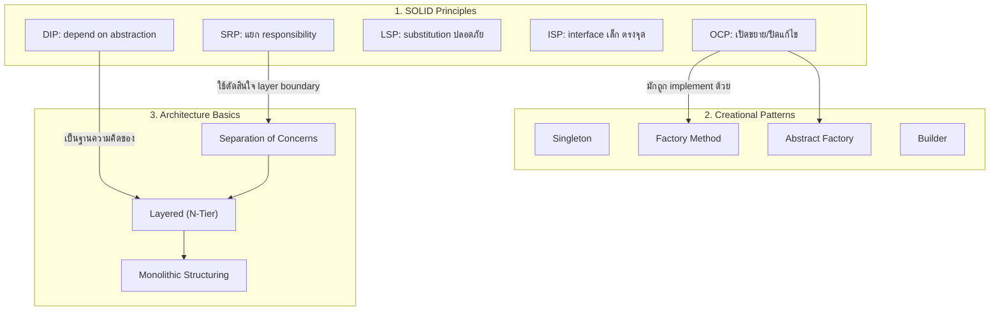

# System Architecture & Design Patterns — 01. Beginner

> เนื้อหาระดับพื้นฐานสำหรับสร้าง "รากฐาน" ความคิดด้าน Software Architecture และ Design Patterns
> ที่ senior engineer / tech lead ทุกคนต้องแม่นจนอธิบายเป็นภาษาพูดได้ ไม่ใช่แค่จำชื่อ pattern

## เป้าหมายของบทนี้

หลังเรียนจบบทนี้ คุณควรจะ:

1. อธิบาย SOLID Principles แต่ละตัวได้ พร้อมยกตัวอย่าง anti-pattern จริงที่เจอในโค้ดโปรดักชัน
2. เลือก Creational Pattern (Singleton, Factory Method, Abstract Factory, Builder) ได้ถูกกับสถานการณ์
   และอธิบายได้ว่า "ทำไมไม่เลือกตัวอื่น"
3. อธิบายโครงสร้าง Layered (N-Tier) Architecture และเหตุผลของ Separation of Concerns (SoC)
4. รีแฟกเตอร์ "God Class" ให้เป็นระบบที่ maintain ได้จริงในโลกการทำงาน
5. ตอบคำถามสัมภาษณ์งานสาย System Design / Software Architecture ระดับต้น-กลางได้อย่างมั่นใจ

---

## สารบัญ

- [1. SOLID Principles](#1-solid-principles)
- [1.1 Single Responsibility Principle (SRP)](#11-single-responsibility-principle-srp)
- [1.2 Open/Closed Principle (OCP)](#12-openclosed-principle-ocp)
- [1.3 Liskov Substitution Principle (LSP)](#13-liskov-substitution-principle-lsp)
- [1.4 Interface Segregation Principle (ISP)](#14-interface-segregation-principle-isp)
- [1.5 Dependency Inversion Principle (DIP)](#15-dependency-inversion-principle-dip)
- [2. Creational Design Patterns](#2-creational-design-patterns)
- [2.1 Singleton](#21-singleton)
- [2.2 Factory Method](#22-factory-method)
- [2.3 Abstract Factory](#23-abstract-factory)
- [2.4 Builder](#24-builder)
- [2.5 เลือก Pattern ไหนดี? (Decision Guide)](#25-เลือก-pattern-ไหนดี-decision-guide)
- [3. Architectural Basics](#3-architectural-basics)
- [3.1 Layered (N-Tier) Architecture](#31-layered-n-tier-architecture)
- [3.2 Monolithic Structuring](#32-monolithic-structuring)
- [3.3 Separation of Concerns (SoC)](#33-separation-of-concerns-soc)
- [4. Best Practices สำหรับ Senior Engineer / Tech Lead](#4-best-practices-สำหรับ-senior-engineer--tech-lead)
- [5. โครงสร้างไฟล์ในบทนี้](#5-โครงสร้างไฟล์ในบทนี้)
- [6. วิธี Run ตัวอย่างโค้ด TypeScript](#6-วิธี-run-ตัวอย่างโค้ด-typescript)

---

## 1. SOLID Principles

SOLID คือกลุ่มหลักการ 5 ข้อที่ Robert C. Martin (Uncle Bob) รวบรวมไว้เพื่อทำให้โค้ด
**เปลี่ยนแปลงได้ง่าย โดยไม่พังของเดิม** เป้าหมายจริง ๆ ของ SOLID ไม่ใช่ "ความสวยงามทางทฤษฎี"
แต่คือการลด **cost of change** — ยิ่งระบบใหญ่ขึ้น ทีมใหญ่ขึ้น ยิ่งต้องพึ่ง SOLID มากขึ้น

### 1.1 Single Responsibility Principle (SRP)

> "A class should have one, and only one, reason to change."

**คำอธิบายที่มักเข้าใจผิด:** SRP ไม่ได้แปลว่า "class ควรมี method เดียว" แต่แปลว่า
class ควรมี **"เหตุผลในการถูกแก้ไข" เพียงเหตุผลเดียว** — ถ้า class หนึ่งถูกแก้เพราะ 3 ทีมที่ไม่เกี่ยวกัน
(เช่น ทีม Reporting, ทีม Infra, ทีม Notification) นั่นคือสัญญาณว่า class นั้นละเมิด SRP

**Anti-pattern ที่เจอบ่อยในโปรดักชัน:**

- `UserService` ที่ทำทั้ง validate input, hash password, บันทึก DB, ส่งอีเมลยืนยัน,
  และ log audit trail ใน class เดียว
- Controller ที่มี business logic คำนวณราคา/ส่วนลดปนอยู่กับ HTTP request handling
- `ReportGenerator` ที่ทั้งดึงข้อมูล, คำนวณ, จัดรูปแบบ PDF, และ upload ขึ้น S3

**สัญญาณเตือน (code smell) ว่า class ละเมิด SRP:**

- ชื่อ class มีคำเชื่อม "and" หรือ "Manager"/"Handler" ที่ทำได้ "ทุกอย่าง"
- เขียน unit test ยาก เพราะต้อง mock dependency ที่ไม่เกี่ยวกับสิ่งที่กำลังเทส (เทส business logic
  ต้อง mock ทั้ง DB และ SMTP)
- ทุกครั้งที่ทีมอื่นขอเปลี่ยนแค่ "รูปแบบการแจ้งเตือน" คุณต้องมาแก้ไฟล์เดียวกับที่มี business logic หลัก

**เมื่อไหร่ควรใช้ / ระมัดระวังอะไร:**

- SRP ใช้ได้เสมอ แต่ **อย่า over-split** จนได้ class 1 method 1 class ละเอียดยิบ (over-engineering)
  — หลักคือแยกตาม "แกนของการเปลี่ยนแปลง" (axis of change) ไม่ใช่แยกตามจำนวนบรรทัด
- ดูตัวอย่างโค้ดเต็มได้ที่ `src/solid/srp.ts` (InvoiceService: god class vs แยก formatter/repository/notifier)

### 1.2 Open/Closed Principle (OCP)

> "Software entities should be open for extension, but closed for modification."

**ใจความสำคัญ:** เมื่อ requirement ใหม่มา ควร **เพิ่มโค้ดใหม่** ได้ โดย **ไม่ต้องแก้โค้ดเดิม**
ที่ผ่านการทดสอบและใช้งานจริงแล้ว การแก้โค้ดเดิมทุกครั้งที่มี feature ใหม่คือความเสี่ยงต่อ regression bug

**Anti-pattern ที่เจอบ่อย:**

```typescript
function calculateDiscount(customerType: string, amount: number) {
  if (customerType === 'regular') return amount * 0.95;
  else if (customerType === 'vip') return amount * 0.85;
  else if (customerType === 'employee') return amount * 0.7;
  // ทุกครั้งที่มี customer type ใหม่ ต้องมาแก้ if/else นี้ต่อไปเรื่อย ๆ
}
```

ปัญหาของ pattern นี้: function/class นี้กลายเป็น **"จุดรวมการแก้ไข"** ที่ทุกทีมต้องมาชนกัน
(merge conflict สูง) และทุกครั้งที่แก้ ต้อง regression test ทั้ง function ใหม่หมด

**แนวทางแก้ (ตามตัวอย่างใน `src/solid/ocp.ts`):**

ใช้ interface กลาง (`PaymentMethodProcessor`) + registry (`PaymentGateway.register()`)
เพิ่มช่องทางจ่ายเงินใหม่ = เขียน class ใหม่ 1 class + register เท่านั้น ไม่ต้องแก้ของเดิมเลย

**เมื่อไหร่ควรใช้ / ข้อควรระวัง:**

- เหมาะกับจุดในระบบที่ **"คาดเดาได้ว่าจะขยายบ่อย"** เช่น payment methods, notification channels,
  export formats — ถ้าจุดนั้นไม่มีทีขยายจริง ๆ การสร้าง abstraction ล่วงหน้าอาจเป็น over-engineering
  (YAGNI — You Aren't Gonna Need It)
- OCP มักถูก implement ผ่าน **Strategy Pattern** หรือ **plugin/registry pattern**

### 1.3 Liskov Substitution Principle (LSP)

> "Objects of a superclass shall be replaceable with objects of its subclasses without
> breaking the application."

**ใจความสำคัญ:** ถ้า `B` เป็น subtype ของ `A` แล้วโค้ดที่เขียนโดยอ้างอิง `A` ต้องทำงานถูกต้อง
แม้จะได้ instance ของ `B` มาแทน — ถ้า subclass ทำให้พฤติกรรม "ผิดคาด" ไปจาก contract ของ parent
(เช่น throw error ใน method ที่ parent สัญญาไว้ว่าทำได้, หรือเปลี่ยน invariant) ถือว่าละเมิด LSP

**ตัวอย่าง classic ที่ควรจำ (มีอยู่ใน `src/solid/lsp.ts`):**

1. **Bird/Penguin problem** — สมมติ `Bird` มี method `fly()` แต่ `Penguin` บินไม่ได้
   การ throw error ใน `Penguin.fly()` คือการละเมิด LSP เพราะโค้ดที่เรียก `bird.fly()`
   แบบ polymorphic จะพังตอน runtime ถ้าได้ `Penguin` มา — ทางแก้คือแยก `Flyable`/`Swimmable`
   ตามความสามารถ (capability-based interface) แทนการสมมติว่า "นกทุกตัวบินได้"

2. **Rectangle/Square problem** — ทางคณิตศาสตร์ Square เป็น Rectangle พิเศษ แต่ในโค้ด OOP
   ถ้า `Square extends Rectangle` แล้ว override `setWidth()` ให้ปรับ height ตามไปด้วย
   จะทำให้ invariant ที่ client code คาดหวังไว้ (เปลี่ยน width ไม่กระทบ height) พังไป
   — ทางแก้คือไม่ inherit กันแบบ is-a ที่ผิด invariant แต่ให้ทั้งคู่ implement `Shape`
   interface ร่วมกันแทน

**วิธีตรวจว่าออกแบบถูก LSP หรือไม่ (Design by Contract):**

- Precondition ของ subclass method ต้อง **ไม่เข้มกว่า** parent (รับ input ได้ไม่น้อยกว่าเดิม)
- Postcondition ของ subclass method ต้อง **ไม่หลวมกว่า** parent (คืนผลลัพธ์ที่ถูกต้องไม่น้อยกว่าเดิม)
- Invariant ของ parent ต้องยังคงอยู่ใน subclass เสมอ

### 1.4 Interface Segregation Principle (ISP)

> "Clients should not be forced to depend upon interfaces they do not use."

**ใจความสำคัญ:** อย่าสร้าง interface "อ้วน" (fat interface) ที่รวมทุกความสามารถไว้ที่เดียว
เพราะจะบังคับให้ทุก implementation ต้อง implement method ที่ตัวเองไม่เกี่ยวข้อง

**Anti-pattern ที่เจอบ่อย:**

```typescript
interface Worker {
  work(): void;
  eat(): void;
  sleep(): void;
  attendMeeting(): void;
}

class RobotWorker implements Worker {
  work() {
    /* ... */
  }
  eat() {
    throw new Error("Robots don't eat!");
  } // ❌ ถูกบังคับ implement
  sleep() {
    throw new Error("Robots don't sleep!");
  } // ❌ ถูกบังคับ implement
  attendMeeting() {
    throw new Error('N/A');
  } // ❌ ถูกบังคับ implement
}
```

**แนวทางแก้ (ดูตัวอย่างเต็มใน `src/solid/isp.ts`):** แยกเป็น `Workable`, `Eatable`, `Sleepable`,
`MeetingAttendee` แล้วให้แต่ละ class เลือก implement เฉพาะที่เกี่ยวข้องกับตัวเองจริง ๆ

**ผลดีที่ได้:** function ที่ต้องการแค่ "สั่งให้ทำงาน" (`assignTask(worker: Workable)`)
ก็ depend on แค่ interface เล็กที่สุดที่พอใช้ ทำให้ compiler ช่วยจับความผิดพลาดได้ตั้งแต่ compile time
และเมื่อ fat interface เปลี่ยน (เพิ่ม method ใหม่) โค้ดที่ไม่เกี่ยวก็ไม่ต้องถูกกระทบไปด้วย

### 1.5 Dependency Inversion Principle (DIP)

> "High-level modules should not depend on low-level modules; both should depend on
> abstractions. Abstractions should not depend on details; details should depend on
> abstractions."

**ใจความสำคัญ:** business logic (high-level) ไม่ควร `new` หรือรู้จัก implementation
รายละเอียดทาง technical (low-level) ตรง ๆ — ทั้งสองฝั่งควร depend on "สัญญา" (interface) กลาง
แล้วทิศทางของ dependency จะ "กลับทาง" (invert) จากที่ high-level ชี้ลง low-level
ไปเป็นทั้งคู่ชี้เข้า abstraction

**Anti-pattern ที่เจอบ่อย:**

```typescript
class OrderService {
  private database = new MySqlDatabase(); // ❌ ผูกติดกับ MySQL ตรง ๆ
  private emailSender = new SmtpEmailSender(); // ❌ ผูกติดกับ SMTP ตรง ๆ

  placeOrder(order: Order) {
    this.database.insertOrder(order);
    this.emailSender.send(order.customerEmail, '...');
  }
}
```

ปัญหา: เทส `OrderService` โดยไม่แตะ MySQL/SMTP จริงไม่ได้เลย และถ้าธุรกิจเปลี่ยนไปใช้
PostgreSQL หรือ LINE Notify ต้องมาแก้ `OrderService` ทั้งที่ business logic ไม่ได้เปลี่ยน

**แนวทางแก้ (ดูตัวอย่างเต็มใน `src/solid/dip.ts`):** นิยาม `OrderRepository` และ
`NotificationSender` เป็น interface แล้ว inject implementation จริงเข้ามาผ่าน constructor
(Dependency Injection) — `OrderService` ตัวเดียวใช้ได้ทั้งกับ MySQL+SMTP (production)
และ InMemory+LineNotify (test/dev) โดยไม่ต้องแก้โค้ดใน `OrderService` เลย

**DIP คือหัวใจของ Clean/Hexagonal Architecture:** เมื่อขยายไปเรียนบท intermediate/expert
(Hexagonal Architecture, Clean Architecture, DDD) จะเห็นว่า DIP คือหลักการที่ทำให้ Domain layer
"ไม่ผูกกับ framework/DB" ได้จริง — ดูตัวอย่างการใช้ DIP ระดับสถาปัตยกรรมใน `src/architecture/layered.ts`

---

## 2. Creational Design Patterns

Creational Patterns คือกลุ่ม pattern ที่ตอบคำถาม **"จะสร้าง object อย่างไรให้ยืดหยุ่น
และไม่ผูกติดกับ concrete class มากเกินไป"**

### 2.1 Singleton

**เจตนา:** การันตีว่า class หนึ่งมี instance เดียวในระบบ พร้อม global access point

**เหมาะกับ:** configuration ที่โหลดครั้งเดียว, connection pool, logger กลาง, cache กลาง

**⚠️ Thread-safety / Concurrency ใน Node.js:**

- Node.js เป็น single-threaded event loop ดังนั้นปัญหา race condition แบบ multi-thread
  (เช่นใน Java/C#) ที่ 2 thread เช็ค `if (instance == null)` พร้อมกันแล้วสร้างซ้ำ **มักไม่เกิด**
  ถ้า `getInstance()` เป็น **synchronous ทั้งหมด**
- แต่ถ้า `getInstance()` เป็น **async** (เช่น ต้อง await การเชื่อมต่อ DB) ปัญหาจะกลับมา!
  เพราะระหว่าง `await` เหตุการณ์อื่นสามารถ "แซง" เข้ามาเรียก `getInstance()` ซ้ำได้
  ก่อนที่ instance แรกจะถูก assign เสร็จ — วิธีแก้คือ **memoize the Promise เอง** ไม่ใช่ memoize
  แค่ผลลัพธ์ (ดูตัวอย่างเปรียบเทียบ `ConnectionPoolAntiPattern` vs `ConnectionPool` ใน
  `src/creational/singleton/singleton.ts`)

**ข้อควรระวังสำคัญ:** Singleton มักถูกใช้ผิดจนกลายเป็น **hidden global mutable state**
ทำให้ unit test ต้อง reset static state ระหว่างเทส และซ่อน dependency ที่ควรเห็นชัดใน constructor
— ทางเลือกที่ดีกว่าในโค้ดสมัยใหม่คือ **"DI-friendly singleton"**: สร้าง instance เดียวที่จุด
composition root (bootstrap) แล้ว inject ผ่าน constructor แทนการ hardcode `static getInstance()`

### 2.2 Factory Method

**เจตนา:** ให้ subclass (หรือ factory function) เป็นผู้ตัดสินใจว่าจะสร้าง concrete product
ตัวไหน โดย client รู้จักแค่ interface กลางของ product

**เหมาะกับ:** ระบบที่มี "หนึ่งกลุ่มของสิ่งที่ผลิตได้หลายแบบ" ที่ยังคง "รูปแบบการใช้งาน" เดิม
เช่น `Notification` (Email/SMS/Push) ที่ทุกแบบมี method `send()` เหมือนกัน แต่รายละเอียดต่างกัน

**ตัวอย่าง:** `NotificationCreator` (abstract) + `EmailNotificationCreator`,
`SmsNotificationCreator`, `PushNotificationCreator` — ดูใน `src/creational/factory-method/factory-method.ts`
(ไฟล์เดียวกันมี "registry-based factory function" เป็นทางเลือกที่ practical กว่าในหลายทีมด้วย)

### 2.3 Abstract Factory

**เจตนา:** สร้าง "ตระกูลของ object ที่เกี่ยวข้องกัน" (family of related products) และการันตีว่า
product ที่ออกมาจาก factory เดียวกัน "เข้ากันได้" เสมอ

**เหมาะกับ:** UI Theme (Light/Dark ที่ต้องสร้าง Button+Input ให้เข้าธีมกัน), Cross-platform UI Kit
(Windows/Mac ต้องสร้าง Button+Checkbox ของแต่ละ OS), Database driver family (connection+transaction
ต้องมาจาก provider เดียวกัน)

**Factory Method vs Abstract Factory ต่างกันอย่างไร?**

|          | Factory Method                                   | Abstract Factory                                            |
| -------- | ------------------------------------------------ | ----------------------------------------------------------- |
| โฟกัส    | สร้าง product **ตัวเดียว** ผ่าน method หนึ่งตัว  | สร้าง **หลาย product ที่เข้าคู่กัน** ผ่าน factory ตัวเดียว  |
| กลไก     | มักใช้ inheritance (abstract method ใน subclass) | มักใช้ composition (factory object ที่มีหลาย create method) |
| ตัวอย่าง | `NotificationCreator.createNotification()`       | `UiThemeFactory.createButton() + createInput()`             |

**ตัวอย่าง:** `LightThemeFactory`/`DarkThemeFactory` ที่สร้าง `Button`+`Input` ให้เข้าธีมกันเสมอ
ดูใน `src/creational/abstract-factory/abstract-factory.ts`

### 2.4 Builder

**เจตนา:** แยกขั้นตอนการสร้าง object ที่ซับซ้อนออกจากตัว object เอง ทำให้สร้างแบบ step-by-step
ด้วย fluent API ที่อ่านง่าย และแก้ปัญหา **"telescoping constructor"** (constructor ที่รับ
parameter เยอะเกินไปจนอ่านไม่รู้ว่าตัวไหนคืออะไร)

**เหมาะกับ:** object ที่มี optional field จำนวนมาก (HTTP request, SQL query, configuration object)
หรืออยากได้ DSL ที่อ่านออกมาเป็นภาษาธรรมดา

**ตัวอย่าง:** `HttpRequestBuilder` และ `SqlQueryBuilder` — ทั้งคู่ใช้ fluent chaining (`return this`)
และรวม validation ไว้ที่ `build()` จุดเดียว ดูใน `src/creational/builder/builder.ts`

### 2.5 เลือก Pattern ไหนดี? (Decision Guide)

```
ต้องการ instance เดียวทั้งระบบ (config, connection pool)?
 └─ ใช่ -> Singleton (แต่พิจารณา DI-friendly alternative ก่อนเสมอ)

ต้องการสร้าง "product เดียว" จากหลายชนิดที่มี interface เดียวกัน?
 └─ ใช่ -> Factory Method (หรือ registry-based factory function)

ต้องการสร้าง "ตระกูลของ product หลายตัว" ที่ต้องเข้าคู่กันเสมอ?
 └─ ใช่ -> Abstract Factory

Object มี field จำนวนมาก / optional เยอะ / อยากได้ fluent DSL?
 └─ ใช่ -> Builder

Object สร้างง่าย ไม่มี field ซับซ้อน?
 └─ ใช่ -> ใช้ constructor ธรรมดา หรือ plain factory function ก็พอ (อย่า over-engineer!)
```

---

## 3. Architectural Basics

### 3.1 Layered (N-Tier) Architecture

Layered Architecture คือการจัดโครงสร้างระบบเป็น "ชั้น" ที่มีหน้าที่ชัดเจน และมีทิศทาง
การเรียกใช้งานเป็นเส้นตรงในทิศทางเดียว:

```
┌─────────────────────────────────────────────────────┐
│ Presentation Layer         │ <- HTTP controller / CLI / GraphQL resolver
│ (รับ input, แปลงเป็น DTO, ส่งต่อ, แปลงผลลัพธ์กลับ)  │
└───────────────────────┬───────────────────────────────┘
       │ เรียกลงไปชั้นล่างเท่านั้น
┌───────────────────────▼───────────────────────────────┐
│ Application Layer (Use Case / Orchestration)   │ <- ประสาน workflow ของ use case
│ (ไม่มี business rule เอง มอบให้ Domain ตัดสินใจ)   │
└───────────────────────┬───────────────────────────────┘
       │
┌───────────────────────▼───────────────────────────────┐
│ Domain Layer (Business Rules / Entities)    │ <- ใจกลางของระบบ ไม่ผูกกับ framework/DB
│ (นิยาม "port" / interface ที่ต้องการจาก Infrastructure) │
└───────────────────────▲───────────────────────────────┘
       │ implement ตาม interface ของ Domain
┌───────────────────────┴───────────────────────────────┐
│ Infrastructure Layer (DB, External APIs, File System)│ <- รายละเอียดทาง technical ทั้งหมด
└─────────────────────────────────────────────────────┘
```

**กฎเหล็ก:**

1. ชั้นบนเรียกชั้นล่างได้ (Presentation -> Application -> Domain)
2. ชั้นล่าง **ห้ามรู้จัก** ชั้นบน — Domain ต้องไม่ import อะไรจาก Application/Presentation
3. Infrastructure "implement" interface ที่ Domain ประกาศไว้ (ports) — สังเกตว่าลูกศรจาก
   Infrastructure ชี้ _เข้า_ Domain ไม่ใช่ Domain ชี้ออกไปหา Infrastructure ตรง ๆ
   นี่คือ **Dependency Inversion Principle ที่ใช้จริงในระดับสถาปัตยกรรม**

**ทำไมต้องแยกชั้น?**

- **Testability:** เทส Domain logic ได้โดยไม่ต้องมี DB/network จริง (Infrastructure เป็นแค่ interface)
- **Replaceability:** เปลี่ยน MySQL เป็น Postgres, เปลี่ยน REST เป็น gRPC โดยไม่กระทบ business logic
- **Team scalability:** แต่ละทีมทำงานในชั้นของตัวเองได้แบบคู่ขนาน โดยรู้แค่ "สัญญา" (interface) ร่วมกัน

ดูตัวอย่างเต็มของ mini e-commerce (Create Order) ใน `src/architecture/layered.ts`

### 3.2 Monolithic Structuring

Monolith ไม่ใช่ "สถาปัตยกรรมที่แย่" อย่างที่หลายคนเข้าใจผิด — ปัญหาจริงคือ **"Big Ball of Mud"**
คือ monolith ที่ไม่มีการแยกชั้น/module ใด ๆ เลย ทำให้ทุกอย่างเชื่อมถึงกันหมด แก้จุดหนึ่งพังจุดอื่น

**Well-structured Monolith** ควรมีลักษณะ:

1. **แยกเป็น module/layer ภายในชัดเจน** (ตาม Layered Architecture ข้างต้น หรือแบ่งตาม
   business domain เช่น `orders/`, `payments/`, `inventory/`)
2. **มี boundary ระหว่าง module** แม้จะ deploy เป็น process เดียว — เช่น module `orders`
   ไม่ import internal ของ module `payments` ตรง ๆ แต่เรียกผ่าน public interface ที่ module
   นั้น export ออกมา (นี่คือแนวคิดที่ต่อไปจะกลายเป็น "Modular Monolith")
3. **แยก concern เชิงเทคนิคออกจาก business logic** — Presentation/Application/Domain/
   Infrastructure ตาม pattern ในหัวข้อ 3.1

**ข้อดีของ (well-structured) Monolith สำหรับทีม/โปรดักต์ขนาดเล็ก-กลาง:**

- Deploy ง่าย, debug ง่าย (ไม่ต้องไล่ log ข้าม service), transaction ข้าม business logic
  ทำได้ตรงไปตรงมา (ACID ใน DB เดียว)
- ไม่ต้องแบกรับ operational complexity ของ microservices (service discovery, distributed
  tracing, network latency, eventual consistency) ตั้งแต่วันแรกที่ยังไม่มี scale ที่ต้องการมัน

**เมื่อไหร่ถึงควรพิจารณาแตกเป็น microservices:** เมื่อทีมโตจนแตะ Conway's Law (ทีมแยกกันชัดเจน
ต้องการ deploy independent), หรือมี bounded context ที่ scale requirement ต่างกันมาก
(หัวข้อนี้จะลงรายละเอียดในบท intermediate/expert)

### 3.3 Separation of Concerns (SoC)

SoC คือหลักการแม่ที่ทั้ง SOLID และ Layered Architecture ยึดถือร่วมกัน: **แต่ละส่วนของระบบ
ควรรับผิดชอบ "concern" เดียว** โดย concern หมายถึงแกนของความรู้/เหตุผลในการเปลี่ยนแปลง เช่น

- **Business concern** (กฎทางธุรกิจ) ต่างจาก **Technical concern** (วิธีเก็บข้อมูล, วิธีส่ง network)
- **Presentation concern** (จะแสดงผลอย่างไร) ต่างจาก **Domain concern** (ข้อมูลนี้ถูกต้องไหม)

**ทดสอบว่าออกแบบตาม SoC หรือยัง:** ลองถามว่า "ถ้าฉันเปลี่ยน X (เช่น เปลี่ยนจาก REST เป็น GraphQL,
เปลี่ยนจาก MySQL เป็น MongoDB, เปลี่ยนกฎ 'ลูกค้า VIP ต้องซื้อขั้นต่ำเท่าไหร่')
ฉันต้องแก้ไฟล์กี่ไฟล์ และไฟล์เหล่านั้นเกี่ยวกับ X โดยตรงหรือไม่" — ถ้าคำตอบคือ "ต้องแก้เยอะ
และหลายไฟล์ไม่เกี่ยวกับ X เลย" แสดงว่า concern ต่าง ๆ ปนกันอยู่ ยังไม่ผ่าน SoC

---

## 4. Best Practices สำหรับ Senior Engineer / Tech Lead

1. **อย่า apply pattern เพราะ "เท่" — apply เพราะมันแก้ปัญหาที่มีอยู่จริง**
   ทุก pattern มี cost (เพิ่ม indirection, เพิ่มไฟล์, เพิ่ม cognitive load) การใส่ Factory/Builder/
   Strategy ในที่ที่ยังไม่มี variation จริง คือ over-engineering ที่ทำให้จูเนียร์งง โดยไม่ได้ประโยชน์

2. **ใช้ SOLID เป็น "เข็มทิศ" ไม่ใช่ "กฎเหล็กที่ตายตัว"**
   บางครั้งการละเมิด SRP เล็กน้อยเพื่อความเรียบง่ายของโค้ด (เช่น function 15 บรรทัดที่ทำ 2 อย่าง
   ที่สัมพันธ์กันแน่นมาก) ดีกว่าการแยกเป็น 3 class ที่ต้องกระโดดอ่าน 3 ไฟล์เพื่อเข้าใจ flow เดียว
   — ให้ตัดสินใจจาก **"ต้นทุนของการเปลี่ยนแปลงในอนาคต"** เป็นหลัก

3. **Dependency Inversion คือทักษะที่คุ้มค่าที่สุดที่จะฝึกให้แม่น**
   เพราะมันคือฐานของทั้ง Clean Architecture, Hexagonal Architecture, และการเทสที่ดี
   ฝึกถามตัวเองเสมอว่า "business logic ตรงนี้ผูกกับ framework/DB/network ใดๆ หรือไม่?"

4. **Composition root คือที่เดียวที่ควร "รู้จัก" ทุกอย่าง**
   ในระบบที่ดี ควรมีจุดเดียว (bootstrap/main/DI container config) ที่ประกอบ (wire) ทุก
   dependency เข้าด้วยกัน ส่วนที่เหลือของระบบไม่ควรรู้จัก concrete implementation ของกันและกัน

5. **Code review ให้เช็ค "ทิศทางของ dependency" ไม่ใช่แค่ syntax**
   คำถามที่ควรถามในทุก PR: "module นี้ import อะไรที่ผิดทิศทาง (เช่น Domain import Infrastructure)
   หรือไม่?" — เพราะทิศทางผิดครั้งเดียวจะสะสมเป็น technical debt ที่แก้ยากขึ้นเรื่อย ๆ

6. **เขียน decision record (ADR) สั้น ๆ เมื่อเลือก pattern สำคัญ**
   บันทึกว่า "ทำไมเลือก Factory Method ตรงนี้" "ทำไมไม่ใช้ Singleton ตรงนี้" — เพื่อให้ทีมในอนาคต
   (รวมถึงตัวคุณเองใน 6 เดือนข้างหน้า) เข้าใจ context ไม่ต้อง reverse-engineer เจตนา

7. **Refactor แบบ incremental พร้อม test coverage คุ้มกัน**
   อย่ารีแฟกเตอร์ god class ทีเดียวทั้งหมดโดยไม่มี regression test — ใช้ characterization test
   (เขียนเทสจับพฤติกรรมปัจจุบันก่อน) แล้วค่อยแยกความรับผิดชอบทีละส่วน

8. **สอน pattern ผ่าน "ปัญหาที่มันแก้" ไม่ใช่ "นิยามท่องจำ"**
   เวลา mentor จูเนียร์ ให้เล่าปัญหาจริงก่อน (เช่น "ทีมเราเจอ merge conflict ทุกครั้งที่เพิ่ม
   payment method ใหม่") แล้วค่อยแนะนำว่า pattern ไหนแก้ปัญหานั้นได้ — จะจำได้ลึกกว่าท่องจำ UML

---

## 5. โครงสร้างไฟล์ในบทนี้

```
01-beginner/
├── README.md       <- ไฟล์นี้ (ทฤษฎีเต็ม)
├── LAB.md        <- Labs สไตล์ System Design Interview พร้อมเฉลย
├── labs/        <- (สำรองสำหรับไฟล์ประกอบ lab เพิ่มเติม)
└── src/
 ├── package.json     <- scripts รัน demo ด้วย tsx
 ├── tsconfig.json     <- ตั้งค่า TypeScript แบบ strict
 ├── solid/
 │ ├── srp.ts      <- InvoiceService: god class vs แยก responsibility
 │ ├── ocp.ts      <- Payment processors: switch-case vs plugin registry
 │ ├── lsp.ts      <- Bird/Penguin, Rectangle/Square
 │ ├── isp.ts      <- Fat Worker interface vs segregated interfaces
 │ └── dip.ts      <- OrderService: hardwired MySQL vs abstraction + DI
 ├── creational/
 │ ├── singleton/
 │ │ └── singleton.ts   <- ConfigManager + async race condition + DI alternative
 │ ├── factory-method/
 │ │ └── factory-method.ts  <- Notification creators (Email/SMS/Push)
 │ ├── abstract-factory/
 │ │ └── abstract-factory.ts <- UI theme factories (Light/Dark: Button, Input)
 │ └── builder/
 │  └── builder.ts    <- HttpRequestBuilder, SqlQueryBuilder
 └── architecture/
  └── layered.ts     <- Mini e-commerce: Presentation→Application→Domain→Infra
```

### แผนภาพความสัมพันธ์ระหว่างหัวข้อ (mermaid)



---

## 6. วิธี Run ตัวอย่างโค้ด TypeScript

ทุกตัวอย่างเป็น TypeScript ล้วน ไม่ต้อง build แยกก่อน เพราะใช้ [`tsx`](https://github.com/privatenumber/tsx)
รัน `.ts` ได้ตรง ๆ

### ติดตั้ง dependencies (ครั้งแรกเท่านั้น)

```bash
cd system-architecture-design-patterns/01-beginner/src
npm install
```

### รันตัวอย่างแต่ละไฟล์

```bash
# SOLID
npx tsx solid/srp.ts
npx tsx solid/ocp.ts
npx tsx solid/lsp.ts
npx tsx solid/isp.ts
npx tsx solid/dip.ts

# Creational Patterns
npx tsx creational/singleton/singleton.ts
npx tsx creational/factory-method/factory-method.ts
npx tsx creational/abstract-factory/abstract-factory.ts
npx tsx creational/builder/builder.ts

# Architecture
npx tsx architecture/layered.ts
```

### หรือใช้ npm scripts ที่เตรียมไว้

```bash
npm run solid:srp
npm run solid:ocp
npm run solid:lsp
npm run solid:isp
npm run solid:dip
npm run creational:singleton
npm run creational:factory-method
npm run creational:abstract-factory
npm run creational:builder
npm run architecture:layered
```

### ตรวจ type ทั้ง project (ไม่ build ไฟล์ออกมา)

```bash
npx tsc --noEmit -p tsconfig.json
```

แต่ละไฟล์มี `if (import.meta.url === ...)` guard (ESM-equivalent ของ `require.main === module`
ในโลก CommonJS — ใน project นี้ `package.json` ตั้ง `"type": "module"` ทำให้ต้องใช้เช็คแบบ ESM)
ที่จะรัน demo function ให้เห็นพฤติกรรมจริงเมื่อสั่งรันไฟล์นั้นตรง ๆ แต่ยังคง `export` ทุก class/type
ที่สำคัญไว้ให้ import ไปใช้ในไฟล์อื่นหรือเทสเพิ่มเติมได้
