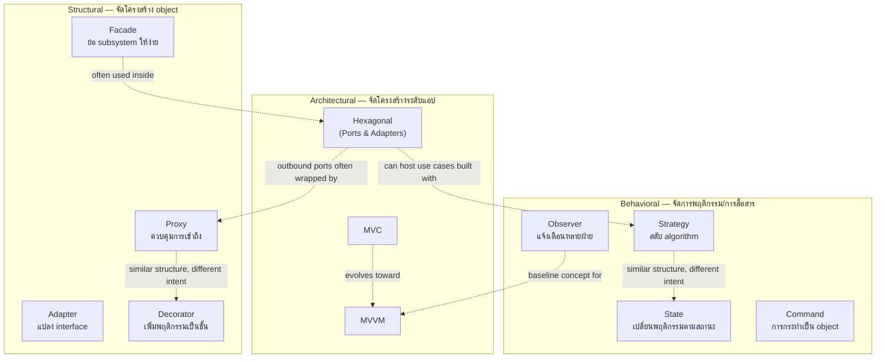

# Level 2 — Intermediate: Structural & Behavioral Patterns, MVC/MVVM, Hexagonal Architecture

ระดับนี้ต่อยอดจาก SOLID + Creational Patterns ใน [`01-beginner/`](../01-beginner/) ไปสู่การ "ประกอบ" object หลายตัวให้ทำงานร่วมกันอย่างยืดหยุ่น (Structural), การจัดการ "พฤติกรรมที่เปลี่ยนแปลงได้" (Behavioral), และการเลือก "โครงสร้างระดับ application" (MVC / MVVM / Hexagonal) ที่ทีมจะต้องอยู่กับมันไปอีกหลายปี

เป้าหมายของ Level นี้ไม่ใช่ "จำชื่อ pattern ให้ได้ 12 ตัว" แต่คือ **อ่านโค้ดแล้วบอกได้ว่าใช้ pattern ไหนอยู่ และทำไม**, และเมื่อออกแบบเอง **เลือก pattern ตามปัญหา ไม่ใช่ตามความเท่**

---

## สารบัญ

1. [Structural Patterns](#1-structural-patterns)

- [1.1 Adapter](#11-adapter)
- [1.2 Decorator](#12-decorator)
- [1.3 Facade](#13-facade)
- [1.4 Proxy](#14-proxy)
- [1.5 Decision Matrix — เลือก Structural Pattern ไหนดี](#15-decision-matrix--เลือก-structural-pattern-ไหนดี)

2. [Behavioral Patterns](#2-behavioral-patterns)

- [2.1 Observer](#21-observer)
- [2.2 Strategy](#22-strategy)
- [2.3 State](#23-state)
- [2.4 Command](#24-command)
- [2.5 เปรียบเทียบ Behavioral Patterns](#25-เปรียบเทียบ-behavioral-patterns)

3. [Architectural Patterns](#3-architectural-patterns)

- [3.1 MVC vs MVVM](#31-mvc-vs-mvvm)
- [3.2 Hexagonal Architecture (Ports & Adapters)](#32-hexagonal-architecture-ports--adapters)

4. [แผนภาพความสัมพันธ์ระหว่าง Pattern ทั้งหมด](#4-แผนภาพความสัมพันธ์ระหว่าง-pattern-ทั้งหมด)
5. [Best Practices สำหรับ Tech Lead](#5-best-practices-สำหรับ-tech-lead)
6. [วิธีรันโค้ดตัวอย่าง](#6-วิธีรันโค้ดตัวอย่าง)
7. [แผนที่ไฟล์ตัวอย่าง](#7-แผนที่ไฟล์ตัวอย่าง)

---

## 1. Structural Patterns

Structural Patterns ตอบคำถาม: **"จะประกอบ (compose) object/class หลายตัวเข้าด้วยกันอย่างไร ให้ได้โครงสร้างที่ใหญ่ขึ้นแต่ยังยืดหยุ่น"** — ต่างจาก Creational ที่ตอบว่า "จะสร้าง object อย่างไร" และ Behavioral ที่ตอบว่า "object จะสื่อสาร/เปลี่ยนพฤติกรรมกันอย่างไร"

### 1.1 Adapter

**ปัญหา:** คุณมี interface สองอันที่ "เข้ากันไม่ได้" — เช่น business logic ของคุณคาดหวัง `PaymentPort.charge()` แต่ SDK ของ vendor มี method ชื่อ `createCharge()` ที่รับ parameter คนละแบบ และคุณแก้ SDK ของ vendor ไม่ได้

**คำตอบ:** เขียน class กลาง (Adapter) ที่ implement interface ที่คุณต้องการ (Target) แล้ว "แปล" การเรียกไปยัง object เดิม (Adaptee) ข้างใน

```
Client → [Target Interface] → Adapter → [Adaptee's own interface] → Legacy/Vendor code
```

**เมื่อไหร่ใช้:**

- ผนวก (integrate) ระบบเก่า/SDK ภายนอกที่มี interface ไม่ตรงกับที่ระบบต้องการ
- ต้องการ "isolate" ความเปลี่ยนแปลงของ vendor ไว้ที่จุดเดียว (ถ้า vendor เปลี่ยน API ต้องแก้ Adapter ตัวเดียว ไม่ใช่ทั้งระบบ)
- migrate จาก library เก่าไปใหม่แบบค่อยเป็นค่อยไป (เขียน Adapter ของ library ใหม่ให้ implement interface เดิมก่อน)

**อย่าใช้เมื่อ:** คุณเป็นคนออกแบบทั้งสอง interface เอง — แค่ทำให้ตรงกันตั้งแต่แรกดีกว่าใส่ Adapter เพิ่ม layer โดยไม่จำเป็น

**ตัวอย่างโค้ด:** [`src/structural/adapter/adapter.ts`](./src/structural/adapter/adapter.ts) — รวม 3 payment vendor (legacy XML-like, Stripe-like SDK, callback-based wallet) ให้อยู่หลัง `PaymentPort` เดียว

```16:33:system-architecture-design-patterns/02-intermediate/src/structural/adapter/adapter.ts
export interface PaymentPort {
 charge(request: ChargeRequest): Promise<ChargeResult>;
 refund(providerTransactionId: string, amountCents: number): Promise<ChargeResult>;
}
```

### 1.2 Decorator

**ปัญหา:** คุณต้องการเพิ่มความสามารถให้ object (logging, retry, cache, compression) แต่ไม่อยากสร้าง subclass สำหรับทุก combination — ถ้ามี 3 feature ที่ผสมกันได้ จะได้ 2³ = 8 subclass (LoggingClient, RetryClient, CacheClient, LoggingRetryClient, ...) ซึ่ง "ระเบิด" ตาม inheritance

**คำตอบ:** ห่อ (wrap) object เดิมด้วย object ที่ implement interface เดียวกัน แล้ว "เพิ่มพฤติกรรม" ก่อน/หลังเรียก object ที่ห่ออยู่ ต่อกันเป็นชั้น ๆ ได้ตาม runtime — ไม่ต้องมี inheritance เพิ่มเลย

```
LoggingDecorator(CacheDecorator(RetryDecorator(RealHttpClient)))
  ↑ ชั้นนอกสุด   ↑ ชั้นกลาง   ↑ ชั้นในสุด   ↑ ของแท้
```

**เมื่อไหร่ใช้:**

- ต้องการ "ต่อเติมพฤติกรรม" ที่ compose ได้หลาย combination โดยไม่แก้ class เดิม (Open/Closed Principle)
- cross-cutting concerns เช่น logging, caching, retry, rate-limit, auth ที่อยากเปิด/ปิดทีละชั้นได้
- ลำดับการห่อ "มีความหมาย" — เช่น cache ควรอยู่นอก retry (ไม่ retry สิ่งที่ hit cache แล้ว)

**อย่าใช้เมื่อ:** จำนวนชั้นที่ห่อมากเกินไปจนตาม stack trace ไม่ออกว่า error เกิดจากชั้นไหน (ในระบบจริงต้อง log/trace ID ให้ชัดในทุกชั้น) หรือพฤติกรรมที่จะเพิ่มมีแค่ 1-2 อย่างและไม่มีแนวโน้มเพิ่ม — ใส่ตรง ๆ ใน class เดิมง่ายกว่า

**ตัวอย่างโค้ด:** [`src/structural/decorator/decorator.ts`](./src/structural/decorator/decorator.ts) — `HttpClient` ห่อด้วย `LoggingDecorator` → `CacheDecorator` → `RetryDecorator`

### 1.3 Facade

**ปัญหา:** caller ต้องเรียก subsystem หลายตัวตามลำดับที่ถูกต้อง (ตรวจสต็อก → จองสต็อก → เก็บเงิน → จัดส่ง → แจ้งเตือน) และต้องรู้วิธี rollback ถ้าขั้นไหนพลาด — ถ้าให้ทุกจุดในระบบเรียก subsystem ตรง ๆ โค้ดจะซ้ำและเสี่ยงเรียกผิดลำดับ

**คำตอบ:** สร้าง class เดียว (Facade) ที่มี method ระดับสูง เช่น `checkout()` คลุม subsystem ทั้งหมด — caller เห็นแค่ interface ง่าย ๆ อันเดียว

```
Client → OrderCheckoutFacade.checkout()
    │
    ├─▶ InventoryService
    ├─▶ PaymentService
    ├─▶ ShippingService
    └─▶ NotificationService
```

**เมื่อไหร่ใช้:**

- ลด coupling ระหว่าง client กับ subsystem หลายตัวที่มัก "ถูกเรียกเป็นชุด" เสมอ
- ทำ orchestration + compensation (rollback) เมื่อขั้นตอนกลางล้มเหลว
- สร้าง "หน้าบ้าน" ที่ง่ายให้ทีมอื่น integrate โดยไม่ต้องรู้ internal ของทีมคุณ

**Anti-pattern:** Facade ที่ค่อย ๆ สะสม business logic เข้าไปเรื่อย ๆ จนกลายเป็น **God Object** — Facade ควรทำหน้าที่ "orchestrate" (เรียกใครก่อนหลัง) เท่านั้น ส่วน logic จริงต้องอยู่ใน subsystem เดิม

**ตัวอย่างโค้ด:** [`src/structural/facade/facade.ts`](./src/structural/facade/facade.ts) — `OrderCheckoutFacade` พร้อม compensation logic เมื่อ payment ถูก decline

### 1.4 Proxy

**ปัญหา:** ต้องการ "ควบคุมการเข้าถึง" object จริงตัวหนึ่ง — อาจเพราะมันสร้างแพง (lazy loading), ต้องตรวจสิทธิ์ก่อน (authorization), หรือต้องการ cache ผลลัพธ์ (caching) — แต่ผู้เรียกไม่ควรต้องรู้เรื่องพวกนี้เลย

**คำตอบ:** สร้าง class ที่ implement interface เดียวกับ object จริง (Real Subject) แล้วควบคุมว่าจะเรียก Real Subject เมื่อไหร่/ยังไง

**ชนิดของ Proxy ที่พบบ่อย:**

| ชนิด                 | หน้าที่                                           | ตัวอย่างในโค้ด         |
| -------------------- | ------------------------------------------------- | ---------------------- |
| **Virtual Proxy**    | เลื่อนการสร้าง object หนักออกไปจนกว่าจะถูกใช้จริง | `LazyImageProxy`       |
| **Protection Proxy** | ตรวจสิทธิ์ก่อนอนุญาตเข้าถึง                       | `AuthorizationProxy`   |
| **Caching Proxy**    | เก็บผลลัพธ์ไว้ ลดการเรียก Real Subject ซ้ำ        | `CachingReportProxy`   |
| **Remote Proxy**     | แทน object ที่อยู่เครื่องอื่น (เช่น gRPC stub)    | _(ไม่มีในตัวอย่างนี้)_ |

**เมื่อไหร่ใช้:** ต้องการคั่นระหว่าง caller กับ object จริงโดยที่ caller "ไม่รู้ตัว" ว่ามีการคั่นอยู่ — interface เหมือนกันทุกประการ

**ตัวอย่างโค้ด:** [`src/structural/proxy/proxy.ts`](./src/structural/proxy/proxy.ts) — `CachingReportProxy` ห่อ `AuthorizationProxy` ห่อ `RealReportService` + ตัวอย่าง `LazyImageProxy` แยก

#### Proxy vs Decorator — ต่างกันตรงไหน?

โครงสร้างโค้ดของทั้งสอง pattern **เหมือนกันเป๊ะ** (wrap object ที่ implement interface เดียวกัน) ความต่างอยู่ที่ **เจตนา (intent)**:

| มิติ                  | Decorator                          | Proxy                                                       |
| --------------------- | ---------------------------------- | ----------------------------------------------------------- |
| เจตนาหลัก             | **เพิ่ม** พฤติกรรม (add behavior)  | **ควบคุม** การเข้าถึง (control access)                      |
| เรียก wrapped เสมอไหม | ปกติเรียกเสมอ แล้วเสริมก่อน/หลัง   | อาจ **ปฏิเสธ** ไม่เรียก Real Subject เลย (เช่น ไม่มีสิทธิ์) |
| ตัวอย่าง              | Logging, Retry, Compression        | Auth check, Lazy init, Access control                       |
| ผู้ควบคุมการต่อชั้น   | Client เลือกห่อกี่ชั้น ลำดับไหนเอง | มักถูกกำหนดตายตัวโดย framework/DI container                 |

### 1.5 Decision Matrix — เลือก Structural Pattern ไหนดี

| สถานการณ์                                                                | ใช้ Pattern                      |
| ------------------------------------------------------------------------ | -------------------------------- |
| interface สองอันเข้ากันไม่ได้ ต้อง integrate ของที่แก้ไม่ได้             | **Adapter**                      |
| ต้องการเพิ่ม/ถอดพฤติกรรมแบบผสมกันได้หลาย combination ตอน runtime         | **Decorator**                    |
| subsystem หลายตัวถูกเรียกเป็นชุดเสมอ อยากให้มี entry point เดียว         | **Facade**                       |
| ต้องการคั่นการเข้าถึง object จริง (lazy/auth/cache) โดย caller ไม่รู้ตัว | **Proxy**                        |
| มี object เดี่ยว ๆ ต้องการ interface ที่ต่างไปจากเดิม (คนละต้นไม้ class) | **Adapter** (single object)      |
| มี subsystem ทั้งชุด ต้องการ interface ที่ง่ายกว่าเดิม (หลาย object)     | **Facade** (multiple subsystems) |

---

## 2. Behavioral Patterns

Behavioral Patterns ตอบคำถาม: **"object จะสื่อสารกันอย่างไร และจะเปลี่ยนพฤติกรรมของตัวเองอย่างไรตามสถานการณ์"**

### 2.1 Observer

**แนวคิด:** Subject (ผู้ประกาศ) เก็บ list ของ Observer (ผู้ติดตาม) ไว้ เมื่อสถานะเปลี่ยน จะ `notify()` ทุก Observer โดย Subject ไม่รู้จัก Observer แต่ละตัวในรายละเอียด รู้แค่ว่ามัน implement interface อะไร

**ทำไมเรียกว่า "event-driven baseline":** แนวคิดนี้เป็นฐานของระบบ event ทุกชนิดที่คุณเจอในงานจริง — DOM events, React state updates, message queue (pub/sub), webhook, WebSocket broadcast ล้วนเป็น Observer pattern ในระดับ concept ที่ต่างกันแค่ transport (in-process function call vs network call)

**เมื่อไหร่ใช้:**

- มี "หนึ่ง event" ที่ต้องกระตุ้นให้ "หลายฝ่าย" ทำงานอิสระกัน (ส่ง email + track analytics + update inventory เมื่อ order เปลี่ยนสถานะ)
- ต้องการเพิ่ม/ลด "ผู้ฟัง" โดยไม่แก้ตัว Subject (Open/Closed)

**Anti-pattern ที่พบบ่อย:**

1. **Observer หนึ่งตัว throw แล้วทำให้ observer ตัวอื่นไม่ได้รับ notify** — ต้อง isolate error ต่อ observer (ดูตัวอย่าง `try/catch` ใน `notify()`)
2. **Memory leak จากการไม่ unsubscribe** — โดยเฉพาะใน frontend ที่ component unmount แต่ subscription ยังอยู่
3. **Circular update** — observer แก้ state ของ subject กลับ ทำให้เกิด notify วนไม่รู้จบ debug ยากมาก
4. **ใช้ Observer แทน request/response ที่ต้องการคำตอบทันที** — ถ้าต้องการ "คำตอบเดี่ยว" ให้ใช้ function call/Promise ตรง ๆ Observer เหมาะกับ "แจ้งแบบ fire-and-forget หลายผู้รับ" มากกว่า

**ตัวอย่างโค้ด:** [`src/behavioral/observer/observer.ts`](./src/behavioral/observer/observer.ts) — `OrderStatusSubject` แจ้ง `EmailNotificationObserver`, `AnalyticsObserver`, `InventoryObserver` และมี `FaultyWebhookObserver` โชว์ error isolation

### 2.2 Strategy

**แนวคิด:** แยก "algorithm" ที่สลับกันได้ ออกมาเป็น class ละตัว ทั้งหมด implement interface เดียวกัน แล้ว **inject** เข้า context จากภายนอก — context เรียกผ่าน interface โดยไม่รู้ว่าเป็น implementation ไหน

**เมื่อไหร่ใช้:**

- มี if/switch ตาม "ประเภท" ที่คำนวณต่างกัน และ "ประเภท" นั้นมีแนวโน้มเพิ่มขึ้นตามธุรกิจ (วิธีคิดค่าส่ง, tier ราคา, กฎภาษีตามประเทศ)
- ต้องการ unit test แต่ละ algorithm แยกจากกันได้ง่าย (mock แค่ interface เดียว)
- ต้องการสลับ algorithm ตอน runtime (config, feature flag, A/B test)

**Anti-pattern:** สร้าง Strategy สำหรับ logic ที่ไม่เคยเปลี่ยนและไม่มีแนวโน้มเพิ่ม variant — เพิ่ม indirection (ต้องเปิดหลายไฟล์เพื่อเข้าใจ flow เดียว) โดยไม่ได้ประโยชน์จริง (overengineering)

**ตัวอย่างโค้ด:** [`src/behavioral/strategy/strategy.ts`](./src/behavioral/strategy/strategy.ts) — `FlatRateShipping`, `WeightBasedShipping`, `DistanceBasedShipping` และ `FreeShippingOverThreshold` ที่ compose strategy อื่นเข้าไปอีกชั้น

### 2.3 State

**แนวคิด:** คล้าย Strategy ในเชิงโครงสร้าง (inject object ที่ implement interface เดียวกัน) แต่ต่างที่ **"ใครเป็นคนเปลี่ยน"**:

|                           | Strategy                                    | State                                                           |
| ------------------------- | ------------------------------------------- | --------------------------------------------------------------- |
| ใครเปลี่ยน implementation | **Caller/Context จากภายนอก** ตามการตั้งค่า  | **ตัว state เอง** เปลี่ยนตัวเองไป state ถัดไป (self-transition) |
| โฟกัส                     | algorithm ที่ทำงานแบบเดียวกันแต่วิธีต่างกัน | ลำดับ/วงจรของสถานะที่มี transition rule ชัดเจน                  |
| ตัวอย่าง                  | เลือกวิธีคิดค่าส่ง                          | Pending → Paid → Shipped → Delivered                            |

**เมื่อไหร่ใช้:** object มี "สถานะ" ที่ควบคุมว่า action ไหนทำได้/ทำไม่ได้ ณ ขณะนั้น (finite state machine) และจำนวน action/state มีแนวโน้มเพิ่มขึ้น

**Anti-pattern ที่พบบ่อยที่สุด:** เขียน State pattern แล้วแต่ยังปล่อยให้ context เช็ค `if (state instanceof PaidState)` จากภายนอกอยู่ดี — เท่ากับ "ย้าย switch ไปไว้ผิดที่" ไม่ใช่กำจัดมันจริง ๆ ต้องให้ transition logic อยู่ **ใน** class ของ state นั้นเอง

**ตัวอย่างโค้ด:** [`src/behavioral/state/state.ts`](./src/behavioral/state/state.ts) — `PendingState` → `PaidState` → `ShippedState` → `DeliveredState`/`CancelledState` พร้อมปฏิเสธ transition ที่ผิดกฎ (เช่น cancel หลัง shipped)

### 2.4 Command

**แนวคิด:** แปลง "การกระทำ" ให้เป็น object ที่มี `execute()`/`undo()` ของตัวเอง แยก **Invoker** (ผู้เรียก execute เช่น history/queue) ออกจาก **Receiver** (ผู้ถูกกระทำจริง) โดย Invoker ไม่ต้องรู้ว่า command ทำอะไรข้างใน

**เมื่อไหร่ใช้:**

- ต้องการ **undo/redo** (text editor, canvas tools, form wizard)
- ต้องการ **queue การกระทำ** ไว้ทำทีหลัง หรือ retry ได้ (job queue, task scheduler)
- ต้องการ **log ทุกการกระทำ** เพื่อ audit หรือ replay (เช่น operational transform, event sourcing เบื้องต้น)
- ต้องการรวมหลาย action เป็น **macro** ที่ execute/undo พร้อมกันเป็นก้อนเดียว

**Anti-pattern:** ลืมเก็บ "state ที่จำเป็นสำหรับ undo" ไว้ตอน `execute()` — เช่น `DeleteTextCommand` ต้องจำข้อความที่ถูกลบไว้ ไม่งั้น `undo()` จะไม่รู้ว่าต้องคืนอะไร (ดูตัวอย่างในโค้ด)

**ตัวอย่างโค้ด:** [`src/behavioral/command/command.ts`](./src/behavioral/command/command.ts) — `InsertTextCommand`, `DeleteTextCommand`, `MacroCommand` ผ่าน `CommandHistory` ที่มี undo/redo stack

### 2.5 เปรียบเทียบ Behavioral Patterns

| Pattern      | คำถามที่ตอบ                                               | จำนวนฝ่ายที่เกี่ยวข้อง           | State เปลี่ยนเอง?             |
| ------------ | --------------------------------------------------------- | -------------------------------- | ----------------------------- |
| **Observer** | "ใครต้องรู้เมื่อเหตุการณ์นี้เกิด?"                        | 1 subject → N observers          | ไม่เกี่ยว                     |
| **Strategy** | "จะคำนวณ/ทำสิ่งนี้ด้วยวิธีไหน?"                           | 1 context ↔ 1 strategy (ตอนนั้น) | ไม่ — context สั่งเปลี่ยน     |
| **State**    | "action นี้ทำได้ไหมในสถานะปัจจุบัน แล้วต่อไปคือสถานะไหน?" | 1 context ↔ 1 state (ตอนนั้น)    | ใช่ — state สั่งเปลี่ยนตัวเอง |
| **Command**  | "จะเก็บ/เลื่อน/ย้อนการกระทำนี้ได้อย่างไร?"                | invoker → command → receiver     | ไม่เกี่ยว                     |

---

## 3. Architectural Patterns

ระดับที่สูงกว่า design pattern เดี่ยว ๆ คือ "จะจัดวาง folder/เลเยอร์ของแอปทั้งตัวยังไง" — สามตัวที่ต้องรู้จักในระดับ intermediate คือ MVC, MVVM, และ Hexagonal

### 3.1 MVC vs MVVM

ทั้งสองแยกเป็น 3 ส่วนชื่อคล้ายกัน (Model อยู่เหมือนกัน) แต่ **ความสัมพันธ์ระหว่าง View กับชั้นที่เหลือ** ต่างกันโดยสิ้นเชิง

```
MVC:         MVVM:
┌────────┐ push (สั่งตรง) ┌──────┐ ┌────────┐ bind (subscribe) ┌────────────┐
│Controller│ ───────────────▶ │ View │ │ View │ ◀─────────────────▶│ ViewModel │
└────┬───┘     └──────┘ └────────┘ (observable)  └─────┬──────┘
  │ mutate                │ mutate
  ▼                  ▼
┌────────┐                ┌────────┐
│ Model │                │ Model │
└────────┘                └────────┘
```

| มิติ                       | MVC                                                                                  | MVVM                                                                              |
| -------------------------- | ------------------------------------------------------------------------------------ | --------------------------------------------------------------------------------- |
| ใครสั่ง View ให้ re-render | **Controller** เรียก View ตรง ๆ ทีละ action                                          | **View เอง** subscribe กับ ViewModel แล้ว re-render อัตโนมัติเมื่อ state เปลี่ยน  |
| View รู้จัก Model ไหม      | ไม่ — ต้องผ่าน Controller เสมอ                                                       | ไม่ — รู้จักแค่ ViewModel (ที่ก็ไม่รู้จัก View กลับ)                              |
| ทิศทาง data flow           | ส่วนใหญ่ทางเดียว ต่อ 1 action = 1 render                                             | reactive/two-way ผ่าน binding, sync ต่อเนื่อง                                     |
| ทดสอบ View ได้ง่ายไหม      | ปานกลาง — Controller มี logic เชื่อม View/Model                                      | ง่ายกว่า — ViewModel ทดสอบได้โดยไม่ต้องมี View จริง (ไม่มี DOM/UI framework)      |
| เหมาะกับ                   | Web framework แบบ server-render ดั้งเดิม (Rails, Django, Spring MVC), REST API layer | Frontend framework ที่มี reactive state (React+hooks, Vue, WPF, SwiftUI, Angular) |
| ความเสี่ยงเวลาใช้ผิดที่    | Controller บวมกลายเป็น "Fat Controller" ที่มี business logic เต็มไปหมด               | ViewModel ผูกกับ framework-specific reactivity มากเกินจนย้าย framework ยาก        |

**ข้อสังเกตสำคัญ:** คำว่า "MVC" ใน framework สมัยใหม่จำนวนมาก (เช่น ASP.NET MVC, Rails) เป็น MVC แบบ "server-side" ที่ Controller คืน HTML/JSON ทั้งหน้า ต่าง จาก MVC แบบ Smalltalk ดั้งเดิมที่ View สังเกตการณ์ Model ได้เอง — เวลาอ่านเอกสาร framework ให้เช็คว่าเขาหมายถึง MVC แบบไหน

**ตัวอย่างโค้ด (domain เดียวกัน เทียบกันตรง ๆ ได้):**

- MVC: [`src/architecture/mvc/mvc.ts`](./src/architecture/mvc/mvc.ts) — `ProductCatalogController` สั่ง `ProductCatalogView.renderList()` หลังทุก action
- MVVM: [`src/architecture/mvvm/mvvm.ts`](./src/architecture/mvvm/mvvm.ts) — `ProductCatalogView` subscribe เข้ากับ `ProductCatalogViewModel.rows` (observable) แล้ว re-render เองอัตโนมัติ

### 3.2 Hexagonal Architecture (Ports & Adapters)

**ปัญหาที่ Hexagonal แก้:** ในระบบทั่วไป business logic มักถูก "ฝัง" ไว้ในโค้ดที่ผูกกับเทคโนโลยี — เช่น validation logic อยู่ใน Express route handler, business rule อยู่ใน SQL query — ทำให้ทดสอบยาก (ต้องมี HTTP server/DB จริง) และเปลี่ยนเทคโนโลยียาก (ย้ายจาก REST ไป gRPC ต้อง copy business logic ไปด้วย)

**แนวคิดหลัก:** วาง business logic ("core"/"domain") ไว้ตรงกลาง ไม่ให้รู้จักเทคโนโลยีภายนอกเลย แล้วให้มันคุยกับโลกภายนอกผ่าน **Port** (interface) เท่านั้น:

- **Inbound Port (Driving Port):** ทางเข้าสู่ core — คือ use case interface ที่ adapter ด้านนอก (HTTP controller, CLI, message consumer) เรียกเข้ามา
- **Outbound Port (Driven Port):** สิ่งที่ core "ต้องการ" จากโลกภายนอก เช่น Repository, Notifier — **core เป็นคนกำหนด interface นี้เอง** ไม่ใช่ adapter กำหนด (สำคัญมาก — นี่คือ Dependency Inversion Principle ในทางปฏิบัติ)
- **Adapter:** ตัวเชื่อมจริงระหว่าง Port กับเทคโนโลยีจริง (Express route ↔ inbound port, Postgres repo ↔ outbound port) — สลับได้โดยไม่แก้ core

```
     ┌─────────────────────────────────────────┐
     │    ADAPTERS (ภายนอก)   │
     │ ┌───────────┐   ┌───────────────┐ │
  HTTP  │ │HTTP  │ inbound │    │ │
  request ────┼─▶│Controller │ port │    │ │
     │ └───────────┘ ───────▶│  CORE  │ │
     │      │ (Use Cases + │ │
     │ ┌───────────┐ outbound│ Entities) │ │
     │ │Postgres/ │◀─ port ─│    │ │
     │ │InMemory │   └───────────────┘ │
     │ │Repository │    ▲   │
     │ └───────────┘    │outbound │
     │ ┌───────────┐    │ port │
     │ │Email/  │◀───────────────┘   │
     │ │Console │       │
     │ │Notifier │       │
     │ └───────────┘       │
     └─────────────────────────────────────────┘

Dependency Rule: ลูกศร dependency ชี้ "เข้า" หา core เสมอ
core ไม่ import อะไรจาก adapters เลย — adapters import จาก core (ports)
```

**ทำไมสำคัญ:**

1. **ทดสอบ core ได้โดยไม่ต้องมี DB/HTTP จริง** — inject `InMemoryOrderRepository` แทน Postgres จริงตอน test
2. **สลับเทคโนโลยีได้โดยไม่แก้ business logic** — เปลี่ยนจาก REST เป็น gRPC = เขียน adapter ใหม่ ไม่แก้ use case
3. **บังคับให้ business rule ไม่หลุดไปฝังใน controller/SQL** — เพราะ core ไม่มีทางเข้าไปถึงมันได้เลยนอกจาก port

**เทียบกับ MVC:** MVC เน้นแยกตาม "หน้าที่ในการแสดงผล" (data / logic / presentation) เหมาะกับแอปที่ UI เป็นศูนย์กลาง — Hexagonal เน้นแยกตาม "ทิศทางของ dependency" (core อยู่ตรงกลาง ไม่รู้จักใครเลย) เหมาะกับระบบที่ business logic ซับซ้อนและต้องอยู่ได้นานข้ามหลาย UI/transport (REST + gRPC + CLI + message queue พร้อมกัน)

**ตัวอย่างโค้ด:** [`src/architecture/hexagonal/hexagonal.ts`](./src/architecture/hexagonal/hexagonal.ts) — `PlaceOrderUseCase` (inbound port) implement โดย `PlaceOrderService` (core) ที่พึ่งพา `ProductLookup`, `OrderRepositoryPort`, `NotifierPort` (outbound ports) แล้วมี `OrderHttpController` (inbound adapter) และ `InMemoryOrderRepository`/`ConsoleNotifier` (outbound adapters)

```62:75:system-architecture-design-patterns/02-intermediate/src/architecture/hexagonal/hexagonal.ts
export interface PlaceOrderUseCase {
 execute(input: PlaceOrderInput): Promise<Order>;
}
```

---

## 4. แผนภาพความสัมพันธ์ระหว่าง Pattern ทั้งหมด



**อ่านแผนภาพนี้ยังไง:**

- **Strategy ↔ State**: โครงสร้างเหมือนกัน (inject interface เดียวกัน) แต่ State ให้ "ตัว state เอง" เปลี่ยนตัวเอง ส่วน Strategy ให้ "context จากภายนอก" เปลี่ยน
- **Proxy ↔ Decorator**: โครงสร้างเหมือนกัน (wrap object เดียวกัน) แต่ Proxy เน้นควบคุมการเข้าถึง (อาจปฏิเสธ) ส่วน Decorator เน้นเพิ่มพฤติกรรม (เรียก wrapped เสมอ)
- **Observer → MVVM**: MVVM's data binding คือการประยุกต์ Observer pattern (View เป็น Observer, ViewModel's observable เป็น Subject)
- **MVC → MVVM**: MVVM คือวิวัฒนาการของ MVC สำหรับ UI ที่ state เปลี่ยนบ่อยจากหลายจุด
- **Hexagonal + Facade/Strategy**: ใน adapter หรือ use case ของ Hexagonal เราสามารถใช้ Facade (รวม subsystem ภายนอก) หรือ Strategy (สลับ algorithm ภายใน use case) ได้ตามปกติ — Hexagonal ไม่ได้ปฏิเสธ design pattern อื่น มันเป็นแค่ "การจัดวางเลเยอร์"

---

## 5. Best Practices สำหรับ Tech Lead

1. **เลือก pattern จากปัญหา ไม่ใช่จากชื่อที่เท่** — ถ้าอธิบายว่า "ทำไมใช้ pattern นี้" ไม่ได้ในหนึ่งประโยค แสดงว่ายังไม่ควรใช้
2. **Decorator/Proxy ต้อง "โปร่งใส" (transparent)** — caller ต้องเรียกผ่าน interface เดียวกันเป๊ะ ไม่มี method พิเศษที่หลุดจาก interface หลัก ไม่งั้นจะเสียจุดแข็งของ pattern ไปเลย
3. **Facade ไม่ใช่ที่เก็บ business logic** — เขียน code review checklist ให้ทีมเช็คว่า Facade แค่ orchestrate ไม่ได้ตัดสินใจทาง business เอง
4. **State machine ควรวาด diagram ก่อนเขียนโค้ด** — ถ้า transition rule ซับซ้อนเกินจะจดจำในหัวได้ ให้ใช้ state diagram (draw.io/mermaid) เป็นเอกสารอ้างอิงคู่กับโค้ด
5. **Command ที่ต้อง undo ต้องคิดเรื่อง "state สำหรับ undo" ตั้งแต่ตอนออกแบบ** ไม่ใช่ตอนเขียน `undo()` — ถ้าลืมเก็บ ต้องไป refactor `execute()` ใหม่ทั้งหมด
6. **Observer ทุกตัวต้อง isolate error** — เขียน convention ทีมว่า pub/sub bus ต้อง try/catch รอบทุก handler เสมอ ไม่ให้ observer หนึ่งตัวทำให้ทั้งระบบสะดุด
7. **MVC vs MVVM คือ trade-off เรื่อง "ใคร push ใคร pull"** ไม่ใช่ว่าอันหนึ่งดีกว่าอันหนึ่งเสมอ — เลือกตามว่า framework/UI ของคุณ reactive แค่ไหน
8. **Hexagonal ไม่ต้องทำ 100% ตั้งแต่วันแรก** — เริ่มจากแยก "business logic" ออกจาก "framework code" ให้ชัดก่อนพอ ค่อยเพิ่ม abstraction (ports) เมื่อมีความจำเป็นจริง (เช่น จะเขียน test แบบไม่พึ่ง DB, หรือกำลังจะรองรับ 2 transport)
9. **ระวัง overengineering** — Pattern ทุกตัวในเอกสารนี้เพิ่ม indirection หนึ่งชั้นเสมอ ถ้าทีมยังเล็กและ requirement ยังไม่แน่นอน การเขียนโค้ดตรง ๆ ก่อนแล้ว refactor เข้า pattern ทีหลัง (เมื่อเห็น pattern ของความซับซ้อนจริง ๆ) มักคุ้มกว่า
10. **ใช้ diagram เป็นภาษากลางของทีม** — เวลา design review ให้วาด (หรือขอให้ทุกคนวาด) ผังแบบในเอกสารนี้ ก่อนเถียงเรื่อง "ควรใช้ pattern อะไร" — จะลดความเห็นต่างที่มาจากการเข้าใจปัญหาไม่ตรงกัน

---

## 6. วิธีรันโค้ดตัวอย่าง

ต้องมี Node.js 20+ ติดตั้งไว้ก่อน

```bash
cd system-architecture-design-patterns/02-intermediate/src
npm install

# Structural
npx tsx structural/adapter/adapter.ts
npx tsx structural/decorator/decorator.ts
npx tsx structural/facade/facade.ts
npx tsx structural/proxy/proxy.ts

# Behavioral
npx tsx behavioral/observer/observer.ts
npx tsx behavioral/strategy/strategy.ts
npx tsx behavioral/state/state.ts
npx tsx behavioral/command/command.ts

# Architecture
npx tsx architecture/mvc/mvc.ts
npx tsx architecture/mvvm/mvvm.ts
npx tsx architecture/hexagonal/hexagonal.ts
```

หรือใช้ npm scripts ที่เตรียมไว้ใน [`src/package.json`](./src/package.json) เช่น `npm run adapter`, `npm run hexagonal` ฯลฯ

ตรวจสอบ type ทั้ง project (ไม่รันจริง):

```bash
npm run typecheck
```

---

## 7. แผนที่ไฟล์ตัวอย่าง

```
02-intermediate/
├── README.md       ← เอกสารนี้
├── LAB.md        ← โจทย์ + เฉลย 3 lab
└── src/
 ├── package.json
 ├── tsconfig.json
 ├── structural/
 │ ├── adapter/adapter.ts   ← 3 payment vendors → PaymentPort
 │ ├── decorator/decorator.ts  ← HttpClient + Logging/Retry/Cache
 │ ├── facade/facade.ts   ← OrderCheckoutFacade
 │ └── proxy/proxy.ts    ← Auth+Cache proxy, Lazy image proxy
 ├── behavioral/
 │ ├── observer/observer.ts  ← OrderStatusSubject + 4 observers
 │ ├── strategy/strategy.ts  ← Shipping cost strategies
 │ ├── state/state.ts    ← Order lifecycle state machine
 │ └── command/command.ts   ← Undoable text editor
 └── architecture/
  ├── mvc/mvc.ts     ← Product catalog, classic MVC
  ├── mvvm/mvvm.ts    ← Same domain, MVVM with binding
  └── hexagonal/hexagonal.ts  ← Place-order use case, Ports & Adapters
```

---

**ถัดไป:** ทำ [`LAB.md`](./LAB.md) ให้ครบ 3 lab ก่อนไป [`../03-expert/`](../03-expert/) (Clean Architecture, DDD, CQRS/ES, Saga, CAP/HA/Resilience)
