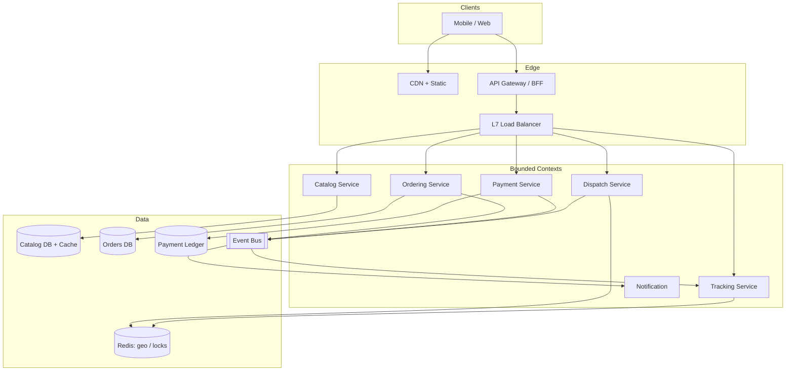
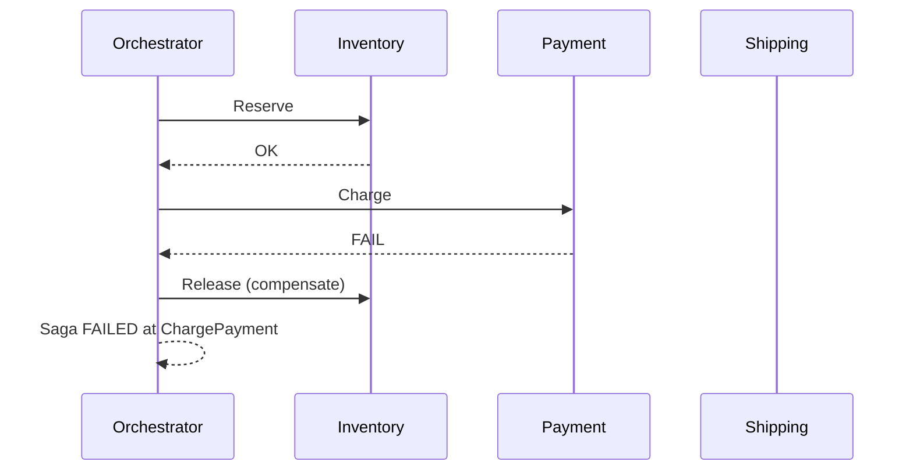
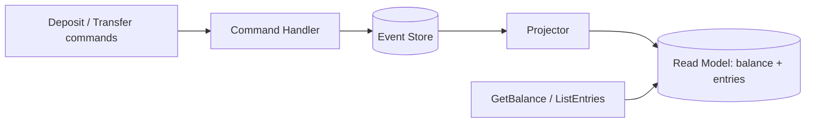

# LAB — Expert: Clean Architecture, DDD, CQRS/ES, Saga, System Design & Resilience

> Labs ระดับ **Senior / Staff System Design Interview** — จับเวลา 60–90 นาทีต่อข้อ
> โครงสร้างแต่ละ lab: **โจทย์ → Functional/NFR → วิธีคิด (trade-offs) → โครงสร้างระบบ → โค้ดเฉลย → Interview follow-ups**

ทำโดยไม่ดูเฉลยก่อน แล้วเทียบกับแนวคิดใน [`README.md`](./README.md) และโค้ดใน `src/`

---

## สารบัญ

1. [Lab 1 — Design Food Delivery Platform](#lab-1--design-food-delivery-platform)
2. [Lab 2 — Implement Checkout Saga](#lab-2--implement-checkout-saga)
3. [Lab 3 — CQRS + Event Sourced Wallet](#lab-3--cqrs--event-sourced-wallet)
4. [Lab 4 — Resilience Hardening](#lab-4--resilience-hardening)

---

## Lab 1 — Design Food Delivery Platform

### โจทย์

ออกแบบ platform **FoodFlash** ที่รองรับ:

- ผู้ใช้สั่งอาหารจากร้าน → rider รับของ → ส่งถึงบ้าน
- เป้า: **10 ล้านออเดอร์/วัน**, peak เที่ยง/เย็น ≈ 10× average
- ตลาด: หลายเมืองใน SEA, multi-currency, multi-language
- Real-time tracking ของ rider (update ตำแหน่งทุก 3–5 วินาทีตอนกำลังส่ง)

คุณเป็น Staff Engineer ที่ต้องนำเสนอ architecture บน whiteboard ใน 45 นาที

### Functional / Non-functional Requirements

| ประเภท        | รายการ                                                                                |
| ------------- | ------------------------------------------------------------------------------------- |
| Functional    | ลงทะเบียนร้าน/เมนู, ค้นหาร้าน, สั่งอาหาร, จ่ายเงิน, assign rider, track สถานะ, rating |
| Availability  | Checkout/Payment path ≥ 99.9%; Catalog browse สามารถ degrade ได้                      |
| Latency       | Search ร้าน p99 < 200ms; Place order p99 < 500ms (ไม่รวม payment gateway)             |
| Consistency   | สต็อกเมนูและสถานะออเดอร์ต้องไม่ oversell; wallet/payment ต้องไม่ double-charge        |
| Scalability   | Horizontal scale ตามเมือง/ภูมิภาค; ไม่มี single DB ใหญ่ทั้งโลก                        |
| Observability | Trace ข้าม service ได้ด้วย `orderId` / `correlationId`                                |

### วิธีคิด (Trade-offs)

1. **แบ่ง Bounded Context ตาม DDD** ไม่แบ่งตาม “หน้าจอ” หรือ “ตาราง DB”

- `Catalog` (ร้าน/เมนู) — read-heavy → cache ได้เข้ม
- `Ordering` — write path สำคัญ, เป็น aggregate หลักของออเดอร์
- `Payment` — strong consistency / idempotency
- `Dispatch` (rider matching) — latency-sensitive, อาจยอม eventual
- `Tracking` — high write (GPS), แยก store (Redis/Time-series)
- `Identity` / `Notification` — supporting contexts

2. **CAP เลือกตาม path**

- Payment / debit inventory ของเมนู limited: เอียง **CP** (หรืออย่างน้อย linearizable ต่อ resource)
- Catalog browse / rider map: เอียง **AP** + stale-ok
- Tracking: AP + last-write-wins ตาม timestamp

3. **ห้ามเริ่มด้วย “microservices ทุกอย่าง”** — เริ่มจาก modular monolith ตาม context แล้วแยกเมื่อมี scaling/team boundary จริง

4. **Caching**: Cache-aside สำหรับ catalog; ไม่ cache “ยอดคงเหลือสต็อกแบบ authoritative” ใน edge โดยไม่มี TTL/invalidation ที่ชัด

5. **HA**: Multi-AZ ต่อ region, active-active อ่าน catalog, active-passive หรือ region-affinity สำหรับ ordering ตามเมือง

### โครงสร้างระบบ



**C4-ish container sketch (ข้อความ):**

- BFF รวม auth + aggregate read สำหรับหน้าแรก
- Ordering รับ `PlaceOrder` → publish `OrderPlaced`
- Payment consume / sync call ตาม saga (Lab 2)
- Dispatch subscribe `OrderPaid` → assign rider → `RiderAssigned`
- Tracking รับ GPS จาก rider app เขียน Redis GEO + fan-out WebSocket/SSE

**Data model (ย่อ):**

```
Order { id, customerId, restaurantId, items[], status, total, cityId, createdAt }
OrderItem { menuItemId, qty, unitPrice }
MenuItem { id, restaurantId, name, price, availableQty? } // หรือ stock ใน Inventory context
RiderLocation { riderId, lat, lng, updatedAt } // hot path ใน Redis
PaymentIntent { id, orderId, amount, status, idempotencyKey }
```

**Failure modes ที่ต้องพูดบน whiteboard:**

| Failure                 | Mitigation                                     |
| ----------------------- | ---------------------------------------------- |
| Payment gateway timeout | Idempotent retry + saga compensation           |
| Catalog cache stampede  | Soft TTL + singleflight / request coalescing   |
| Dispatch ไม่มี rider    | Queue + ETA degrade + notify user              |
| Region partition        | City affinity; ไม่ cross-region sync ออเดอร์สด |
| Tracking spike          | Sample GPS, drop oldest, degrade map refresh   |

### โค้ดเฉลย (ขอบเขต service + port)

ไม่ต้อง implement ทั้ง platform — แสดง **service boundary + port** ที่ Ordering ใช้:

```typescript
/** Ordering context — application ports (Clean Architecture style) */

export interface PlaceOrderCommand {
  readonly customerId: string;
  readonly restaurantId: string;
  readonly cityId: string;
  readonly items: ReadonlyArray<{ menuItemId: string; qty: number }>;
  readonly idempotencyKey: string;
}

export interface OrderRepository {
  save(order: Order): Promise<void>;
  findById(id: string): Promise<Order | null>;
  findByIdempotencyKey(key: string): Promise<Order | null>;
}

export interface CatalogPort {
  getMenuPrices(restaurantId: string, menuItemIds: string[]): Promise<Map<string, number>>;
}

export interface PaymentPort {
  authorize(input: {
    orderId: string;
    amount: number;
    currency: string;
    idempotencyKey: string;
  }): Promise<{ paymentId: string; status: 'authorized' | 'failed' }>;
}

export interface DomainEventPublisher {
  publish(event: { type: string; payload: unknown; correlationId: string }): Promise<void>;
}

export type OrderStatus = 'pending' | 'paid' | 'dispatching' | 'delivered' | 'cancelled';

export interface Order {
  id: string;
  customerId: string;
  restaurantId: string;
  cityId: string;
  items: Array<{ menuItemId: string; qty: number; unitPrice: number }>;
  total: number;
  status: OrderStatus;
  idempotencyKey: string;
}

export class PlaceOrderUseCase {
  constructor(
    private readonly orders: OrderRepository,
    private readonly catalog: CatalogPort,
    private readonly payments: PaymentPort,
    private readonly events: DomainEventPublisher,
  ) {}

  async execute(cmd: PlaceOrderCommand): Promise<Order> {
    const existing = await this.orders.findByIdempotencyKey(cmd.idempotencyKey);
    if (existing) return existing;

    const ids = cmd.items.map((i) => i.menuItemId);
    const prices = await this.catalog.getMenuPrices(cmd.restaurantId, ids);

    const lines = cmd.items.map((i) => {
      const unitPrice = prices.get(i.menuItemId);
      if (unitPrice === undefined) throw new Error(`Unknown menu item ${i.menuItemId}`);
      return { ...i, unitPrice };
    });
    const total = lines.reduce((s, l) => s + l.unitPrice * l.qty, 0);

    const order: Order = {
      id: crypto.randomUUID(),
      customerId: cmd.customerId,
      restaurantId: cmd.restaurantId,
      cityId: cmd.cityId,
      items: lines,
      total,
      status: 'pending',
      idempotencyKey: cmd.idempotencyKey,
    };

    await this.orders.save(order);

    const pay = await this.payments.authorize({
      orderId: order.id,
      amount: total,
      currency: 'THB',
      idempotencyKey: `pay:${cmd.idempotencyKey}`,
    });

    if (pay.status !== 'authorized') {
      order.status = 'cancelled';
      await this.orders.save(order);
      throw new Error('Payment authorization failed');
    }

    order.status = 'paid';
    await this.orders.save(order);
    await this.events.publish({
      type: 'OrderPaid',
      payload: { orderId: order.id, cityId: order.cityId },
      correlationId: order.id,
    });

    return order;
  }
}
```

> ใน production จริง payment + inventory มักอยู่ใน **Saga** (Lab 2) ไม่ใช่ inline ใน use case เดียวแบบด้านบน — ใช้แบบสั้นนี้เพื่อสื่อ dependency rule และ idempotency บน whiteboard

### Interview follow-ups

- ทำไมไม่ใช้ DB เดียวทั้งบริษัท? → blast radius, team autonomy, scaling ต่าง profile
- Search ร้านใช้อะไร? → Elasticsearch/OpenSearch + CDC จาก Catalog; ไม่ query OLTP ตรง
- GPS ทุก 3 วินาทีที่ 100k riders พร้อมกันทำไง? → Redis GEO / Kafka partitioned by city, downsample
- CAP ของ “เมนูหมด” แก้ยังไง? → soft stock + confirm ตอน kitchen accept; หรือ reserved qty สั้น ๆ

---

## Lab 2 — Implement Checkout Saga

### โจทย์

ระบบ checkout ของ e-commerce ต้องทำ 3 ขั้นตอนข้าม service (แต่ละตัวมี DB ของตัวเอง):

1. **ReserveInventory** — จองสต็อก
2. **ChargePayment** — ตัดบัตร/wallet
3. **CreateShipment** — สร้างใบจัดส่ง

ถ้าขั้นใดล้มเหลว ต้อง **compensate** ขั้นที่สำเร็จไปแล้วให้ถูกต้อง (ไม่ค้างจองสต็อก / ไม่เก็บเงินโดยไม่ส่งของ)

### Functional / Non-functional Requirements

- Orchestration style (มี coordinator ชัดเจน — สอดคล้องกับ `src/saga/`)
- Compensation ต้อง **idempotent**
- รองรับจำลอง failure ที่ขั้น Payment หรือ Shipment
- คืนผลลัพธ์โครงสร้างที่บอกว่าขั้นไหนสำเร็จ/ถูก compensate

### วิธีคิด (Trade-offs)

| ทางเลือก      | ข้อดี                                | ข้อเสีย                                          |
| ------------- | ------------------------------------ | ------------------------------------------------ |
| Orchestration | มอง flow ง่าย, ทดสอบง่าย, audit ง่าย | Coordinator เป็นจุดรวม logic (ต้อง durable)      |
| Choreography  | ลด coupling ตรงกลาง                  | Flow กระจาย, debug ยาก, risk cyclic events       |
| 2PC / XA      | Atomic จริง                          | ไม่ scale, lock นาน, ไม่เหมาะ cloud microservice |

เลือก **Orchestration + compensations** เพราะ checkout มีลำดับชัดและต้องการ observability

**Idempotency:** ทุก downstream API รับ `idempotencyKey` / `sagaId+stepName`
**Durability (production):** persist saga state (`RUNNING`, `COMPENSATING`, `COMPLETED`, `FAILED`) ใน DB ของ orchestrator หรือใช้ Temporal/Cadence — ใน lab นี้เก็บ in-memory เพื่อโฟกัส logic

### โครงสร้างระบบ

```
CheckoutOrchestrator
 ├─ step: ReserveInventory compensate: ReleaseInventory
 ├─ step: ChargePayment  compensate: RefundPayment
 └─ step: CreateShipment  compensate: CancelShipment
```



### โค้ดเฉลย

สามารถเทียบกับ `src/saga/saga.ts` + `src/saga/index.ts` — ด้านล่างเป็นเฉลยที่ครบสำหรับ interview (copy ไปรันใน `src/saga/` ได้)

```typescript
// checkout-saga-lab.ts
export interface SagaStep<TContext> {
  readonly name: string;
  execute(ctx: TContext): Promise<void>;
  compensate(ctx: TContext): Promise<void>;
}

export interface SagaResult {
  success: boolean;
  failedStep?: string;
  failureReason?: string;
  outcomes: Array<{ step: string; status: 'completed' | 'compensated' }>;
}

export class SagaOrchestrator<TContext> {
  constructor(private readonly steps: SagaStep<TContext>[]) {}

  async run(ctx: TContext): Promise<SagaResult> {
    const completed: SagaStep<TContext>[] = [];
    const outcomes: SagaResult['outcomes'] = [];

    for (const step of this.steps) {
      try {
        await step.execute(ctx);
        completed.push(step);
        outcomes.push({ step: step.name, status: 'completed' });
      } catch (err) {
        const failureReason = err instanceof Error ? err.message : String(err);
        for (const done of [...completed].reverse()) {
          await done.compensate(ctx);
          outcomes.push({ step: done.name, status: 'compensated' });
        }
        return { success: false, failedStep: step.name, failureReason, outcomes };
      }
    }
    return { success: true, outcomes };
  }
}

export interface CheckoutContext {
  sagaId: string;
  orderId: string;
  sku: string;
  qty: number;
  amount: number;
  /** simulation knobs */
  failAt?: 'payment' | 'shipment';
  reservationId?: string;
  paymentId?: string;
  shipmentId?: string;
  log: string[];
}

const reserveInventory: SagaStep<CheckoutContext> = {
  name: 'ReserveInventory',
  async execute(ctx) {
    ctx.reservationId = `res-${ctx.sagaId}`;
    ctx.log.push(`Reserved ${ctx.qty} of ${ctx.sku} (${ctx.reservationId})`);
  },
  async compensate(ctx) {
    if (!ctx.reservationId) return; // idempotent no-op
    ctx.log.push(`Released reservation ${ctx.reservationId}`);
    ctx.reservationId = undefined;
  },
};

const chargePayment: SagaStep<CheckoutContext> = {
  name: 'ChargePayment',
  async execute(ctx) {
    if (ctx.failAt === 'payment') throw new Error('Payment declined');
    ctx.paymentId = `pay-${ctx.sagaId}`;
    ctx.log.push(`Charged ${ctx.amount} (${ctx.paymentId})`);
  },
  async compensate(ctx) {
    if (!ctx.paymentId) return;
    ctx.log.push(`Refunded ${ctx.paymentId}`);
    ctx.paymentId = undefined;
  },
};

const createShipment: SagaStep<CheckoutContext> = {
  name: 'CreateShipment',
  async execute(ctx) {
    if (ctx.failAt === 'shipment') throw new Error('Carrier unavailable');
    ctx.shipmentId = `ship-${ctx.sagaId}`;
    ctx.log.push(`Shipment created ${ctx.shipmentId}`);
  },
  async compensate(ctx) {
    if (!ctx.shipmentId) return;
    ctx.log.push(`Shipment cancelled ${ctx.shipmentId}`);
    ctx.shipmentId = undefined;
  },
};

export async function runCheckoutDemo() {
  const orchestrator = new SagaOrchestrator<CheckoutContext>([
    reserveInventory,
    chargePayment,
    createShipment,
  ]);

  const okCtx: CheckoutContext = {
    sagaId: 'S1',
    orderId: 'O1',
    sku: 'SKU-1',
    qty: 2,
    amount: 1200,
    log: [],
  };
  console.log('=== success ===', await orchestrator.run(okCtx), okCtx.log);

  const failCtx: CheckoutContext = {
    sagaId: 'S2',
    orderId: 'O2',
    sku: 'SKU-1',
    qty: 1,
    amount: 500,
    failAt: 'payment',
    log: [],
  };
  console.log('=== payment fail ===', await orchestrator.run(failCtx), failCtx.log);
}

runCheckoutDemo();
```

### Interview follow-ups

- Compensation ล้มเหลวเองทำไง? → retry + dead-letter + manual ops queue; compensation ต้อง idempotent
- จะทำ saga ให้ survive process crash ยังไง? → persist step cursor + outbox
- ต่างจาก Process Manager / Workflow engine ยังไง? → concept เดียวกันในระดับสูงกว่า (Temporal = durable orchestrator)
- ทำไมไม่ใช้ distributed transaction? → latency, availability, vendor lock, ไม่เข้ากับ polyglot persistence

---

## Lab 3 — CQRS + Event Sourced Wallet

### โจทย์

ออกแบบ **Digital Wallet** ที่ต้อง:

- ฝากเงิน / โอนออก / รับโอน
- Audit trail ครบทุกบาท (compliance)
- หน้า UI แสดงยอดคงเหลือและประวัติเร็ว
- ห้ามติดลบ (invariant)

### Functional / Non-functional Requirements

|             |                                                                   |
| ----------- | ----------------------------------------------------------------- |
| Write model | Event-sourced ledger (`WalletCredited`, `WalletDebited`, …)       |
| Read model  | Projection ยอดคงเหลือ + feed รายการล่าสุด                         |
| Consistency | Write: strong per wallet aggregate; Read: eventual ยอมได้เล็กน้อย |
| Idempotency | `commandId` กัน double spend จาก retry                            |
| Scale       | Partition ตาม `walletId`                                          |

### วิธีคิด (Trade-offs)

**เมื่อไหร่ควรใช้ Event Sourcing**

- ต้องการ audit/time-travel จริง
- business มี domain events เป็นภาษาหลัก
- อ่าน/เขียน asymmetric (เขียนน้อยแต่ต้องถูกต้อง, อ่านเยอะหลาย shape)

**เมื่อไหร่ไม่ควรใช้**

- CRUD ธรรมดาไม่มี audit requirement
- ทีมยังไม่มี operational maturity (replay, versioning, snapshot)
- ต้องการ query ad-hoc ซับซ้อนบน write model โดยตรง

**CQRS ที่นี่:** Command path ไม่คืน list ประวัติยาว — query อ่านจาก projection

### โครงสร้างระบบ

```
Command API → Command Handler → Event Store (append-only)
          │
          ▼
        Projector(s) → Read DB / Cache
          │
        Query API ←——————┘
```



### โค้ดเฉลย

```typescript
// wallet-es-lab.ts
type WalletEvent =
  | { type: 'WalletOpened'; walletId: string; ownerId: string; at: string }
  | {
      type: 'WalletCredited';
      walletId: string;
      amount: number;
      commandId: string;
      reason: string;
      at: string;
    }
  | {
      type: 'WalletDebited';
      walletId: string;
      amount: number;
      commandId: string;
      reason: string;
      at: string;
    };

interface StoredEvent {
  streamId: string;
  version: number;
  event: WalletEvent;
}

class InMemoryEventStore {
  private readonly streams = new Map<string, StoredEvent[]>();

  append(streamId: string, expectedVersion: number, events: WalletEvent[]): void {
    const current = this.streams.get(streamId) ?? [];
    if (current.length !== expectedVersion) {
      throw new Error(`Concurrency conflict on ${streamId}`);
    }
    const next = [...current];
    for (const event of events) {
      next.push({ streamId, version: next.length + 1, event });
    }
    this.streams.set(streamId, next);
  }

  load(streamId: string): StoredEvent[] {
    return this.streams.get(streamId) ?? [];
  }

  loadAll(): StoredEvent[] {
    return [...this.streams.values()].flat().sort((a, b) => a.version - b.version);
  }
}

/** Aggregate reconstitutes from events — source of truth for invariants */
class WalletAggregate {
  walletId = '';
  balance = 0;
  version = 0;
  private seenCommands = new Set<string>();
  private pending: WalletEvent[] = [];

  static open(walletId: string, ownerId: string): WalletAggregate {
    const w = new WalletAggregate();
    w.apply({ type: 'WalletOpened', walletId, ownerId, at: new Date().toISOString() });
    return w;
  }

  static rehydrate(events: WalletEvent[]): WalletAggregate {
    const w = new WalletAggregate();
    for (const e of events) w.mutate(e);
    w.version = events.length;
    return w;
  }

  credit(amount: number, commandId: string, reason: string): void {
    if (amount <= 0) throw new Error('amount must be positive');
    if (this.seenCommands.has(commandId)) return; // idempotent
    this.apply({
      type: 'WalletCredited',
      walletId: this.walletId,
      amount,
      commandId,
      reason,
      at: new Date().toISOString(),
    });
  }

  debit(amount: number, commandId: string, reason: string): void {
    if (amount <= 0) throw new Error('amount must be positive');
    if (this.seenCommands.has(commandId)) return;
    if (this.balance < amount) throw new Error('insufficient funds');
    this.apply({
      type: 'WalletDebited',
      walletId: this.walletId,
      amount,
      commandId,
      reason,
      at: new Date().toISOString(),
    });
  }

  pullPending(): WalletEvent[] {
    const out = [...this.pending];
    this.pending = [];
    return out;
  }

  private apply(event: WalletEvent): void {
    this.mutate(event);
    this.pending.push(event);
    this.version += 1;
  }

  private mutate(event: WalletEvent): void {
    switch (event.type) {
      case 'WalletOpened':
        this.walletId = event.walletId;
        break;
      case 'WalletCredited':
        this.balance += event.amount;
        this.seenCommands.add(event.commandId);
        break;
      case 'WalletDebited':
        this.balance -= event.amount;
        this.seenCommands.add(event.commandId);
        break;
    }
  }
}

interface WalletReadModel {
  balance: number;
  entries: Array<{ at: string; amount: number; direction: 'in' | 'out'; reason: string }>;
}

class WalletProjector {
  private readonly views = new Map<string, WalletReadModel>();

  project(event: WalletEvent): void {
    if (event.type === 'WalletOpened') {
      this.views.set(event.walletId, { balance: 0, entries: [] });
      return;
    }
    const view = this.views.get(event.walletId);
    if (!view) throw new Error('projection missing wallet');
    if (event.type === 'WalletCredited') {
      view.balance += event.amount;
      view.entries.unshift({
        at: event.at,
        amount: event.amount,
        direction: 'in',
        reason: event.reason,
      });
    } else if (event.type === 'WalletDebited') {
      view.balance -= event.amount;
      view.entries.unshift({
        at: event.at,
        amount: event.amount,
        direction: 'out',
        reason: event.reason,
      });
    }
  }

  get(walletId: string): WalletReadModel | undefined {
    return this.views.get(walletId);
  }
}

class WalletCommandHandler {
  constructor(
    private readonly store: InMemoryEventStore,
    private readonly projector: WalletProjector,
  ) {}

  open(walletId: string, ownerId: string): void {
    const agg = WalletAggregate.open(walletId, ownerId);
    this.persist(agg);
  }

  deposit(walletId: string, amount: number, commandId: string): void {
    const agg = this.load(walletId);
    agg.credit(amount, commandId, 'deposit');
    this.persist(agg);
  }

  withdraw(walletId: string, amount: number, commandId: string): void {
    const agg = this.load(walletId);
    agg.debit(amount, commandId, 'withdraw');
    this.persist(agg);
  }

  private load(walletId: string): WalletAggregate {
    const recorded = this.store.load(walletId).map((s) => s.event);
    if (recorded.length === 0) throw new Error('wallet not found');
    return WalletAggregate.rehydrate(recorded);
  }

  private persist(agg: WalletAggregate): void {
    const pending = agg.pullPending();
    const expected = agg.version - pending.length;
    this.store.append(agg.walletId, expected, pending);
    for (const e of pending) this.projector.project(e);
  }
}

// demo
const store = new InMemoryEventStore();
const projector = new WalletProjector();
const handler = new WalletCommandHandler(store, projector);

handler.open('W1', 'user-1');
handler.deposit('W1', 1000, 'cmd-1');
handler.deposit('W1', 1000, 'cmd-1'); // retry — idempotent
handler.withdraw('W1', 250, 'cmd-2');
console.log('read model', projector.get('W1'));
console.log('event count', store.load('W1').length);
```

### Interview follow-ups

- Snapshot จำเป็นเมื่อไหร่? → stream ยาวมาก (หมื่น+ events ต่อ aggregate)
- แก้ event schema เก่าอย่างไร? → upcasters / weak schema / version field
- Transfer ระหว่าง 2 wallet? → saga ข้าม 2 aggregates หรือ process manager; อย่าทำ 2 aggregate ใน transaction เดียวแบบซ่อน
- ทำไม read model ถึงช้ากว่า write? → async projection; ถ้าต้องการ read-your-writes ให้ sync project ใน process เดียวหรือรอ version

---

## Lab 4 — Resilience Hardening

### โจทย์

มี call graph ระหว่าง services ที่ “คุยกันบ่อยและเปราะ”:

```
Checkout → Pricing → TaxService
   ↘ Inventory
   ↘ PaymentGateway (ภายนอก)
   ↘ Recommendation (nice-to-have)
```

อาการปัจจุบัน: เมื่อ `TaxService` หรือ `PaymentGateway` ช้า/ล่ม → thread pool ของ Checkout หมด → ทั้งเว็บล่ม (cascading failure)

จงออกแบบและ implement ชั้น resilience

### Functional / Non-functional Requirements

- **Circuit Breaker** รอบ dependency ที่ไม่เสถียร
- **Bulkhead** แยก concurrency limit ต่อ dependency
- **Rate Limiter** กัน spiky traffic เข้า Payment
- **Graceful Degradation** สำหรับ Recommendation และ (ถ้าจำเป็น) Tax ประมาณการ

### วิธีคิด (Trade-offs)

```
ก่อน: Checkout ──sync──▶ Tax ──▶ (ช้า) ──▶ Checkout threads หมด ──▶ 5xx ทั้งระบบ
หลัง: Checkout ──bulkhead+CB──▶ Tax
    ──bulkhead+RL+CB──▶ Payment
    ──CB+fallback────▶ Recommendation (คืน empty)
    ──fallback───────▶ Tax estimate ถ้า OPEN
```

อย่าใส่ทุก pattern ทุก call — ใส่ตาม **criticality**:

| Dependency     | Critical? | Pattern                                                              |
| -------------- | --------- | -------------------------------------------------------------------- |
| Payment        | ใช่       | Bulkhead + CB + Rate limit + ไม่มี silent fallback ที่ “แกล้งสำเร็จ” |
| Tax            | เกือบใช่  | CB + timeout + degrade เป็น estimate พร้อม flag                      |
| Recommendation | ไม่       | CB + fallback ค่าว่าง / cache เก่า                                   |
| Inventory      | ใช่       | Bulkhead + CB; fail order ถ้าจองไม่ได้                               |

### โครงสร้างระบบ

เทียบกับโค้ดใน `src/resilience/`:

```
createResilientCaller(name)
 ├─ RateLimiter (optional)
 ├─ Bulkhead (max concurrent + queue)
 ├─ CircuitBreaker (closed → open → half-open)
 └─ GracefulDegradation / fallback
```

### โค้ดเฉลย

```typescript
// resilience-lab.ts
type CircuitState = 'closed' | 'open' | 'half_open';

class CircuitBreaker {
  private state: CircuitState = 'closed';
  private failures = 0;
  private openedAt = 0;

  constructor(
    private readonly failureThreshold: number,
    private readonly resetMs: number,
  ) {}

  async exec<T>(fn: () => Promise<T>): Promise<T> {
    if (this.state === 'open') {
      if (Date.now() - this.openedAt >= this.resetMs) this.state = 'half_open';
      else throw new Error('circuit open');
    }
    try {
      const result = await fn();
      this.failures = 0;
      this.state = 'closed';
      return result;
    } catch (e) {
      this.failures += 1;
      if (this.failures >= this.failureThreshold || this.state === 'half_open') {
        this.state = 'open';
        this.openedAt = Date.now();
      }
      throw e;
    }
  }
}

class Bulkhead {
  private active = 0;
  constructor(private readonly maxConcurrent: number) {}

  async exec<T>(fn: () => Promise<T>): Promise<T> {
    if (this.active >= this.maxConcurrent) throw new Error('bulkhead full');
    this.active += 1;
    try {
      return await fn();
    } finally {
      this.active -= 1;
    }
  }
}

class RateLimiter {
  private tokens: number;
  private last = Date.now();
  constructor(
    private readonly capacity: number,
    private readonly refillPerSec: number,
  ) {
    this.tokens = capacity;
  }

  async exec<T>(fn: () => Promise<T>): Promise<T> {
    this.refill();
    if (this.tokens < 1) throw new Error('rate limited');
    this.tokens -= 1;
    return fn();
  }

  private refill() {
    const now = Date.now();
    const add = ((now - this.last) / 1000) * this.refillPerSec;
    this.tokens = Math.min(this.capacity, this.tokens + add);
    this.last = now;
  }
}

async function withFallback<T>(primary: () => Promise<T>, fallback: () => Promise<T>): Promise<T> {
  try {
    return await primary();
  } catch {
    return fallback();
  }
}

// Flaky dependencies
let taxFails = 0;
async function taxService(amount: number): Promise<number> {
  taxFails += 1;
  if (taxFails <= 3) throw new Error('tax timeout');
  return Math.round(amount * 0.07);
}

async function recommendation(_userId: string): Promise<string[]> {
  throw new Error('rec down');
}

async function paymentGateway(amount: number): Promise<'ok'> {
  return amount > 0 ? 'ok' : Promise.reject(new Error('bad amount'));
}

const taxCB = new CircuitBreaker(2, 2_000);
const taxBH = new Bulkhead(5);
const payRL = new RateLimiter(5, 5);
const payBH = new Bulkhead(3);
const payCB = new CircuitBreaker(3, 5_000);
const recCB = new CircuitBreaker(1, 10_000);

export async function checkout(userId: string, amount: number) {
  const tax = await withFallback(
    () => taxBH.exec(() => taxCB.exec(() => taxService(amount))),
    async () => {
      console.log('degraded: using tax estimate');
      return Math.round(amount * 0.07);
    },
  );

  const recs = await withFallback(
    () => recCB.exec(() => recommendation(userId)),
    async () => [],
  );

  const pay = await payRL.exec(() =>
    payBH.exec(() => payCB.exec(() => paymentGateway(amount + tax))),
  );

  return { tax, recs, pay, total: amount + tax };
}

// demo
(async () => {
  for (let i = 0; i < 5; i++) {
    try {
      console.log(await checkout('u1', 1000));
    } catch (e) {
      console.log('checkout failed', e);
    }
  }
})();
```

### Interview follow-ups

- Timeout ควรอยู่ที่ไหน? → ทุก outbound call; CB alone ไม่พอถ้า hang ไม่ throw
- Retry ใส่ตอนไหน? → เฉพาะ idempotent + budget จำกัด; ไม่ retry บน CB open
- Bulkhead vs thread pool isolation ใน Java/Go ต่างกันยังไง? → concept เดียวกัน: จำกัด blast radius ของ concurrency
- Graceful degradation ที่ payment ได้ไหม? → โดยทั่วไป **ไม่ได้** (อย่าบอกว่าจ่ายสำเร็จถ้ายังไม่ยืนยัน)

---

## เช็คลิสต์ก่อนจบ Expert Level

- [ ] อธิบาย Dependency Rule ของ Clean Architecture ได้โดยไม่ง้อสไลด์
- [ ] วาด Bounded Context ของ domain ที่คุ้นเคยได้อย่างน้อย 4 contexts
- [ ] บอกได้ว่าเมื่อไหร่ CQRS/ES “แพงเกินคุ้ม”
- [ ] เขียน Saga orchestration + compensation ได้จากศูนย์
- [ ] เลือก CAP/consistency ต่อ API path ได้เป็นตาราง
- [ ] วาง Circuit Breaker / Bulkhead / Fallback บน call graph จริงของทีมคุณได้

เมื่อครบแล้ว ลองเอา Lab 1 ไปซ้อม whiteboard กับเพื่อน tech lead — สุ่ม follow-up จากท้ายแต่ละ lab
