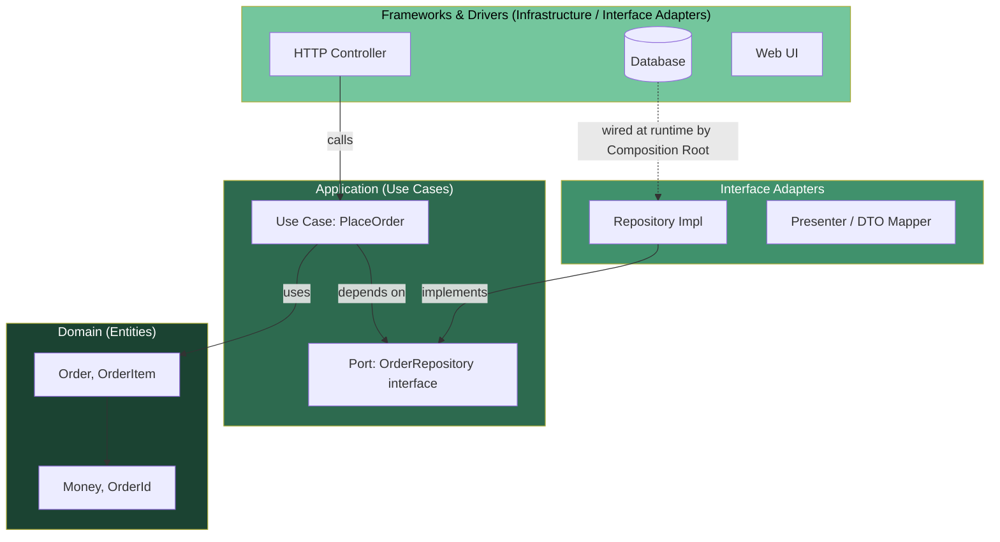
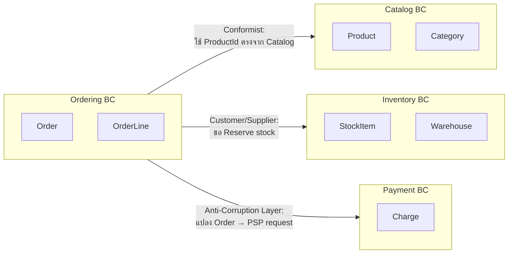
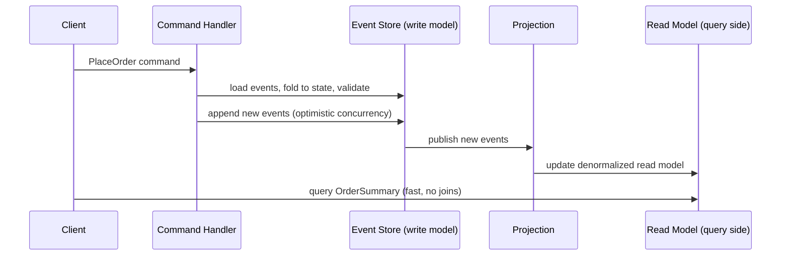
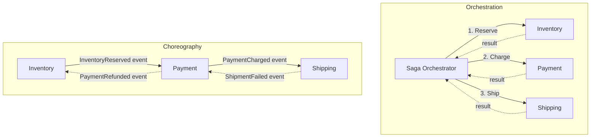
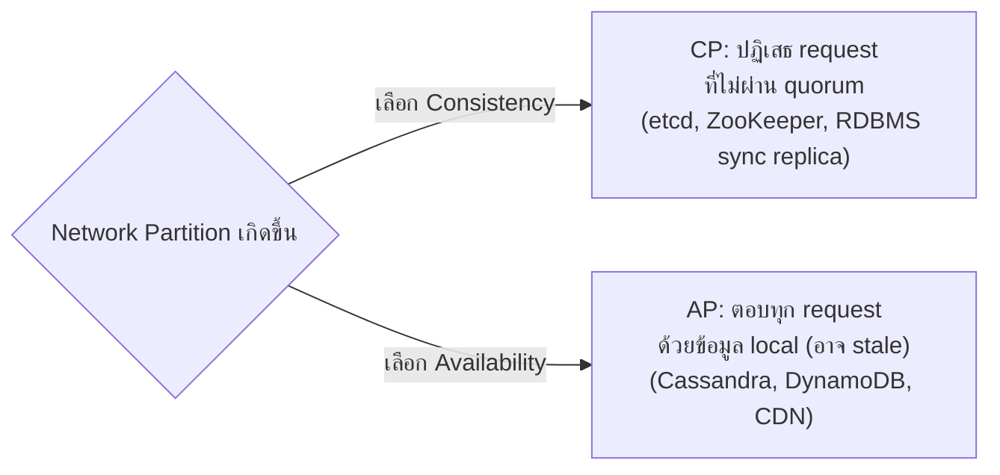
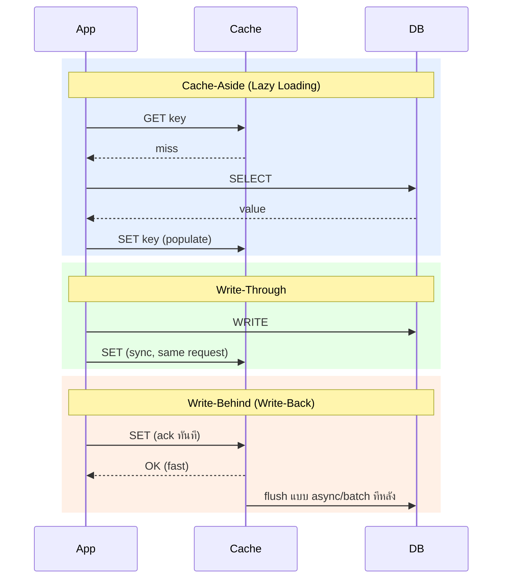
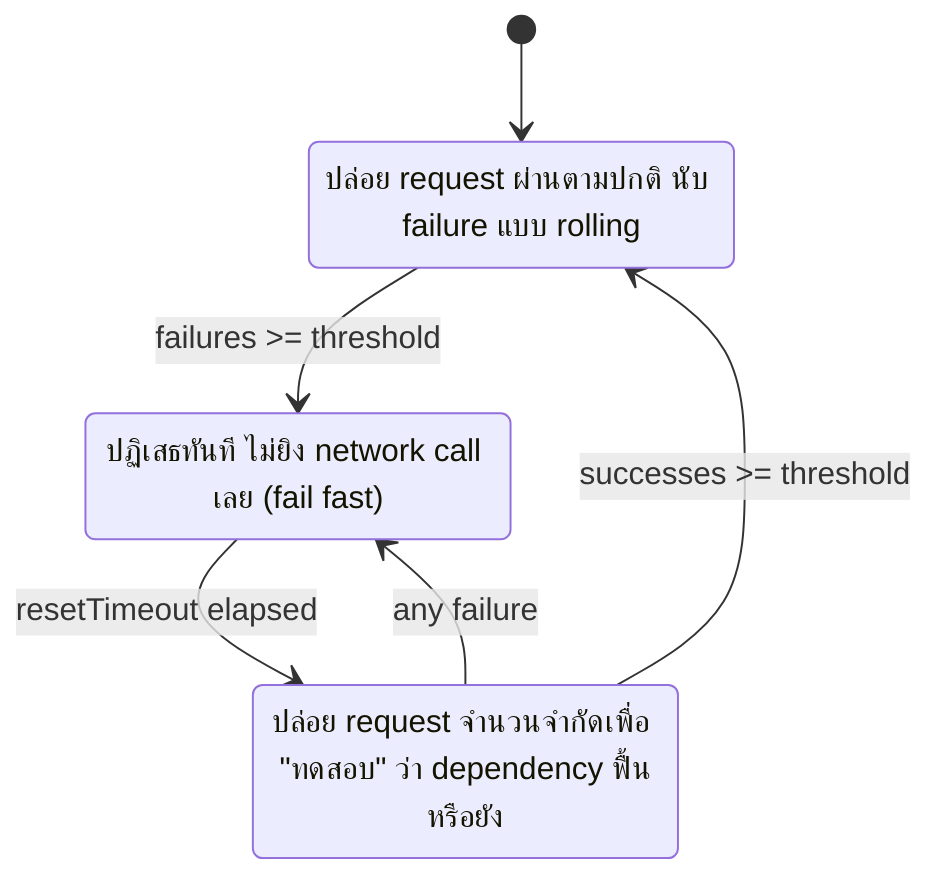
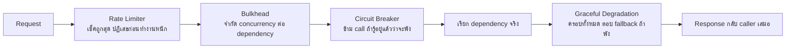

# Level 3 — Expert: Clean Architecture, DDD, CQRS/ES, Saga, System Design, Resilience

เนื้อหาระดับ **Senior / Staff Engineer** — เน้นการ**ตัดสินใจ** (trade-off) มากกว่าการจำนิยาม เพราะในงานจริงและใน System Design Interview สิ่งที่แยก senior ออกจาก mid-level คือ "รู้ว่าทำไมไม่ใช้" ไม่ใช่แค่ "รู้ว่าเป็นอะไร"

> ก่อนเริ่ม แนะนำให้ทวนเนื้อหา [`01-beginner`](../01-beginner/) (SOLID, Creational) และ [`02-intermediate`](../02-intermediate/) (Structural/Behavioral, Hexagonal) เพราะ Clean Architecture และ DDD ในบทนี้สร้างต่อจากแนวคิด Hexagonal/Ports & Adapters โดยตรง

## สารบัญ

1. [Clean Architecture](#1-clean-architecture)
2. [Domain-Driven Design (DDD)](#2-domain-driven-design-ddd)
3. [CQRS + Event Sourcing](#3-cqrs--event-sourcing)
4. [Saga Pattern](#4-saga-pattern)
5. [System Design Fundamentals](#5-system-design-fundamentals)
6. [Resilience Patterns](#6-resilience-patterns)
7. [Decision Framework สำหรับ Tech Lead](#7-decision-framework-สำหรับ-tech-lead)
8. [แผนผังรวมของโค้ดตัวอย่าง](#8-แผนผังรวมของโค้ดตัวอย่าง)
9. [วิธีรันตัวอย่างโค้ด](#9-วิธีรันตัวอย่างโค้ด)
10. [อ่านต่อ](#10-อ่านต่อ)

---

## 1. Clean Architecture

Robert C. Martin (Uncle Bob) เสนอ Clean Architecture เพื่อตอบคำถามเดียว: **"ทำอย่างไรให้ business logic ไม่ผูกกับกรอบเทคโนโลยี (framework, database, UI) ที่เปลี่ยนบ่อยกว่ากฎธุรกิจ"**

### 1.1 The Dependency Rule

> Source code dependencies **ต้องชี้เข้าด้านใน (inward) เท่านั้น** ไม่มีอะไรใน circle ชั้นในรู้จักอะไรเลยใน circle ชั้นนอก



จุดสำคัญที่คนมักเข้าใจผิด: **control flow กับ source-code dependency เป็นคนละเรื่อง**

- **Control flow ตอน runtime**: HTTP → Use Case → Repository (Infra) → Database — ไหลจากนอกเข้าใน
- **Source-code dependency**: Use Case รู้จักแค่ `interface OrderRepository` (port) ที่ตัวมันประกาศเอง ไม่รู้จัก `InMemoryOrderRepository`/`PostgresOrderRepository` เลย — Infra ถึงจะเป็นฝ่าย `implements` interface ของ Application

เทคนิคที่ทำให้ dependency ชี้กลับทางได้คือ **Dependency Inversion Principle**: ประกาศ interface (port) ไว้ที่ชั้นใน แล้วให้ชั้นนอก implement — ไม่ใช่ให้ชั้นในเรียก `import` ชั้นนอกตรง ๆ

### 1.2 4 Layers (มาตรฐานของ Uncle Bob)

| Layer                    | หน้าที่                                                                            | ตัวอย่างในโค้ด (`src/clean-architecture/`)      |
| ------------------------ | ---------------------------------------------------------------------------------- | ----------------------------------------------- |
| **Entities**             | Enterprise business rules — invariant ที่ "ถูกทุกที่ทุกแอป"                        | `domain/entities.ts`, `domain/value-objects.ts` |
| **Use Cases**            | Application-specific business rules — orchestrate entities เพื่อบรรลุ intent เดียว | `application/place-order.ts`                    |
| **Interface Adapters**   | แปลงข้อมูลเข้า/ออกระหว่าง use case กับโลกภายนอก (Controller, Presenter)            | `interface/http-handler.ts`                     |
| **Frameworks & Drivers** | DB driver, web framework, UI — รายละเอียดที่ "เปลี่ยนบ่อยที่สุด"                   | `infrastructure/in-memory-order-repo.ts`        |

### 1.3 Use Case คืออะไร

Use Case = "การกระทำหนึ่งอย่างที่ระบบทำให้ actor หนึ่งคนสำเร็จ" เช่น `PlaceOrder`, `CancelOrder`, `RefundPayment` — **ไม่ใช่** CRUD method (`createOrder`, `updateOrder`, `getOrder`) เพราะ CRUD generic เกินไปจนไม่สื่อความหมายทางธุรกิจ

กฎการเขียน Use Case ที่ดี:

1. รับ **input DTO ธรรมดา** (primitive/plain object) ไม่รับ framework request object (`Express.Request`) ตรงเข้ามา — ไม่งั้น Use Case จะผูกกับ Express
2. คืนค่าเป็น **output DTO** ธรรมดา ไม่คืน HTTP status code หรือ entity ดิบให้ controller ไปเดายังไงต่อ
3. รู้จัก dependency ภายนอกผ่าน **interface (port)** เท่านั้น (`OrderRepository`) ไม่ import class infra ตรง ๆ
4. ไม่มี business rule ของตัวเอง — rule จริงอยู่ใน Entity เสมอ (`Order.place()` เช็ค invariant, Use Case แค่เรียกมัน)

ดูตัวอย่างจริงได้ที่ `src/clean-architecture/application/place-order.ts` — `PlaceOrderUseCase` ไม่รู้จัก HTTP หรือ database เลย รู้จักแค่ `Order`, `OrderItem` (entities) กับ `OrderRepository` (port ของตัวเอง)

### 1.4 เมื่อไหร่ควร / ไม่ควรใช้

| ใช้เมื่อ                                                                           | อย่าใช้เมื่อ                                                |
| ---------------------------------------------------------------------------------- | ----------------------------------------------------------- |
| Business logic ซับซ้อน จะอยู่นานหลายปี                                             | CRUD ธรรมดา, prototype, MVP ที่ยังไม่รู้ product-market fit |
| คาดว่าจะเปลี่ยน framework/DB ระหว่างทาง (เช่น ต้อง support ทั้ง REST และ gRPC)     | ทีมเล็ก 1-2 คน ที่ over-engineering จะช้ากว่าคุ้ม           |
| ต้องการเทส business logic โดยไม่ต้อง spin up DB/HTTP server                        | Domain simple มาก (เช่น ระบบ config เก็บ key-value)         |
| หลาย bounded context ใช้ domain เดียวกันแต่ interface ต่างกัน (web, CLI, cron job) | —                                                           |

**Anti-pattern ที่พบบ่อย**: สร้าง 4 layer ครบ แต่ entity เป็นแค่ data bag (getter/setter ล้วน) ไม่มี invariant/behavior เลย — นี่คือ "Clean Architecture เปลือก" ไม่ได้ประโยชน์อะไรจากมันจริง ๆ เพราะแท้จริงคุณกำลังทำ Anemic Domain Model ที่ห่อด้วย layer เยอะขึ้น

---

## 2. Domain-Driven Design (DDD)

DDD แบ่งเป็น 2 ระดับ: **Strategic DDD** (การแบ่งระบบใหญ่ ๆ ให้ถูกที่) และ **Tactical DDD** (การออกแบบโค้ดภายในแต่ละส่วน) — บริษัทจำนวนมากทำ Tactical DDD (Aggregate, Value Object) แต่ลืม Strategic DDD (Bounded Context) แล้วก็งงว่าทำไม microservices ยังคง coupled แน่นเหมือนเดิม

### 2.1 Strategic DDD

**Ubiquitous Language (ภาษากลาง)**: คำศัพท์ที่ domain expert, PM, และ dev ใช้ตรงกันทั้งในการพูดและในโค้ด ถ้า business เรียก "ตะกร้าที่ยังไม่ checkout" ว่า "Cart" โค้ดต้องมี class `Cart` ไม่ใช่ `Basket` หรือ `TempOrder` — ความคลาดเคลื่อนของภาษาคือต้นตอบั๊กเชิง requirement ที่แพงที่สุด

**Bounded Context (BC)**: ขอบเขตที่โมเดล + ภาษาหนึ่งความหมายเดียวมีผล คำว่า "Product" ใน `Catalog` context (มีรูป, คำอธิบาย, หมวดหมู่) กับ "Product" ใน `Inventory` context (มี SKU, จำนวนคงคลัง, ตำแหน่งใน warehouse) คือ**คนละโมเดล**แม้ชื่อคำเดียวกัน — พยายามทำโมเดลเดียว "ครอบจักรวาล" ทั้งสอง context คือสาเหตุอันดับ 1 ที่ domain model บวมจนดูแลไม่ได้



**Context Mapping** — รูปแบบความสัมพันธ์ระหว่าง Bounded Context ที่พบบ่อย:

| Pattern                         | ความหมาย                                                                       | เมื่อไหร่ใช้                                                                                            |
| ------------------------------- | ------------------------------------------------------------------------------ | ------------------------------------------------------------------------------------------------------- |
| **Shared Kernel**               | สอง BC แชร์โมเดลย่อยร่วมกัน (เช่น `Money`, `Address`)                          | ทีมสนิทกัน เปลี่ยนพร้อมกันได้ ความเสี่ยง coupling สูงถ้าทีมห่างกัน                                      |
| **Customer/Supplier**           | downstream (customer) ขึ้นกับ upstream (supplier) แต่ supplier ยอมรับ feedback | ทีมในบริษัทเดียวกัน เจรจากันได้                                                                         |
| **Conformist**                  | downstream ยอม "ตาม" โมเดลของ upstream ทั้งหมด ไม่มีสิทธิ์เจรจา                | เรียกใช้ third-party API/legacy system ที่แก้ไม่ได้                                                     |
| **Anti-Corruption Layer (ACL)** | สร้าง layer แปลโมเดลกันไม่ให้โมเดลแปลกปลอมรั่วเข้ามาปนกับ domain ของเรา        | เชื่อมกับ legacy/external system ที่โมเดลไม่ตรงกับภาษาของเรา — **ควรใช้เสมอเมื่อเรียก external system** |
| **Separate Ways**               | ไม่เชื่อมกันเลย ยอมให้ข้อมูลซ้ำเล็กน้อยดีกว่า coupling                         | ความสัมพันธ์ทางธุรกิจน้อยมาก ไม่คุ้มจะ integrate                                                        |

### 2.2 Tactical DDD — Building Blocks

| Building Block        | นิยาม                                                                                         | ตัวอย่างในโค้ด                                                                  |
| --------------------- | --------------------------------------------------------------------------------------------- | ------------------------------------------------------------------------------- |
| **Value Object (VO)** | ไม่มี identity, เทียบเท่ากันด้วย "ค่า" ทั้งหมด, **immutable**                                 | `Money`, `Address` ใน `src/ddd/order-aggregate.ts`                              |
| **Entity**            | มี identity เฉพาะตัว (id) เทียบเท่ากันด้วย id แม้ attribute อื่นเปลี่ยน, มี lifecycle         | `OrderLine` (มี `lineId`)                                                       |
| **Aggregate**         | กลุ่มของ Entity + VO ที่ต้องเปลี่ยนแปลง "เป็นหน่วยเดียวกัน" อย่าง atomic เพื่อรักษา invariant | `Order` (root) + `OrderLine[]`                                                  |
| **Aggregate Root**    | จุดเข้าเดียวของ aggregate — โค้ดข้างนอกห้ามถือ reference ไปที่ entity ภายในตรง ๆ              | `Order` class — ทุก mutation ผ่าน method ของ `Order` เท่านั้น                   |
| **Domain Event**      | ข้อเท็จจริงที่เกิดขึ้นแล้วในอดีต (past tense) ที่ aggregate ประกาศออกมา                       | `OrderPlaced`, `OrderCancelled`                                                 |
| **Domain Service**    | logic ที่ไม่ได้เป็นของ entity ตัวใดตัวหนึ่งโดยธรรมชาติ (ต้องมีหลาย aggregate ร่วมคิด)         | เช่น `PricingService` ที่คำนวณส่วนลดจาก `Order` + `Promotion` (ต่างอยู่ต่างที่) |

**กฎการออกแบบ Aggregate (สำคัญที่สุดในเชิง production)**:

1. **หนึ่ง transaction แก้ได้แค่ 1 aggregate** — ถ้า use case ต้อง update 2 aggregate พร้อมกันแบบ atomic แปลว่าเส้นแบ่ง aggregate อาจผิด หรือควรใช้ eventual consistency (domain event + saga) แทน
2. **Aggregate ควรเล็ก** — ยิ่งเล็กยิ่ง concurrency ดี (lock/version conflict น้อย) ยึด "invariant ที่ต้อง atomic จริง ๆ" เป็นเกณฑ์ ไม่ใช่ "ข้อมูลที่เกี่ยวข้องกัน" (เกี่ยวข้องกัน ≠ ต้อง atomic ด้วยกัน)
3. **อ้างอิง aggregate อื่นด้วย ID เท่านั้น** ไม่ embed object เต็ม — `Order` เก็บ `CustomerId` ไม่เก็บ `Customer` object ทั้งตัว ป้องกันไม่ให้ aggregate โตจนควบคุมไม่ได้ และป้องกัน stale data ข้าม aggregate
4. **แก้ state ผ่าน method ที่สื่อความหมายธุรกิจ** (`order.place()`, `order.cancel(reason)`) ไม่ใช่ setter (`order.setStatus("PLACED")`) — setter เปิดช่องให้ข้าม invariant check
5. **Invariant ต้องถูกเช็คใน aggregate เดียว จบในตัว** ไม่กระจายไปเช็คที่ service layer/controller — ดู `Order.place()` ใน `src/ddd/order-aggregate.ts` ที่เช็คทั้ง "ต้องมี line", "ต้องมี address", "ต้องถึง minimum order value" ในที่เดียว

### 2.3 DDD vs Clean Architecture ต่างกันตรงไหน

คนมักสับสนว่าต้องเลือกอย่างใดอย่างหนึ่ง — จริง ๆ แล้ว**ใช้คู่กันได้และมักใช้คู่กัน**:

- **Clean Architecture** ตอบคำถาม "โค้ดควรแบ่ง layer ยังไงให้ domain ไม่ผูกกับ framework" (structural/dependency concern)
- **DDD** ตอบคำถาม "domain model ควรออกแบบยังไงให้สื่อความหมายธุรกิจและรักษา invariant ได้" (modeling concern)

พูดง่าย ๆ: Entities layer ของ Clean Architecture **คือที่ที่ Aggregate/Entity/VO ของ DDD อาศัยอยู่** — สองแนวคิดนี้ complement กัน ไม่ compete กัน

---

## 3. CQRS + Event Sourcing

### 3.1 CQRS (Command Query Responsibility Segregation)

หลักการ: **แยก model สำหรับเขียน (Command) ออกจาก model สำหรับอ่าน (Query)** เพราะ requirement ของสองฝั่งต่างกันโดยธรรมชาติ — ฝั่งเขียนต้องการ**ความถูกต้องของ invariant**, ฝั่งอ่านต้องการ**ความเร็วและรูปแบบที่ตรงกับหน้าจอ**



**เมื่อไหร่ CQRS คุ้ม**:

- Read/Write ratio ต่างกันมาก (อ่าน 1000x มากกว่าเขียน) และ scale แยกกันได้จะช่วยมาก
- หน้า UI ต้องการข้อมูลรูปแบบต่างจาก write model มาก (เช่น dashboard สรุปข้าม aggregate หลายตัว) — ทำ join ตอน query จะช้า ทำ projection ไว้ล่วงหน้าเร็วกว่า
- ต้องการ scale read/write independently (เพิ่ม read replica โดยไม่แตะฝั่งเขียน)

**เมื่อไหร่ CQRS ไม่คุ้ม (over-engineering)**:

- CRUD ธรรมดา ที่ read model = write model แทบจะทุก field — แยกแล้วมีแต่ boilerplate เพิ่ม ไม่มีประโยชน์
- ทีมเล็ก ไม่มี message broker/infra พร้อม — เพิ่ม operational complexity เกินความจำเป็น
- Business ยังไม่นิ่ง เปลี่ยน requirement บ่อย — CQRS เพิ่ม friction ในการเปลี่ยนโมเดลเพราะต้อง sync สอง schema

### 3.2 Event Sourcing (ES)

ES คือการเปลี่ยน "แหล่งความจริง" (source of truth) จาก **current-state table** เป็น **append-only log ของ event ทุกตัวที่เคยเกิด** — `state = reduce(events, initialState)` เสมอ

**ทำไมถึงน่าสนใจ**:

- **Audit trail แบบธรรมชาติ 100%** — ไม่ต้องสร้างตาราง `audit_log` แยก เพราะ event log คือ audit log อยู่แล้ว
- **Time travel / debugging** — ดู state ณ เวลาใดก็ได้โดย fold events แค่ถึง version นั้น
- **Rebuild read model ใหม่ได้เสมอ** — ถ้า schema ของ projection ผิด แก้ reducer แล้ว replay log ใหม่ทั้งหมดได้ (ดู `OrderSummaryProjection.replay()` ใน `src/cqrs-event-sourcing/order-projection.ts`)
- **เปิดทาง integrate กับระบบอื่นแบบ event-driven** ได้ธรรมชาติ (event ก็ publish ไปที่ message broker ได้เลย)

**ราคาที่ต้องจ่าย**:

- Query "state ปัจจุบัน" ต้อง fold event ทุกครั้ง (ต้องมี snapshot/projection ช่วย ไม่งั้นช้าขึ้นเรื่อย ๆ ตามจำนวน event)
- Schema migration ยากขึ้น — event เก่าที่เคย append ไปแล้ว "แก้ไม่ได้" (immutable log) ต้องรองรับด้วย **event versioning/upcasting**
- Debugging ยากขึ้นสำหรับคนที่ไม่ชิน — ต้องอ่าน "ประวัติ" ไม่ใช่แค่ดู row ปัจจุบัน
- Eventual consistency ระหว่าง write model กับ read model (ดูหัวข้อถัดไป)

### 3.3 Consistency Models & Projections

- **Write side (event store)**: **strongly consistent ภายใน 1 stream** — ใช้ optimistic concurrency (`expectedVersion`) การันตี event ใหม่ถูก append ต่อจาก version ล่าสุดที่ handler เห็นจริง ๆ (ดู `ConcurrencyError` ใน `src/cqrs-event-sourcing/event-store.ts`)
- **Read side (projection)**: โดยทั่วไปเป็น **eventually consistent** — projection update "หลัง" event ถูก commit แล้วเสมอ ไม่ใช่ใน transaction เดียวกัน (ในระบบจริงมักมี message broker คั่นกลาง ทำให้มี replication lag เป็น millisecond ถึงวินาที)
- ผลกระทบเชิง UX: หลัง user submit "PlaceOrder" แล้ว query ทันทีอาจยังเห็น order เก่า — วิธีแก้ทั่วไปคือ **read-your-own-write**: ให้ client ใช้ response ของ command เป็นแหล่งข้อมูลตั้งต้น (optimistic UI) แทนที่จะ query ทันที, หรือ poll/subscribe จน projection ตามทัน

### 3.4 เมื่อไหร่ "ไม่" ควรใช้ Event Sourcing (สำคัญมากในการสัมภาษณ์)

ผู้สมัคร senior ที่ดีต้องพูดถึงข้อนี้เอง ไม่ต้องให้ interviewer ถาม:

- domain ที่ต้องการแค่ "state ปัจจุบัน" และไม่มีความต้องการ audit/replay (เช่น user profile settings) — ES เพิ่ม complexity โดยไม่ได้ประโยชน์
- ทีมไม่มีประสบการณ์กับ eventual consistency — โอกาสสร้างบั๊กเชิง consistency สูงกว่า CRUD ธรรมดา
- Query pattern เปลี่ยนบ่อยและซับซ้อนกว่า write pattern มาก โดยไม่ต้องการ historical replay — ทำ CQRS โดยไม่ต้องทำ ES ก็พอ (read replica / materialized view จาก CDC ก็ได้ผลลัพธ์คล้ายกันโดยไม่ต้อง reengineer write model)
- ระบบมี "delete" แบบถาวรจริง ๆ ตามกฎหมาย (GDPR right-to-be-forgotten) ต้องออกแบบ crypto-shredding หรือ event redaction เพิ่ม — เพิ่มความซับซ้อนที่ต้องคิดล่วงหน้า

ตัวอย่างที่ ES **คุ้มค่าจริง**: ledger การเงิน (wallet, accounting), inventory ที่ต้อง audit ทุกการเปลี่ยนแปลง, ระบบที่ compliance บังคับเก็บ history ครบ (ดู Lab 3 ใน `LAB.md`)

---

## 4. Saga Pattern

เมื่อ business transaction หนึ่งต้องข้าม **หลาย service/หลาย aggregate/หลาย database** (เช่น checkout ต้องแก้ Inventory + Payment + Shipping ที่แต่ละอันมี database ของตัวเอง) เราไม่มี distributed transaction (2PC) ให้ใช้แบบปลอดภัยในสถาปัตยกรรม microservices ทั่วไป — Saga คือทางออก: **แตกเป็นหลาย local transaction ที่แต่ละอันมี compensating action (การกระทำย้อนกลับ) ของตัวเอง**

### 4.1 Choreography vs Orchestration



| ด้าน            | Orchestration                                                                                        | Choreography                                                                           |
| --------------- | ---------------------------------------------------------------------------------------------------- | -------------------------------------------------------------------------------------- |
| ควบคุม          | Coordinator ตัวเดียวรู้ recipe ทั้งหมด                                                               | กระจาย — แต่ละ service ฟัง event แล้วตัดสินใจเอง                                       |
| Coupling        | Coordinator coupled กับทุก service (แต่ service ไม่ coupled กัน)                                     | Service coupled กับ event schema ของกันและกันทางอ้อม                                   |
| การมองเห็น flow | เห็นทั้ง flow ในที่เดียว (โค้ด/diagram เดียว) ดีต่อ debug                                            | Flow กระจายอยู่ใน event handler ของหลาย service ต้องรวมจาก log/tracing ถึงจะเห็นภาพรวม |
| จุดที่พัง       | Coordinator ล้ม = saga ทั้งหมดค้าง (ต้องทำให้ coordinator ทน crash ได้ เช่น persisted state machine) | ไม่มี single point of failure ที่ coordinator แต่ debug "ใครเรียกใคร" ยากกว่า          |
| เหมาะกับ        | Flow ซับซ้อน, มีเงื่อนไข if/else เยอะ, ต้องการ retry/timeout ทั้ง saga รวมศูนย์                      | Flow เรียบง่าย เชิงเส้น, ทีมที่อยาก decouple service ให้มากที่สุด                      |

**คำแนะนำเชิงปฏิบัติ**: เริ่มจาก Orchestration ก่อนเสมอถ้าไม่มั่นใจ — debug ง่ายกว่ามาก และ scale ทีมได้ดีกว่าตอน flow ซับซ้อนขึ้น (ปรับ orchestrator ที่เดียว ไม่ต้องไล่แก้ event handler กระจายหลาย repo)

### 4.2 Compensation & Idempotency

Compensating action **ไม่ใช่ rollback แบบ database transaction** — มันคือ "การกระทำทางธุรกิจใหม่ที่ทำให้ผลลัพธ์กลับสู่สภาพที่ยอมรับได้" เช่น "ยกเลิกการจอง" (`ReleaseInventory`) ไม่ใช่ DELETE record ทิ้งเสมอไป (บางทีต้อง insert record ใหม่ประเภท "การคืนเงิน" เพื่อ audit ด้วยซ้ำ)

กฎการออกแบบ compensation ที่สำคัญ:

1. **Compensation ต้อง idempotent เสมอ** — เพราะ orchestrator อาจ retry การ compensate เดิมซ้ำถ้า network flake ระหว่างทาง (ดู comment ใน `src/saga/saga.ts`: compensation failure คือ failure mode ที่แย่ที่สุดของ saga ต้องมี dead-letter/manual intervention path)
2. **Forward action ก็ควร idempotent** ด้วย ผ่าน **idempotency key** (เช่น `orderId` หรือ `orderId:stepName`) เพื่อกัน double-charge ถ้า orchestrator ส่ง command ซ้ำหลัง timeout (ดูรายละเอียดเชิงลึกใน `LAB.md` Lab 2)
3. **ไม่ใช่ทุก step compensate ได้จริง** — เช่น "ส่งอีเมลยืนยัน" compensate ไม่ได้ (ส่งไปแล้วเรียกกลับไม่ได้) ต้องออกแบบให้ step แบบนี้อยู่ "หลังสุด" ของ saga เสมอ (หลัง point-of-no-return)
4. **Semantic lock**: ระหว่าง saga กำลังทำงาน resource ที่ "reserve" ไว้ (เช่น inventory) ควรถูก mark ว่า pending ไม่ใช่ available เต็มร้อย เพื่อไม่ให้ saga อื่นแย่งไปพร้อมกัน (แต่ก็ไม่ lock แบบ database lock เพราะจะ block ยาวข้าม network call)

### 4.3 ข้อจำกัดของ Saga ที่ต้องรู้

- **ไม่มี isolation แบบ ACID** — ระหว่าง saga กำลัง execute อยู่ ผู้อ่านคนอื่นอาจเห็น "สถานะกลาง ๆ" ได้ (เช่น เห็น inventory ลดไปแล้วแต่ payment ยังไม่ผ่าน) ต้องยอมรับและออกแบบ UI/business process ให้ทนสภาวะนี้ได้
- **Debugging ยากกว่า transaction เดี่ยว** — จำเป็นต้องมี distributed tracing (correlation id ต่อ saga instance) ไม่งั้นจะหา root cause ไม่ได้เมื่อ production มีปัญหา
- **Saga ที่ยาวเกินไป (>5-6 steps) ควรพิจารณาแบ่งเป็น sub-saga** หรือ redesign bounded context ใหม่ — สัญญาณว่า aggregate/context boundary อาจผิดตั้งแต่แรก

---

## 5. System Design Fundamentals

### 5.1 CAP Theorem (และ PACELC ที่ควรรู้ต่อ)

**CAP**: ระหว่างเกิด network **P**artition คุณเลือกได้แค่ **C**onsistency หรือ **A**vailability อย่างใดอย่างหนึ่ง (ไม่ใช่ทั้งสองอย่าง) — นอกเวลา partition ระบบให้ทั้งคู่ได้ตามปกติ



ดูโค้ดจำลองที่ `src/system-design/cap-scenarios.ts` — `CpStore` ปฏิเสธ write เมื่อ node ไม่ครบ quorum, `ApStore` ตอบทุก request แต่ยอมให้ข้อมูลสองฝั่ง diverge กันชั่วคราวระหว่าง partition แล้ว reconcile ทีหลัง

**PACELC** (ส่วนขยายที่ทีม senior ควรพูดถึง): "แม้ไม่มี **P**artition ก็ต้องเลือกระหว่าง **L**atency กับ **C**onsistency อยู่ดี" — เพราะการ replicate ให้ consistent ต้องรอ ack จาก replica (latency สูงขึ้น) ส่วนการตอบเร็ว (low latency) มักแปลว่ายอมให้ replica บาง node ยังไม่ sync (ไม่ consistent เป๊ะ) นี่คือเหตุผลที่ระบบจริงจำนวนมาก "AP แม้ไม่มี partition" เพราะ latency สำคัญกว่า

**การใช้จริง**: ไม่มีระบบไหนเป็น "CP ทั้งระบบ" หรือ "AP ทั้งระบบ" 100% — เลือกต่อ endpoint/operation เช่น "เช็คยอดเงินคงเหลือก่อนโอน" ต้อง CP, "แสดงยอด like ของโพสต์" เป็น AP ได้สบาย

### 5.2 High Availability (HA)

**การวัด SLA (Availability Table)**:

| "เก้า"            | Downtime/ปี | Downtime/เดือน |
| ----------------- | ----------- | -------------- |
| 99% (2 nines)     | 3.65 วัน    | 7.3 ชม.        |
| 99.9% (3 nines)   | 8.76 ชม.    | 43.8 นาที      |
| 99.99% (4 nines)  | 52.6 นาที   | 4.4 นาที       |
| 99.999% (5 nines) | 5.26 นาที   | 26 วินาที      |

**เสาหลักของ HA**:

1. **Redundancy** — ไม่มี single point of failure: อย่างน้อย N+1 instance ทุก tier (app, DB, cache, LB)
2. **Health checks + auto-failover** — Load balancer/orchestrator ต้องตรวจจับ instance ตายได้ใน **วินาที** ไม่ใช่นาที (active health check ที่ /health endpoint, ไม่พึ่งพา passive detection เพียงอย่างเดียว)
3. **Multi-AZ / Multi-Region** — AZ (Availability Zone) ป้องกัน data-center-level failure, Region ป้องกันภัยระดับภูมิภาค (แต่เพิ่ม latency ข้าม region ต้องคิด replication strategy ให้ดี)
4. **Graceful degradation** (ดูหัวข้อ 6.4) — ระบบควร "เสื่อมสภาพแบบมีการควบคุม" ไม่ใช่ "ล้มทั้งระบบ" เมื่อ dependency บางตัวมีปัญหา
5. **Blast radius containment** — Bulkhead (หัวข้อ 6.2), circuit breaker, timeout ทุกจุดเชื่อมต่อข้าม service

### 5.3 Load Balancing

ดู implementation จริงที่ `src/system-design/load-balancer.ts`

| Algorithm                             | หลักการ                                                         | ข้อดี                                                                             | ข้อเสีย                                                                        |
| ------------------------------------- | --------------------------------------------------------------- | --------------------------------------------------------------------------------- | ------------------------------------------------------------------------------ |
| **Round Robin**                       | วนลำดับ backend ทีละตัว                                         | ง่าย, fair ตามจำนวน request                                                       | ไม่รู้ backend ตัวไหนช้า/บัค กระจายเท่ากันแม้ load ไม่เท่ากัน                  |
| **Least Connections**                 | ส่งไปที่ backend ที่มี active connection น้อยที่สุด             | ปรับตาม load จริง เหมาะกับ request ที่ใช้เวลาไม่เท่ากัน                           | ต้องเก็บ state ของทุก backend (ซับซ้อนกว่า)                                    |
| **Weighted (Round Robin/Least Conn)** | backend แรงกว่าได้ weight สูงกว่า ได้ request มากกว่าตามสัดส่วน | รองรับ fleet ไม่เท่ากัน, ใช้ทำ canary release (เช่น ให้ version ใหม่ 5%)          | ต้อง tune weight เอง, ถ้า weight ผิดจะกระจาย load ผิด                          |
| **Consistent Hashing**                | Hash ของ request key (เช่น user id) กำหนด backend ที่รับผิดชอบ  | Request จาก user เดิมไปที่ backend เดิมเสมอ (ดีต่อ cache locality/sticky session) | ปรับ topology (เพิ่ม/ลด backend) ต้องออกแบบ hash ring ให้ rebalance น้อยที่สุด |

**L4 vs L7 Load Balancer**: L4 (transport layer, ดู TCP/UDP) เร็วกว่าเพราะไม่แตะ payload; L7 (application layer, เห็น HTTP header/path) ทำ routing ตาม path/header ได้ (เช่น `/api/*` ไป service A, `/static/*` ไป CDN) แต่แลกด้วย overhead การ parse ที่มากกว่า

### 5.4 Caching Topologies

ดู implementation จริงที่ `src/system-design/caching-topology.ts`



| Topology          | Consistency                                                                          | Write Latency                 | เหมาะกับ                                                                                         |
| ----------------- | ------------------------------------------------------------------------------------ | ----------------------------- | ------------------------------------------------------------------------------------------------ |
| **Cache-Aside**   | อาจ stale สั้น ๆ ช่วงระหว่าง write กับ read ถัดไป (เพราะ invalidate ไม่ update)      | ปกติ (ไม่แตะ cache ตอนเขียน)  | Read-heavy ทั่วไป, pattern ที่นิยมที่สุด (ง่ายสุด ปลอดภัยสุด)                                    |
| **Write-Through** | Cache ตรงกับ DB เสมอหลัง write สำเร็จ                                                | สูงกว่า (รอทั้ง DB และ cache) | ข้อมูลที่ต้อง fresh แน่นอนหลัง write (เช่น ราคาสินค้าหลังแก้ไข)                                  |
| **Write-Behind**  | Cache fresh ทันที, DB fresh "ทีหลัง" (มี window เสี่ยงข้อมูลหายถ้า crash ก่อน flush) | ต่ำสุด (ack จาก cache ทันที)  | High write throughput ที่ยอมรับความเสี่ยงสูญข้อมูลเล็กน้อยได้ (counter, view count, leaderboard) |

**Cache Invalidation** (จุดที่ยากที่สุดในวงการ — "There are only two hard things in Computer Science: cache invalidation and naming things"):

- **TTL-based**: ตั้งเวลาหมดอายุ ง่ายสุดแต่ trade-off คือ stale window แน่นอนตาม TTL
- **Event-based**: เมื่อข้อมูลต้นทางเปลี่ยน publish event ให้ invalidate/update cache ที่เกี่ยวข้อง ซับซ้อนกว่าแต่ freshness ดีกว่า
- **Cache stampede**: เมื่อ key ที่ traffic สูงหมดอายุพร้อมกัน request จำนวนมากพุ่งเข้า DB พร้อมกัน (thundering herd) — แก้ด้วย **request coalescing** (ให้ request แรกไปดึง ที่เหลือรอผลเดียวกัน), **jittered TTL** (สุ่มเวลาหมดอายุเล็กน้อยไม่ให้ตรงกันหมด), หรือ **stale-while-revalidate** (ตอบค่าเก่าไปก่อนแล้ว refresh เบื้องหลัง — ดู `StaleCache` ใน `src/resilience/graceful-degradation.ts`)

**Caching หลายชั้น (topology ในเชิง network)**: Client (browser) → CDN edge → API Gateway cache → Application in-memory cache (L1) → Distributed cache เช่น Redis (L2) → Database — แต่ละชั้นมี trade-off latency vs hit-rate vs freshness ต่างกัน ยิ่งใกล้ client ยิ่งเร็วแต่ยิ่ง stale ง่าย

### 5.5 Replication Models

| Model                         | หลักการ                                                                         | Consistency                                           | เหมาะกับ                                                             |
| ----------------------------- | ------------------------------------------------------------------------------- | ----------------------------------------------------- | -------------------------------------------------------------------- |
| **Single-Leader**             | เขียนที่ leader เดียว, อ่านได้จาก follower (replica)                            | Follower อาจ lag (async) หรือรอ ack (sync) — เลือกได้ | Read-heavy ทั่วไป, RDBMS ส่วนใหญ่ (Postgres, MySQL)                  |
| **Multi-Leader**              | หลาย leader รับ write พร้อมกัน (คนละ region) แล้ว sync กัน                      | ต้องมี conflict resolution (LWW, CRDT, custom merge)  | Multi-region write-heavy, ต้องการ low write latency ทุก region       |
| **Leaderless (Quorum-based)** | ไม่มี leader, client เขียน/อ่านจากหลาย replica พร้อมกันแล้วยึด quorum (W+R > N) | Tunable — เลือก W/R ต่อ operation ได้                 | High availability + write throughput สูง (Cassandra, DynamoDB, Riak) |

**Synchronous vs Asynchronous replication**: Sync = การันตี replica update ก่อน ack กลับ (consistency สูง, latency สูง, ถ้า replica ตายกระทบ write ทันที); Async = ack ทันทีไม่รอ replica (latency ต่ำ, เสี่ยง data loss หน้าตาแบบ "lost write" ถ้า leader ตายก่อน replica sync ทัน) — ระบบจริงมักใช้ **semi-synchronous** (รอ ack จากอย่างน้อย 1 replica เท่านั้น ไม่ต้องรอทุกตัว) เป็นจุดสมดุล

---

## 6. Resilience Patterns

หลักคิดรวม: ระบบ distributed จะมี dependency ล้มเป็นเรื่องปกติ (not-if แต่ when) — resilience patterns ไม่ได้ "ป้องกัน" ความล้มเหลว แต่ทำให้ความล้มเหลวของ 1 dependency **ไม่ลาม** ไปทำลายทั้งระบบ (containment) ดูโค้ดทั้งหมดที่ `src/resilience/`

### 6.1 Circuit Breaker

ป้องกันการยิง request ไปยัง dependency ที่กำลังพังซ้ำ ๆ (ซึ่งจะยิ่งทำให้มันฟื้นตัวช้าลง และทำให้ caller เองค้างรอ thread/connection จนตายตามไปด้วย — "cascading failure")



ดู `CircuitBreaker` ใน `src/resilience/circuit-breaker.ts` — ค่า config หลักคือ `failureThreshold` (ทน failure กี่ครั้งก่อน open), `resetTimeoutMs` (รอนานแค่ไหนก่อนลองใหม่), `halfOpenSuccessThreshold` (ต้องสำเร็จกี่ครั้งก่อน close เต็มที่)

### 6.2 Bulkhead

แยก resource pool (thread/connection/concurrency budget) ต่อ dependency เพื่อไม่ให้ dependency ตัวเดียวที่ช้า/ตาย "กิน" resource ทั้งหมดของระบบจนกระทบ dependency อื่นที่ยังปกติ (ชื่อมาจากผนังกันน้ำในเรือ — ห้องหนึ่งท่วมไม่ทำให้เรือทั้งลำจม)

ดู `Bulkhead` ใน `src/resilience/bulkhead.ts` — จำกัด `maxConcurrent` + `maxQueueSize` ต่อ dependency แต่ละตัว เกินโควต้าปฏิเสธทันที (`BulkheadRejectedError`) ไม่ปล่อยให้ queue ยาวไม่จำกัดจนกิน memory/latency พัง

### 6.3 Rate Limiter

จำกัด**อัตรา**การเรียก ไม่ใช่จำนวนพร้อมกัน (ต่างจาก bulkhead) — ใช้ป้องกันทั้งสองทาง: ป้องกันเราเอง (client-side) ไม่ยิง downstream เกินโควต้าที่เขาให้, และป้องกันเรา (server-side) จาก client ที่ยิงถี่เกินจนทำระบบล่ม

**Token Bucket** (implementation ที่เลือกใน `src/resilience/rate-limiter.ts`): bucket เติม token ตามอัตราคงที่ ทุก request ใช้ 1 token — ข้อดีเหนือ fixed-window counter คือรองรับ burst แบบมีขอบเขต (สูงสุด = capacity) โดยไม่ยอมให้ rate เฉลี่ยระยะยาวเกินกำหนด (fixed window มีช่องโหว่ที่ boundary ของสอง window ติดกันอาจปล่อย 2x rate ได้)

### 6.4 Graceful Degradation

เมื่อ dependency ไม่พร้อมใช้งาน (circuit open, rate limited, timeout) ระบบควร**ตอบอะไรบางอย่างที่ยังมีประโยชน์**แทนที่จะ error เปล่า ๆ — ระดับความ "เต็มใจลดคุณภาพ" เรียงจากดีไปแย่:

1. **Stale-while-revalidate**: ตอบค่าล่าสุดที่ cache ไว้ (แม้เก่า) ดีกว่าไม่ตอบเลย
2. **Static/default fallback**: ตอบค่า default ที่กำหนดตายตัว (เช่น "แนะนำสินค้าขายดี" แทน personalized recommendation ที่ดึงไม่ได้)
3. **Fallback chain**: ลองผู้ให้บริการสำรอง (secondary provider) ที่คุณภาพอาจต่ำกว่าแต่ยังตอบได้

ดู `withGracefulDegradation` และ `withFallbackChain` ใน `src/resilience/graceful-degradation.ts`

### 6.5 การเรียงลำดับ Pattern เป็น Pipeline เดียว



เหตุผลของลำดับนี้: เช็คที่ **ต้นทุนถูกที่สุดก่อน** (rate limiter ไม่ต้องรอ I/O) เพื่อ reject เร็วที่สุดเมื่อจำเป็น, ส่วน **graceful degradation ครอบทั้ง pipeline ไว้ชั้นนอกสุด** เพราะไม่ว่าจะพังจากขั้นไหน (rate limit/bulkhead full/circuit open/dependency error จริง) ผู้เรียกสุดท้ายก็ควรได้ response ที่ใช้งานได้เสมอ ดูโค้ดรวมทั้ง pipeline จริงที่ `src/resilience/index.ts`

---

## 7. Decision Framework สำหรับ Tech Lead

### 7.1 คำถามที่ต้องถามก่อนหยิบ pattern มาใช้ (ไม่ใช่ถามว่า pattern นี้ทำอะไร)

1. **ปัญหาที่ pattern นี้แก้ มีจริงในระบบตอนนี้ไหม หรือแก้ปัญหาที่ยังไม่เกิด (premature optimization)?**
2. **ต้นทุนดำเนินการ (operational cost) คุ้มกับปัญหาที่แก้ไหม?** — เพิ่ม message broker/event store แปลว่าเพิ่มสิ่งที่ทีมต้อง monitor, on-call, upgrade ตลอดไป
3. **ทีมมีความรู้พอจะ debug/maintain มันไหม ไม่ใช่แค่สร้างมันได้?** — Saga/ES ที่ทีมไม่เข้าใจ eventual consistency จะกลายเป็นระบบที่ไม่มีใครกล้าแก้
4. **ถ้าไม่ใช้ pattern นี้ ทางเลือกที่ง่ายกว่าคืออะไร และมันแย่กว่าแค่ไหนจริง ๆ?** — บางทีคำตอบคือ "แย่กว่าเล็กน้อยแต่เร็วกว่ามากในการ ship"

### 7.2 Trade-off Matrix สรุปทั้งบท

| Pattern            | แลกอะไร                                                 | ได้อะไร                                                               | สัญญาณว่า "ถึงเวลาใช้"                                                        |
| ------------------ | ------------------------------------------------------- | --------------------------------------------------------------------- | ----------------------------------------------------------------------------- |
| Clean Architecture | Boilerplate, indirection มากขึ้น                        | Testability, แยก domain จาก framework                                 | ต้อง support หลาย interface (web+CLI+cron) หรือ business logic ซับซ้อนอยู่นาน |
| DDD (Aggregate/BC) | เวลาออกแบบก่อนเขียนโค้ดนานขึ้น                          | Invariant ปลอดภัย, ทีมสื่อสารตรงกัน, scale เป็น microservices ได้จริง | Domain ซับซ้อน, หลายทีมต้องทำงานพร้อมกันโดยไม่ตีกัน                           |
| CQRS               | Sync 2 model, operational complexity                    | Scale read/write อิสระ, query เร็วขึ้นมาก                             | Read:Write ratio สูงมาก, read pattern ต่างจาก write pattern มาก               |
| Event Sourcing     | Query state ปัจจุบันซับซ้อนขึ้น, schema evolution ยาก   | Audit trail สมบูรณ์, rebuild ได้เสมอ, time-travel debug               | Compliance ต้องการ history ครบ, domain การเงิน/ledger                         |
| Saga               | ไม่มี ACID isolation ข้าม step, debug ยากขึ้น           | Business transaction ข้าม service ได้โดยไม่ต้อง 2PC                   | Checkout/workflow ที่ต้องแก้หลาย service คนละ database                        |
| Circuit Breaker    | Complexity เพิ่ม, ต้อง tune threshold                   | กัน cascading failure, fail fast                                      | เรียก dependency ที่ล้มได้ (external API, unreliable service)                 |
| Bulkhead           | ใช้ resource (thread/conn) เผื่อไว้ ไม่ dynamic เต็มที่ | Isolate blast radius ระหว่าง dependency                               | Dependency หลายตัวที่ reliability ต่างกันมาก                                  |
| Rate Limiter       | อาจ reject traffic ที่ถูกต้องถ้า tune ผิด               | ป้องกัน overload ทั้งสองทาง                                           | Public API, มี noisy neighbor risk                                            |
| CAP: เลือก AP      | ข้อมูลอาจ stale/diverge ชั่วคราว                        | Availability สูงสุดแม้ partition                                      | Session, social feed, analytics — ที่ "ผิดชั่วคราวไม่ตาย"                     |
| CAP: เลือก CP      | Availability ลดลงตอน partition                          | ไม่มีทาง "ตอบผิด"                                                     | เงิน, inventory ที่ oversell ไม่ได้, สิทธิ์การเข้าถึง                         |

### 7.3 Mini ADR (Architecture Decision Record) Template

เวลาต้องตัดสินใจใหญ่ (เช่น "จะใช้ Event Sourcing ไหม") เขียนสั้น ๆ แบบนี้เก็บไว้ใน repo (`docs/adr/NNN-title.md`):

```markdown
# ADR-004: ใช้ Event Sourcing สำหรับ Wallet Ledger

## Status: Accepted

## Context

Wallet ต้องการ audit trail ครบ 100% ตามข้อกำหนด compliance และ
ต้องรองรับการคำนวณยอดคงเหลือย้อนหลัง ณ วันที่ใดก็ได้สำหรับข้อพิพาท

## Decision

ใช้ Event Sourcing สำหรับ Wallet aggregate เท่านั้น (ไม่ใช้กับ
Catalog/Profile ที่ไม่ต้องการ history)

## Consequences

- Audit trail สมบูรณ์แบบ, rebuild read model ได้เสมอ
- Time-travel query สำหรับข้อพิพาทลูกค้าทำได้ตรงไปตรงมา

* ทีม backend ต้อง upskill เรื่อง eventual consistency ของ read model
* ต้องลงทุน tooling สำหรับ event versioning/snapshot ตั้งแต่ต้น
```

---

## 8. แผนผังรวมของโค้ดตัวอย่าง

```mermaid
graph TD
 subgraph src["src/"]
  CA[clean-architecture/<br/>Order use case, 4 layers]
  DDD[ddd/<br/>Order aggregate, invariants, events]
  CQRS[cqrs-event-sourcing/<br/>Event store, command handler, projection]
  SAGA[saga/<br/>OrderSaga orchestrator + compensation]
  RES[resilience/<br/>Circuit Breaker, Bulkhead, Rate Limiter, Graceful Degradation]
  SD[system-design/<br/>CAP, Caching, Load Balancing simulations]
 end

 CA -.->|domain model แบบง่ายกว่า, โฟกัส layer| DDD
 DDD -.->|state ของ aggregate เดียวกัน แต่เก็บเป็น events| CQRS
 CQRS -.->|command handler เดียวอาจเป็น 1 step ใน| SAGA
 SAGA -.->|ทุก external call ควรครอบด้วย| RES
 SD -.->|แนวคิดระดับ infrastructure ที่ครอบทุก module ข้างบน| CA
```



---

## 9. วิธีรันตัวอย่างโค้ด

```bash
cd system-architecture-design-patterns/03-expert/src
npm install

# รันทีละ module
npx tsx clean-architecture/index.ts
npx tsx ddd/order-aggregate.ts
npx tsx cqrs-event-sourcing/index.ts
npx tsx saga/index.ts
npx tsx resilience/index.ts
npx tsx system-design/index.ts

# หรือใช้ script ที่เตรียมไว้ใน package.json
npm run clean-architecture
npm run ddd
npm run cqrs
npm run saga
npm run resilience
npm run system-design

# รันทุก module ต่อกัน
npm run all

# ตรวจสอบ type ทั้ง project โดยไม่ compile ไฟล์ออกมา
npx tsc --noEmit
```

ทุกไฟล์ `index.ts` (และ `ddd/order-aggregate.ts` ที่รวม demo ไว้ในตัว) รันได้อิสระ ไม่มี dependency ข้าม folder ไม่ต้องต่อ database/network จริง — เหมาะกับการรันตามอ่านทีละ module แล้วลองแก้โค้ดดู effect ทันที

**แนะนำวิธีเรียนต่อ module**:

1. เปิดโค้ดคู่กับหัวข้อทฤษฎีในบทนี้ที่ตรงกัน อ่าน comment บนไฟล์ (อธิบาย "ทำไม" ไม่ใช่แค่ "ทำอะไร")
2. รัน `index.ts` ดู output แล้วไล่ผลลัพธ์กลับไปที่โค้ดว่าทำไมได้ output แบบนั้น
3. ลองแก้ config (เช่น `failureThreshold` ของ Circuit Breaker, `resetTimeoutMs`) แล้วรันใหม่ดูว่า behavior เปลี่ยนยังไง
4. ปิดทั้งสองไฟล์ แล้วลองเขียน pattern เดิมใหม่จากความเข้าใจ (ไม่ copy) — ถ้าเขียนไม่ได้แปลว่ายังไม่เข้าใจจริง กลับไปอ่านซ้ำ
5. ทำ [`LAB.md`](./LAB.md) โดยจับเวลา 45–90 นาทีต่อโจทย์แบบ interview จริง ก่อนเปิดดูเฉลย

---

## 10. อ่านต่อ

- **Clean Architecture** — Robert C. Martin, _Clean Architecture: A Craftsman's Guide to Software Structure and Design_
- **DDD** — Eric Evans, _Domain-Driven Design: Tackling Complexity in the Heart of Software_; Vaughn Vernon, _Implementing Domain-Driven Design_
- **CQRS/ES** — Greg Young's talks/blog เรื่อง Event Sourcing; martinfowler.com/bliki/CQRS.html
- **Saga** — microservices.io/patterns/data/saga.html (Chris Richardson)
- **System Design** — Martin Kleppmann, _Designing Data-Intensive Applications_ (บทเรื่อง Replication, Partitioning, Consistency and Consensus คือแก่นของหัวข้อ CAP/Replication ในบทนี้)
- **Resilience** — Michael Nygard, _Release It!_ (ต้นกำเนิดของ Circuit Breaker/Bulkhead ในความหมายวิศวกรรมซอฟต์แวร์)

จบ Level นี้แล้วให้ลองทำ [`LAB.md`](./LAB.md) — โจทย์แนว System Design Interview 4 ข้อพร้อมเฉลยเต็มรูปแบบ ที่รวมแนวคิดทุกหัวข้อของบทนี้เข้าด้วยกันในสถานการณ์จริง
